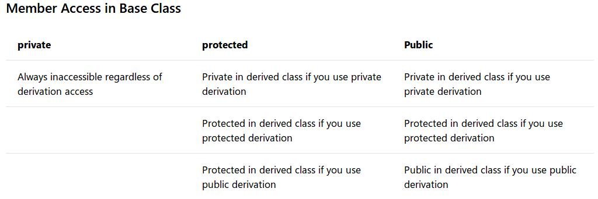
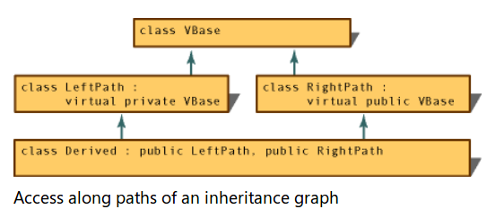

# [c++11]成员访问控制

参考：[Member Access Control (C++)](https://docs.microsoft.com/en-us/cpp/cpp/member-access-control-cpp?view=vs-2019)

类的访问控制能够有效分离公共接口和私有实现细节，以及派生类可访问成员

## 访问类型

有`3`种访问类型：

1. `private`：私有函数，仅对类的成员函数和友元（`friend`）函数可见
2. `protected`：受保护函数，除了对类的成员函数和友元函数可见外，还对派生类可见
3. `public`：公共函数，没有访问限制

`class`默认的访问权限是`private`；`struct`和`union`默认的访问权限是`public`

## 派生类的访问控制

对于派生类的成员来说，其对于基类成员的访问权限取决于两个因素：

* 是否派生类使用`public`访问说明符声明基类
* 基类成员的访问权限

下图显示了派生类对于基类成员的访问控制



* 对于基类中声明为`private`的成员而言，派生类均不能访问
* 对于基类中声明为`protected`的成员而言
    * 如果派生类使用`private`声明基类，可看成派生类中的`private`成员
    * 如果派生类使用`protected`声明基类，可看成派生类的`protected`成员
    * 如果派生类使用`public`声明基类，可看成派生类的`protected`成员
* 对于基类中声明为`public`的成员而言
    * 如果派生类使用`private`声明基类，可看成派生类的`private`成员
    * 如果派生类使用`protected`声明基类，可看成派生类的`protected`成员
    * 如果派生类使用`public`声明基类，可看成派生类的`public`成员

如果没有显式声明基类访问符，

* 对于`class`而言，默认是`private`声明
* 对于`struct`而言，默认是`public`声明

## virtual函数

对`virtual`函数的使用不影响访问控制。示例如下：

```
class Base {
public:
    virtual int show();
};

int Base::show() {
    return 1;
}

class Drived : public Base {
private:
    int show() override;
};

int Drived::show() {
//    Base::show();
    return 2;
}

int main() {
    Drived drived;
    drived.show(); // error

    Base base;
    base.show(); // correct
}
```

基类中的`virtual`函数是`public`访问权限，所以可以被对象调用；而派生类中的重写函数是`private`访问权限，所以不能被调用

## 多继承访问控制

`c++`支持多继承，就可能会发生派生类经过多个路径抵达同一基类，如下图所示



因为可以沿着这些不同的路径应用不同的访问控制，所以编译器选择提供最大访问权限的路径

上图中通过`RightPath`能够更多的访问基类`VBase`

## 友元

参考：[friend (C++)](https://docs.microsoft.com/en-us/cpp/cpp/friend-cpp?view=vs-2019)

友元（`friend`）的作用是单独为外部或派生类提供访问权限

### 友元声明

从`c++11`开始，有两种声明友元类的方式：

```
friend class F;
friend F;
```

* 如果在最内部的命名空间中找不到同名类，第一种方式将引入新的类F
* 第二种方式不介绍新的类，它在类声明后使用，或者在将模板类型参数或`typedef`声明为友元时使用

```
namespace NS
{
    class M
    {
        class friend F;  // 未声明类F时使用第一种方式
        friend F;        // error C2433: 'NS::F': 'friend' not permitted on data declarations
    };
}

// 声明模板参数为friend
template <typename T>
class my_class
{
    friend T;
    //...
};

// 声明typedef重命名类为friend
class Foo {};
typedef Foo F;

class G
{
    friend F; // OK
    friend class F // Error C2371 -- redefinition
};
```

如果要声明两个类互为友元，则必须将第二个类声明为第一个类的友元。同时可以选择第一个类中哪些函数是第二个类的友元

### 友元函数

友元函数不是类的成员，不能使用成员选择算子（`.`或者`->`）来访问它（除非它是另一个类的函数），但是被授予权限访问类的`private`和`protected`成员

友元函数声明可以放置在类声明的任意位置，不影响其访问权限。示例如下：

```
class Point {
    friend void ChangePrivate(Point &);

public:
    Point(void) : m_i(0) {}

    void PrintPrivate(void) { cout << m_i << endl; }

private:
    int m_i;
};

void ChangePrivate(Point &i) { i.m_i++; }

int main() {
    Point sPoint;
    sPoint.PrintPrivate();
    ChangePrivate(sPoint);
    sPoint.PrintPrivate();
// Output: 0
//         1
}
```

创建友元函数`ChangePrivate`和类`Point`，友元函数能够改变类`Point`的私有变量`m_i`

### 友元类

友元类是指其整个类的成员函数均是另一个类的友元函数。示例如下：

```
class YourClass {
    friend class YourOtherClass;  // Declare a friend class
public:
    YourClass() : topSecret(0) {}

    void printMember() { cout << topSecret << endl; }

private:
    int topSecret;
};

class YourOtherClass {
public:
    void change(YourClass &yc, int x) { yc.topSecret = x; }
};

int main() {
    YourClass yc1;
    YourOtherClass yoc1;
    yc1.printMember();
    yoc1.change(yc1, 5);
    yc1.printMember();
}
```

类`YourOtherClass`是类`YourClass`的友元类，所以`YourOtherClass`的所有函数均能访问类`YouClass`的私有成员

**注意 1：友元关系无法继承（`inherited`），所以`YourOtherClass`的派生类无法访问`YourClass`**

**注意 2：友元关系无法传递（`transitive`），所以`YourOtherClass`的友元类无法访问`YourClass`**

### 内联友元函数

友元函数可以在类声明内定义（给定函数体）。这些函数是内联函数，与成员内联函数一样，其作用域在整个类内