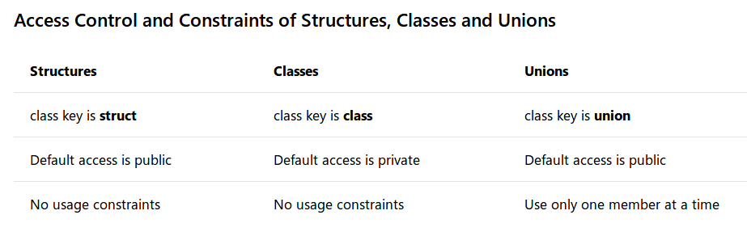

# 类、结构体和共同体

类、结构体和共同体是`3`种类的类型，分别通过关键字`class、struct`和`union`定义

## 类 vs. 结构体

这两个构造在`C++`中是相同的，除了在结构中默认的可访问性是公共的，而在类中默认是私有的

类和结构体是用于自定义类型的构造。类和结构体都可以包含数据成员和成员函数，能够描述类型的状态和行为

## 访问控制和限制

类、结构体和共同体的访问控制（`access control`）和限制（`constraint`）有所差异。如下图所示：

* 就访问控制而言，结构体和共同体默认访问权限是`public`，而类的访问权限是`private`
* 就访问限制而言，结构体和类没有任何限制，而共同体每次只能使用一个成员
