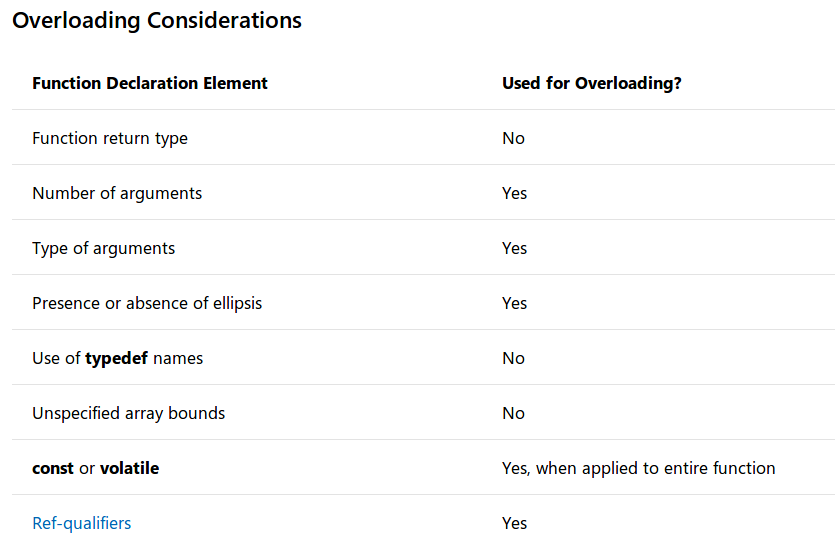

# [c++11]函数

参考：[Functions (C++)](https://docs.microsoft.com/en-us/cpp/cpp/functions-cpp?view=vs-2019)

学习函数的类别、声明、重载、模板等内容，并学习`c++11`规范

## 函数类别

根据作用域定义函数类别

* 成员函数（`member function`）：定义在类作用域内
* 自由函数（`free function`）：定义在命名空间作用域或者全局作用域内，也称为非成员函数（`non-member function`）

## 函数声明

最简单的函数声明包括返回类型，函数名和形参列表（*可以为空*），最后加上一个分号（`semicolon`）

```
return_type function_name(parameter list);
```

* **返回类型**指定了函数返回值的类型，设为`void`表示无返回值。从`c++11`开始，可以使用`auto`作为返回类型，编译器会自动推导返回值的类型
* **函数名**必须以字母或下划线开头，不能包含空格。通常标准库函数名中的前缀下划线表示私有成员函数，或者表示不希望用户使用的非成员函数
* **参数列表**是由零个或多个参数组成，用逗号分隔的集合。用于指定类型和可选的本地名称，通过该名称可以在函数体内部访问

### 可选说明符

还可以添加以下说明符，用于进一步说明函数的使用范围

1. `constexpr`：表明函数的返回值是一个常量，可以在编译时计算

        constexpr float exp(float x, int n);

2. `extern`或`static`：影响其链接规范。声明为`extern`表明其拥有外部链接；声明为`static`表明其拥有内部链接。参考[链接](https://zj-image-processing.readthedocs.io/zh_CN/latest/c++/%E9%93%BE%E6%8E%A5.html)
3. `inline`：设置为内联函数。它指示编译器用函数代码本身替换对函数的每个调用。在函数执行速度快并且在性能关键的代码部分反复调用的情况下，内联可以帮助提高性能
    
        inline double Account::GetBalance()
        {
            return balance;
        }

4. `noexcept`：是否抛出异常，指定函数是否可以引发异常
5. `cv`限定符：仅适用于成员函数，指定函数是否是`const`或者`volatile`
6. `virtual，override和final`：仅适用于成员函数。`virtual`指定函数可在派生类中重写；`override`指定函数是重写父类的`virtual`函数；`final`指定函数不能被后续的派生类重写
7. `static`：仅适用于成员函数，表明该函数不与任一个对象相关联
8. 引用限定符：仅适用于非成员函数，它向编译器指定当隐式对象参数（`*this`）是右值引用而不是左值引用时要选择的函数重载

## 函数定义

函数定义由函数声明加函数体组成：

```
return_type function_name(parameter list) {
    。。。
    。。。
}
```

在函数体内部声明的变量称为局部变量（`local variables`）。它们的作用域仅限于函数体；因此，函数不应返回对局部变量的引用！

## const和constexpr

当声明类成员函数为`const`时，该函数不能修改类中任何数据成员的值，否则会出现编译错误

```
class CTest {

public:
    int f(int a) const;

private:
    int b = 4;
};

int CTest::f(int a) const {
    b = a;

    return a + b;
}


int main() {
    CTest c;
    cout << c.f(3) << endl;
}
```

编译结果：

```
/home/zj/CLionProjects/first/main.cpp: In member function ‘int CTest::f(int) const’:
/home/zj/CLionProjects/first/main.cpp:18:7: error: assignment of member ‘CTest::b’ in read-only object
     b = a;
       ^
CMakeFiles/first.dir/build.make:62: recipe for target 'CMakeFiles/first.dir/main.cpp.o' failed
```

当函数生成的值在编译器确定时，赋值为`constexpr`，声明为`constexpr`的函数通常比常规函数执行更快

```
constexpr auto int f(int a) {
    return a + 3;
}
```

## 函数重载

参考：[Function Overloading](https://docs.microsoft.com/en-us/cpp/cpp/function-overloading?view=vs-2019)

函数可以被重载（`overloaded`），即相同名称函数的不同版本可以在形参的数量和（或）类型上有所不同，下图显示可用于重载的函数元素



**注意 1：默认参数不能区分重载函数**

### 参数匹配

将选择当前作用域中的函数声明与函数调用中提供的参数最佳匹配的函数，最佳指的是以下一种：

* 找到完全匹配的参数列表
* 执行了一个简单的转换
* 实现了整数提升
* 存在到所需参数类型的标准转换
* 存在到所需参数类型的用户定义转换
* 找到省略号表示的参数

### 参数类型差异

重载函数采用不同初始值设定项的参数类型进行区分，所以如果输入初始值类型相同，则不能作为重载函数

* 给定类型的参数和对该类型的引用被认为是相同的
* 有`const`或`volatile`声明的参数类型和原始参数类型被认为相同的

### 函数重载限制

1. 重载函数集中任意两个函数都拥有不同的参数列表
2. 重载具有相同类型参数列表的函数（仅基于返回类型）是错误的
3. 成员函数不能仅基于一个静态函数和另一个非静态函数而重载
4. `typedef`声明不定义新类型；它们引入了现有类型的同义词。它们不影响重载机制
5. 枚举类型是不同的类型，可用于区分重载函数
6. 为区分重载函数，类型`array of`和`pointer to`被认为是相同的，但仅适用于单维数组
    ```
    void Print(char *szToPrint) {
        cout << szToPrint << endl;
    }
    // error, redefinition
    void Print(char szToPrint[]) {
        cout << szToPrint << endl;
    }
    ```
    对于多维数组，从第二维开始的后续维度被认为是类型的一部分，所以可用于区分重载函数
    ```
    void Print(char szToPrint[]) {
        cout << szToPrint << endl;
    }

    void Print(char szToPrint[][7]) {
        cout << szToPrint << endl;
    }

    void Print(char szToPrint[][9][42]) {
        cout << szToPrint << endl;
    }
    ```


## 函数模板

函数模板类似于类模板：它基于模板参数生成具体的函数。在许多情况下，模板能够推断类型参数，没有必要显式地指定它们

```
template<typename Lhs, typename Rhs>
auto Add2(const Lhs& lhs, const Rhs& rhs)
{
    return lhs + rhs;
}
```

## 函数参数

函数参数列表由`0`个或多个类型组成，用逗号（`comma`）隔开

默认情况下函数的参数是输入数据的复制体，所以实参和形参不一致，并且复制过程有可能耗时且占内存

### 可变参数

`C++`支持函数可变参数，类似`C`语言中的`printf`函数

参考：

[C stdarg.h的使用](https://blog.csdn.net/u012005313/article/details/52122077)

[Functions with Variable Argument Lists (C++)](https://docs.microsoft.com/en-us/cpp/cpp/functions-with-variable-argument-lists-cpp?view=vs-2019)

### 引用参数

要通过引用（特别是`lvalue`引用）传递参数，需向参数添加引用限定符

```
void DoSomething(std::string& input){...}
```

当函数修改通过引用传递的参数时，它将修改原始对象，而不是本地副本。要防止函数修改此类参数，需要将参数限定为`const &`：

```
void DoSomething(const std::string& input){...}
```

`c++11`规定：要显式处理由右值引用（`rvalue-reference`）或左值引用（`lvalue-reference`）传递的参数，请在参数上使用双和号（`double-ampersand`）来表示通用引用：

```
void DoSomething(const std::string&& input){...}
```

### void

设置参数列表为空或者`void`表示没有输入参数，注意：仅能使用单个`void`

```
void f()           # 正确
void f(void)       # 正确
void f(void, void) # error
```

从`void`类型派生的类型（例如指向`void`的指针和`void`数组）可以出现在参数声明列表的任何位置

```
int dd(void *a) {
    return *static_cast<int *>(a);
}

int main() {
    int a = 3;
    cout << dd(&a) << endl;
}
```

### 默认参数

参考：[Default Arguments](https://docs.microsoft.com/en-us/cpp/cpp/default-arguments?view=vs-2019)

参数列表中的最后一个或多个参数可以被分配一个默认参数，这意味着调用方在调用函数时可能会忽略该参数，除非他们想指定其他值

```
void def(int a, float b = 3.21, char c = '2') {
    cout << a << " ";
    cout << b << " ";
    cout << c << endl;
}

int main() {
    def(1);
    def(1, 32.11);
    def(1, 3.33, 'a');
}
```

结果：

```
1 3.21 2
1 32.11 2
1 3.33 a
```

**注意：必须按顺序赋值参数列表，无法指定某个默认参数进行赋值**

## 返回类型

默认函数返回类型由函数声明左侧的标签确定，还可以使用尾随返回类型（`trailing return types`）确定，使用方式如下：

```
auto def(int a, float b = 3.21, char c = '2') -> int {
    return b;
}

int main() {
    cout << def(1) << endl;
    cout << def(1, 32.11) << endl;
    cout << def(1, 3.33, 'a') << endl;
}
```

在函数声明右侧使用运算符`->`确定，此时左侧的`auto`说明符仅充当占位符，不执行类型推导。所以虽然`return`值的类型是`float`，但是返回类型是`int`

```
3
32
3
```

通常和`decltype`搭配使用，函数修改如下：

```
auto def(int a, float b = 3.21, char c = '2') -> decltype(a) {
```

## 函数局部变量

函数体内声明的变量称为局部变量，其作用域仅限于函数体

如果函数局部变量声明为`static`，那么其副本存在于该函数的所有实例中

```
auto def(float b) {
    static float ff;
    cout << ff << endl;
    ff = b;
}

int main() {
    def(3);
    def(3.32);
    def(3.2221);
}
```

结果

```
0
3
3.32
```

*静态局部对象在`atexit`指定的终止期间被销毁。如果由于程序的控制流绕过了静态对象的声明而未构造该对象，则不会尝试销毁该对象*

## 返回多个函数值

函数一次仅能返回一个函数值，如果要同时返回多个函数值，可以自定义类或者结构体，也可以调用标准库的`std::tuple`或者`std::pair`对象

## Overloading，overriding和hiding

基类声明函数的作用域与派生类相同名称函数的作用域不同

* 如果派生类函数声明了基类`virtual`函数，则进行了重写（`override`）操作
* 如果基类函数没有声明为`virtual`，那么派生类函数隐藏（`hide`）了它。重写（`overridding`）和隐藏（`hiding`）操作不同于重载（`overloaded`）

### 局部函数

在函数内声明了和外部函数同名的局部函数，那么局部函数**隐藏**了外部同名函数，示例如下：

```
void func(int i) {
    cout << "Called file-scoped func : " << i << endl;
}

void func(char *sz) {
    cout << "Called locally declared func : " << sz << endl;
}

int main() {
    // Declare func local to main.
    extern void func(char *sz);

//    func(3);   // C2664 Error. func( int ) is hidden.
    func("s");
}
```

`main`函数内部的`func`函数声明隐藏了外部`func`函数重载，所以只能支持输入字符数组的参数

同一类的成员函数在不同的访问权限（`public/protect/private`）下仍是重载函数

示例如下：

```
// declaration_matching2.cpp
class Account
{
public:
   Account()
   {
   }
   double Deposit( double dAmount, char *szPassword );

private:
   double Deposit( double dAmount )
   {
      return 0.0;
   }
   int Validate( char *szPassword )
   {
      return 0;
   }

};

int main()
{
    // Allocate a new object of type Account.
    Account *pAcct = new Account;

    // Deposit $57.22. Error: calls a private function.
    // pAcct->Deposit( 57.22 );

    // Deposit $57.22 and supply a password. OK: calls a
    //  public function.
    pAcct->Deposit( 52.77, "pswd" );
}

double Account::Deposit( double dAmount, char *szPassword )
{
   if ( Validate( szPassword ) )
      return Deposit( dAmount );
   else
      return 0.0;
}
```

## 内联函数

参考：[Inline Functions (C++)](https://docs.microsoft.com/en-us/cpp/cpp/inline-functions-cpp?view=vs-2019)

在类声明中定义的函数称为内联函数（`inline function`），不需要显示声明为`inline`；如果内联函数定义在外部，必须在定义时声明为`inline`。示例如下：

```
class Account
{
public:
    Account(double initial_balance) { balance = initial_balance; }
    double GetBalance();
private:
    double balance;
};

inline double Account::GetBalance()
{
    return balance;
}
```

构造器`Account`和函数`GetBalance`都是内联函数
