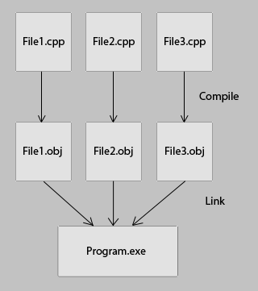

# 声明和定义

参考：

[Declarations and Definitions (C++)](https://docs.microsoft.com/en-us/cpp/cpp/declarations-and-definitions-cpp?view=vs-2019)

[Declarations, Prototypes, Definitions, and Implementations](http://www.cplusplus.com/articles/yAqpX9L8/)

## 声明和定义

* 声明（`declaration`）用于为程序引入名称
* 定义（`definition`）是在内存中创建实体位置

声明通常可看成定义，除了以下情况：

1. 函数原型（`function prototype`）：只有函数声明，没有函数体
2. 包含`extern`标识符，同时没有初始化值（对于对象和变量而言）或没有函数体（对于函数而言）。这意味着不一定在当前单元进行定义，给予其外部链接
3. 类声明中的静态数据成员：因为静态类数据成员是类中所有对象共享的离散变量，所以必须在类声明之外定义和初始化它们
4. 不包含定义的类声明，比如`class T;`
5. `typedef`表达式

声明后都需要进行定义，除了以下两种情况：

1. 函数已声明，但从未被函数调用或者被表达式引用其地址
2. 类的使用方式不需要知道其定义，但是必须声明类。比如

```
class WindowCounter;   // Forward declaration; no definition

class Window
{
   // Definition of WindowCounter not required
   static WindowCounter windowCounter;
};

int main()
{
}
```

## 为什么要区分声明和定义

从源文件编译得到程序可分为两个过程：编译（`compile`）和链接（`link`）



* 编译阶段：独立编译每一个`.cpp`文件。将所有`#include`文件插入到`.cpp`中，然后从头到尾进行编译，生成机器码输出为`.obj`文件
* 链接阶段：组合所有`.obj`文件，生成内存寻址以及函数调用，最后输出一个可执行程序

在编译阶段编译器只需要知道函数参数类型以及返回值类型即可，不关心具体实现过程

所以声明作用于编译阶段，定义作用于链接阶段

## 使用声明和定义

在编译阶段编译器从头到尾处理`.cpp`文件，所以在使用变量、函数等名称之前必须有声明，有两种方式：

1. 前向声明（`Forward declaration`）：仅包含声明，在之后进行定义（**推荐**）
2. 在使用之前同时进行声明和定义