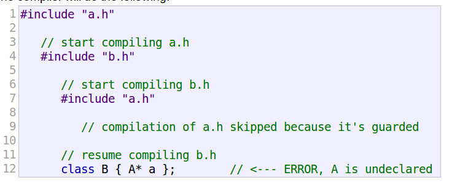

# 头文件

参考：

[Header files (C++)](https://docs.microsoft.com/en-us/cpp/cpp/header-files-cpp?view=vs-2019)

[Headers and Includes: Why and How](http://www.cplusplus.com/articles/Gw6AC542/)

学习头文件的使用规范

## 为什么要使用头文件

通常将变量、函数、类、结构体的声明放置在头文件（`header file`）中，在源文件中使用`#include`指令插入头文件

有两个作用：

1. 保证所有源文件使用同一个声明
2. 加快编译时间
3. 结构化程序，比如接口和实现分离

## include guard

通常，头文件具有`include guard`或`#pragma once`指令，以确保它们不会多次插入到单个`.cpp`文件中

```
// my_class.h
#ifndef MY_CLASS_H  // if my_class.h hasn't been included yet...
#define MY_CLASS_H  // #define this so the compiler knows it has been included

namespace N
{
    class my_class
    {
    public:
        void do_something();
    };
}

#endif /* MY_CLASS_H */
```

## 头文件包含内容

头文件和源文件一样，也可以包含定义，但是不推荐使用，因为这会造成同一个名称的多次定义

以下内容是不允许或被认为是非常糟糕的做法：

* 在全局作用域或命名空间进行内置类型定义
* 非内联函数定义
* 非`const`变量定义
* 聚合定义（`aggregate definitions`）
* 未命名的名称空间
* `using`指令

使用`using`指令不一定会导致错误，但可能会导致问题，因为它将命名空间引入直接或间接包含该头文件的每个`.cpp`文件的作用域

## .h/.hpp/.c/.cpp/.cc的区别

不同的文件扩展名可表示不同的作用

* 头文件：使用`.h__`扩展名，比如`.h、.hpp、.hxx`等
* `c++`源文件：使用`.c__`扩展名，比如`.cpp、.cxx、.cc`等
* `c`源文件：使用`.c`扩展名

## 循环依赖问题

有两个头文件`a.h`和`b.h`，各自头文件定义了类，同时相互调用，这会产生**循环依赖**（`Circular Dependencies`）问题

### 错误示例

主程序使用类`a`：

```
// a.h
#include "b.h"

class A {
public:
    B *b;
};

// b.h
#include "a.h"

class B {
public:
    A *a;
    int h;
};

// main.cpp
#include "a.h"

int main() {
    A aa;
    aa.b = new B();
    aa.b->h = 3;

    cout << aa.b->h << endl;

    return 0;
}
```

会出现编译问题：

```
[ 40%] Building CXX object CMakeFiles/first.dir/a.cpp.o
In file included from /home/zj/CLionProjects/first/a.h:8:0,
                 from /home/zj/CLionProjects/first/a.cpp:5:
/home/zj/CLionProjects/first/b.h:14:5: error: ‘A’ does not name a type
     A *a;
     ^
```

编译器首先编译源文件`a.cpp`，根据`#include`指令编译头文件`a.h`，再根据`#include`指令编译`b.h`，最后根据`#include`指令编译`a.h`。然而因为`include guard`保护，所以跳过了`a.h`的编译，造成`b.h`中的类`A`未进行声明



### 解决方案：前向声明

在使用之前进行**前向声明**（`forward declaring`），所以需要在`a.h`中声明类`B`，在`b.h`中声明类`A`。完整代码如下：

```
# a.h
#ifndef FIRST_A_H
#define FIRST_A_H

#include "b.h"

class B;

class A {
public:
    B *b;
};

#endif //FIRST_A_H

# b.h
#ifndef FIRST_B_H
#define FIRST_B_H

#include "a.h"

class A;

class B {
public:
    A *a;
    int h;
};

#endif //FIRST_B_H

# main.cpp
#include "a.h"

int main() {
    A aa;
    aa.b = new B();
    aa.b->h = 3;

    cout << aa.b->h << endl;

    return 0;
}
```

执行结果

```
3
```

## 编写规范

参考：[在开发大C++工程的时候如何判断和避免循环include?](https://www.zhihu.com/question/23178386)

1. 使用include guard
2. 在`A.cpp`文件中放置`A.h`在第一位
3. 出现循环依赖，重新思考文件布局，拆分文件
4. 在`.h`使用前向声明，在`.cpp`引入对应`.h`文件

## 示例代码

```
#pragma once
#include <vector> // #include directive
#include <string>

namespace N  // namespace declaration
{
    inline namespace P
    {
        //...
    }

    enum class colors : short { red, blue, purple, azure };

    const double PI = 3.14;  // const and constexpr definitions
    constexpr int MeaningOfLife{ 42 };
    constexpr int get_meaning()
    {
        static_assert(MeaningOfLife == 42, "unexpected!"); // static_assert
        return MeaningOfLife;
    }
    using vstr = std::vector<int>;  // type alias
    extern double d; // extern variable

#define LOG   // macro definition

#ifdef LOG   // conditional compilation directive
    void print_to_log();
#endif

    class my_class   // regular class definition,
    {                // but no non-inline function definitions

        friend class other_class;
    public:
        void do_something();   // definition in my_class.cpp
        inline void put_value(int i) { vals.push_back(i); } // inline OK

    private:
        vstr vals;
        int i;
    };

    struct RGB
    {
        short r{ 0 };  // member initialization
        short g{ 0 };
        short b{ 0 };
    };

    template <typename T>  // template definition
    class value_store
    {
    public:
        value_store<T>() = default;
        void write_value(T val)
        {
            //... function definition OK in template
        }
    private:
        std::vector<T> vals;
    };

    template <typename T>  // template declaration
    class value_widget;
}
```