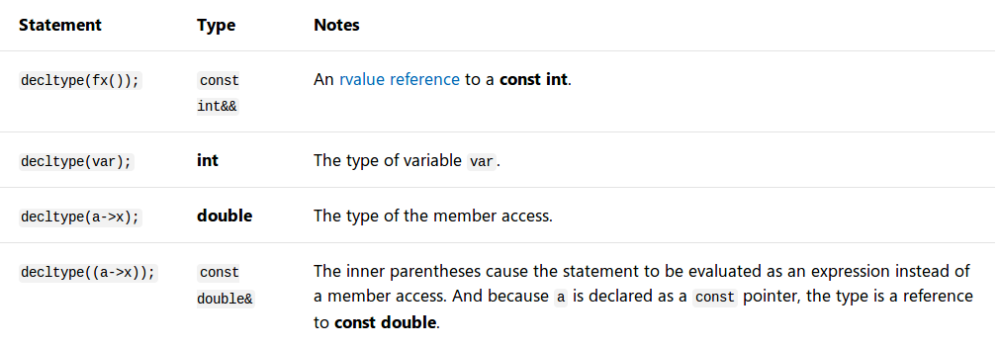

# [c++11]decltype

参考：

[decltype (C++)](https://docs.microsoft.com/en-us/cpp/cpp/decltype-cpp?view=vs-2019)

[decltype specifier](https://en.cppreference.com/w/cpp/language/decltype)

`decltype`类型说明符是`c++11`新增的特性，能够生成指定表达式的类型。语法如下：

```
decltype( expression )
```

## 推导规则

编译器使用以下规则推导参数`expression`的类型

1. 如果参数`expression`是一个标识符（`identifier`）或者类成员访问（`class member access`），那么`decltype(expression)`是该实体（`entity`）的类型
2. 如果参数`expression`是一个函数或者重载操作符的调用，那么`decltype(expression)`返回函数值类型。忽略重载运算符周围的括号
3. 如果参数`expression`是一个`rvalue`，那么`decltype(expression)`是`expression`的类型；如果是一个`lvalue`，那么结果是对`expression`类型的`lvalue`引用

## 示例

```
int var;
const int&& fx();
struct A { double x; }
const A* a = new A();
```

推导结果如下：

