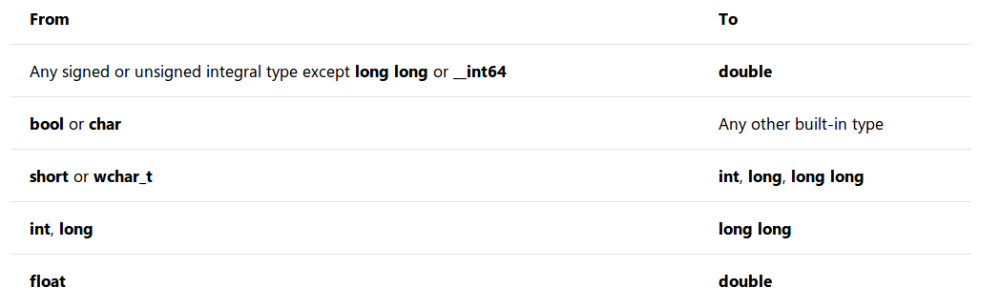

# 标准转换

参考：[Standard conversions](https://docs.microsoft.com/en-us/cpp/cpp/standard-conversions?view=vs-2019)

`C++`定义了基本类型之间的转换，也定义了指针、引用和成员指针派生类型之间的转换，这些统称为标准转换（`standard conversion`）

共分为`8`个部分：

1. 整型提升（`integral promotions`）
2. 整型转换（`integral conversions`）
3. 浮点型转换（`floating conversions`）
4. 浮点和整数转换（`floating and integral conversions`）
5. 数值型间的转换（`arithmetic conversions`）
6. 指针转换（`pointer conversions`）
7. 引用转换（`reference conversions`）
8. 成员指针的转换（`pointer-to-member conversions`）

## 隐式类型转换

当表达式包含不同内置类型的操作数且不存在显式强制转换时，编译器执行隐式转换

### 加宽转换

在加宽转换（`Widening conversions`，也称为提升，`promotion`）中，较小变量中的值被分配给较大变量，而不会丢失数据。因为扩大转换总是安全的，编译器会静默地执行它们，不会发出警告。以下转换是加宽转换。



### 变窄转换

如果将精度较大变量分配给精度较小的变量，有可能发生数据损失情况，编译器会因为这个情况报出一个警告（`warn`）

* 对于明确知道不会发生数据损失的情况，可以执行强制类型转换以消除警告
* 如果不明确是否会发生数据损失，可以增加一些运行时检查

### 有符号-无符号转换

`signed-unsigned`转换不会改变变量位数，但是因为其位模式发生了变化导致数据的大小发生了变化。编译器不警告有符号和无符号整数类型之间的隐式转换，但是建议完全避免有符号到无符号的转换

如果不能避免它们，那么在代码中添加一个运行时检查，以检测正在转换的值是否大于或等于零，并且小于或等于已签名类型的最大值。此范围内的值将从有符号转换为无符号，或从无符号转换为有符号，而不需要重新解释

### 指针转换

`C`风格的数组可以隐式看成指向数组第一个元素的指针。虽然进行数据操作很简单，但也容易出错，不推荐使用

```
# 示例
$ char* s = "Help" + 3;
```

## 显式类型转换

相比较于隐式类型转换，使用显式类型转换更能明确转换目标，有两种方式：

1. `C`风格转换
2. `C++`风格转换

### C风格转换

最常用的是使用`C`风格的转换算子，即直接在变量前添加类型，如下所示：

```
(int) x; // old-style cast, old-style syntax
int(x); // old-style cast, functional syntax
```