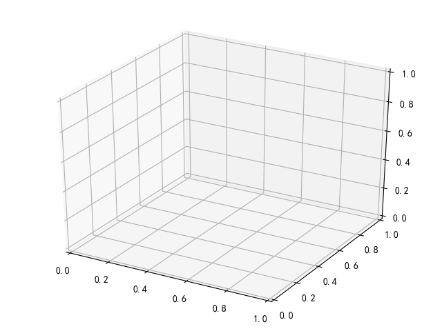
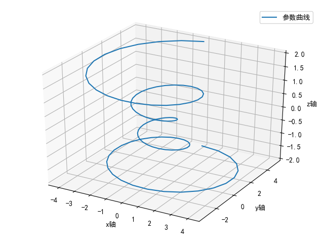
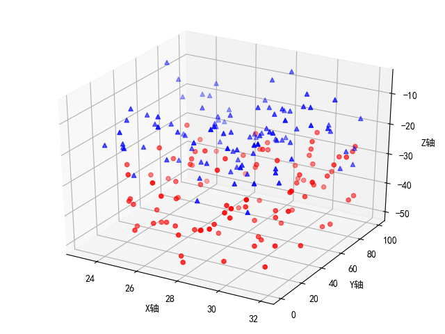
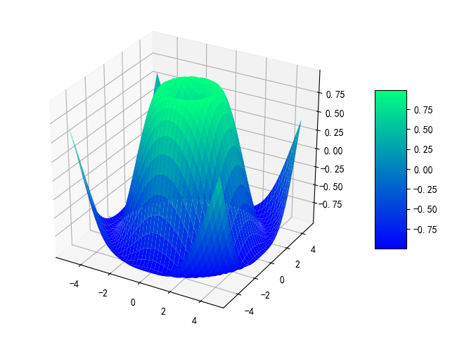

# 3d绘图

使用[mpl_toolkits.mplot3d.axes3d.Axes3D](https://matplotlib.org/api/_as_gen/mpl_toolkits.mplot3d.axes3d.Axes3D.html?highlight=axes3d)进行`3d`绘图操作

## 绘制3d坐标系

使用函数`add_subplot`绘制`3d`坐标系

```
fig = plt.figure()
ax = fig.add_subplot(111, projection='3d')
fig.show()
```



## 曲线图

使用函数[Axes3D.plot](https://matplotlib.org/api/_as_gen/mpl_toolkits.mplot3d.axes3d.Axes3D.html?highlight=axes3d%20plot#mpl_toolkits.mplot3d.axes3d.Axes3D.plot)进行线图绘制，增加了可选参数`zs`来输入`z`值

```
import numpy as np
import matplotlib.pyplot as plt
from mpl_toolkits.mplot3d import Axes3D

plt.rcParams['legend.fontsize'] = 10

if __name__ == '__main__':
    fig = plt.figure()
    ax = fig.add_subplot(111, projection='3d')

    # Prepare arrays x, y, z
    theta = np.linspace(-4 * np.pi, 4 * np.pi, 100)
    z = np.linspace(-2, 2, 100)
    r = z ** 2 + 1
    x = r * np.sin(theta)
    y = r * np.cos(theta)

    ax.plot(x, y, z, label='参数曲线')
    ax.set_xlabel('x轴')
    ax.set_ylabel('y轴')
    ax.set_zlabel('z轴')
    ax.legend()

    plt.show()
```



## 散点图

>Axes3D.scatter(xs, ys, zs=0, zdir='z', s=20, c=None, depthshade=True, *args, **kwargs)[source]

```
import numpy as np
import matplotlib.pyplot as plt
from mpl_toolkits.mplot3d import Axes3D

# Fixing random state for reproducibility
np.random.seed(19680801)

def randrange(n, vmin, vmax):
    '''
    Helper function to make an array of random numbers having shape (n, )
    with each number distributed Uniform(vmin, vmax).
    '''
    return (vmax - vmin) * np.random.rand(n) + vmin

if __name__ == '__main__':
    fig = plt.figure()
    ax = fig.add_subplot(111, projection='3d')

    n = 100

    # For each set of style and range settings, plot n random points in the box
    # defined by x in [23, 32], y in [0, 100], z in [zlow, zhigh].
    for c, m, zlow, zhigh in [('r', 'o', -50, -25), ('b', '^', -30, -5)]:
        xs = randrange(n, 23, 32)
        ys = randrange(n, 0, 100)
        zs = randrange(n, zlow, zhigh)
        ax.scatter(xs, ys, zs, c=c, marker=m)

    ax.set_xlabel('X轴')
    ax.set_ylabel('Y轴')
    ax.set_zlabel('Z轴')

    plt.show()
```



## 曲面图

>Axes3D.plot_surface(X, Y, Z, *args, norm=None, vmin=None, vmax=None, lightsource=None, **kwargs)

**输入参数`x/y/z`都是二维数组**

```
import numpy as np
import matplotlib.pyplot as plt
from mpl_toolkits.mplot3d import Axes3D

if __name__ == '__main__':
    fig = plt.figure()
    ax = fig.gca(projection='3d')

    # Make data.
    X = np.arange(-5, 5, 0.25)
    Y = np.arange(-5, 5, 0.25)
    X, Y = np.meshgrid(X, Y)
    R = np.sqrt(X ** 2 + Y ** 2)
    Z = np.sin(R)

    # 绘制曲面
    # Plot the surface.
    surf = ax.plot_surface(X, Y, Z, cmap=plt.cm.winter)

    # 添加将值映射到颜色的颜色栏
    # Add a color bar which maps values to colors.
    fig.colorbar(surf, shrink=0.5, aspect=5)

    plt.show()
```



可修改曲面颜色，比如[matplotlib绘图系列----3D曲面图与散点图](https://blog.csdn.net/ningyingqi/article/details/78800435)

* `plt.cm.coolwarm`
* `plt.cm.spring`
* `plt.cm.summer`
* `plt.cm.autumn`
* `plt.cm.winter`

## 相关阅读

* [The mplot3d Toolkit](https://matplotlib.org/tutorials/toolkits/mplot3d.html?highlight=3d%20plo#the-mplot3d-toolkit)
* [Parametric Curve](https://matplotlib.org/gallery/mplot3d/lines3d.html)
* [3D scatterplot](https://matplotlib.org/gallery/mplot3d/scatter3d.html)
* [3D surface (color map)](https://matplotlib.org/gallery/mplot3d/surface3d.html)