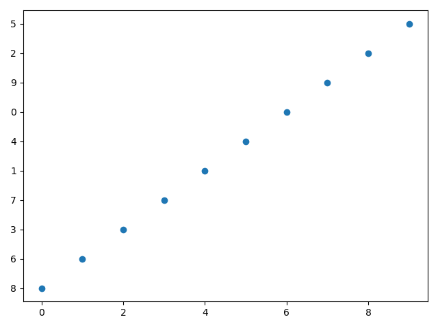

# y轴坐标错乱

今天遇到一个问题，`y`轴坐标值出现了乱序，如下图所示：



参考[plt作图时出现横坐标或者纵坐标乱序的解决方法](https://blog.csdn.net/weixin_43748786/article/details/96432047)，发现是因为输入`y`轴数据类型不是`np.int/np.float`，在程序中查了一下，发现果真如此，数据类型为`np.str`

复现代码如下：

```
import numpy as np
import matplotlib.pyplot as plt


def draw(y):
    f = plt.figure()

    x = list(range(len(y)))
    plt.scatter(x, y)

    plt.show()


if __name__ == '__main__':
    a = np.arange(10).astype(np.str)
    np.random.shuffle(a)
    draw(a)
```