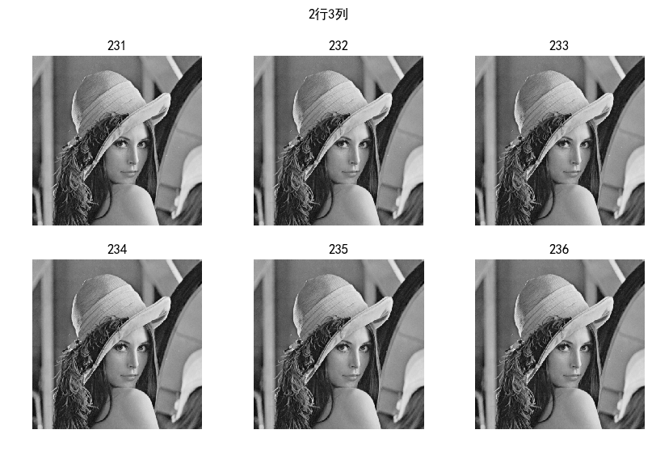

# 图像读取、显示和保存

`Matplotlib.pyplot`支持读取、显示和保存图像操作

## 读取图像

使用函数[matplotlib.pyplot.imread](https://matplotlib.org/api/_as_gen/matplotlib.pyplot.imread.html?highlight=imread#matplotlib-pyplot-imread)读取本地图像

```
matplotlib.pyplot.imread(fname, format=None)
```

参数`fname`是字符串，表示图片路径；返回值`imagedata`是一个`numpy.array`对象

*从源码查看，`matplotlib`使用`PIL`进行图片读取*

## 显示图像

取消绘制`x/y`轴

```
plt.axis('off')
```

### 显示彩色图像

```
# -*- coding: utf-8 -*-

"""
图像操作
"""

import matplotlib.pyplot as plt

img = plt.imread('lena.jpg')

plt.imshow(img)
plt.axis('off')

plt.show()
```

**注意：如果使用`opencv`读取图像，需要先转换成`RGB`格式**

### 显示灰度图像

需要加载灰度图后，在`imshow`函数中设置参数`cmap='gray'`

```
# -*- coding: utf-8 -*-

"""
图像操作
"""

import matplotlib.pyplot as plt
import cv2 as cv

img = cv.imread('lena.jpg', cv.IMREAD_GRAYSCALE)
plt.imshow(img, cmap='gray')
plt.axis('off')
plt.title('灰度图')

plt.savefig('gray.png')
plt.show()    
```


### 绘制多张图

```
# -*- coding: utf-8 -*-

"""
图像操作
"""

import matplotlib.pyplot as plt
import cv2 as cv

img = cv.imread('lena.jpg', cv.IMREAD_GRAYSCALE)

plt.figure(figsize=(10, 5))  # 设置窗口大小
plt.suptitle('2行3列')  # 图片名称

plt.subplot(2, 3, 1)
plt.title('231')
plt.imshow(img, cmap='gray'), plt.axis('off')
plt.subplot(2, 3, 2)
plt.title('232')
plt.imshow(img, cmap='gray'), plt.axis('off')
plt.subplot(2, 3, 3)
plt.title('233')
plt.imshow(img, cmap='gray'), plt.axis('off')
plt.subplot(2, 3, 4)
plt.title('234')
plt.imshow(img, cmap='gray'), plt.axis('off')
plt.subplot(2, 3, 5)
plt.title('235')
plt.imshow(img, cmap='gray'), plt.axis('off')
plt.subplot(2, 3, 6)
plt.title('236')
plt.imshow(img, cmap='gray'), plt.axis('off')

plt.savefig('gray-2-3.png', bbox_inches='tight')
plt.show()
```



## 保存图像

使用函数[matplotlib.pyplot.imsave](https://matplotlib.org/api/_as_gen/matplotlib.pyplot.imsave.html?highlight=imsave#matplotlib-pyplot-imsave)保存数组为本地图像

```
matplotlib.pyplot.imsave(fname, arr, **kwargs)[source]
```

参数`fname`表示保存地址
参数`arr`表示图像数组

## 相关阅读

* [Image tutorial](https://matplotlib.org/tutorials/introductory/images.html#image-tutorial)