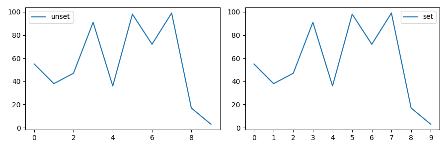

# 手动设置轴刻度间隔

默认情况下，`Matplotlib`会自动调整`x`轴刻度，需要手动设置

## 定义

```
import matplotlib.pyplot as plt
from matplotlib.pyplot import MultipleLocator

# 设置`x`轴刻度间隔为`1`
x_major_locator = MultipleLocator(1)
ax = plt.gca()
ax.xaxis.set_major_locator(x_major_locator)
```

## 示例

参考：[折线图](./折线图.md)

```
import matplotlib.pyplot as plt
from matplotlib.pyplot import MultipleLocator

def show():
    x = list(range(10))
    y = random.sample(list(range(100)), 10)

    plt.figure(1, figsize=(9, 3))

    plt.title('test')
    plt.subplot(1, 2, 1)
    plt.plot(x, y, label='unset')
    plt.legend()

    plt.subplot(122)

    x_major_locator = MultipleLocator(1)
    ax = plt.gca()
    ax.xaxis.set_major_locator(x_major_locator)

    plt.plot(x, y, label='set')
    plt.legend()

    plt.show()
```



## 相关阅读

* [Python设置matplotlib.plot的坐标轴刻度间隔以及刻度范围](https://www.jb51.net/article/163842.htm)