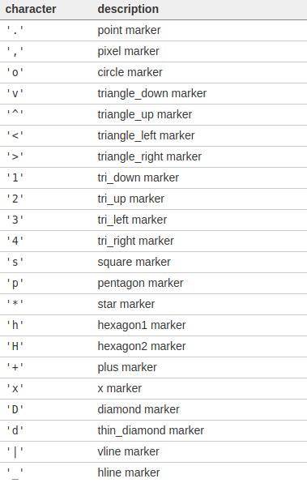
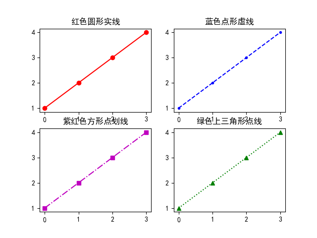
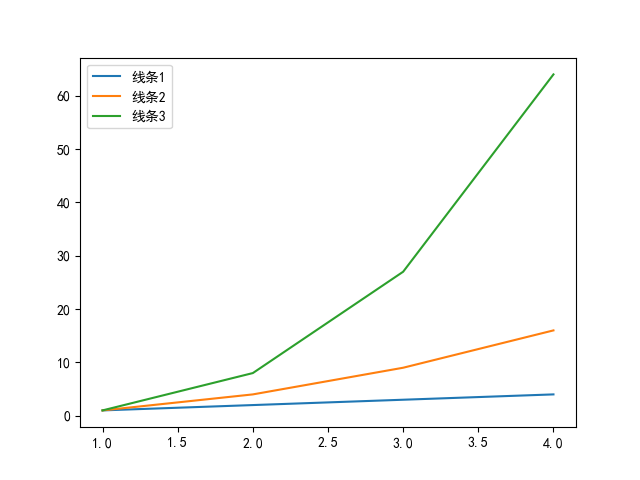
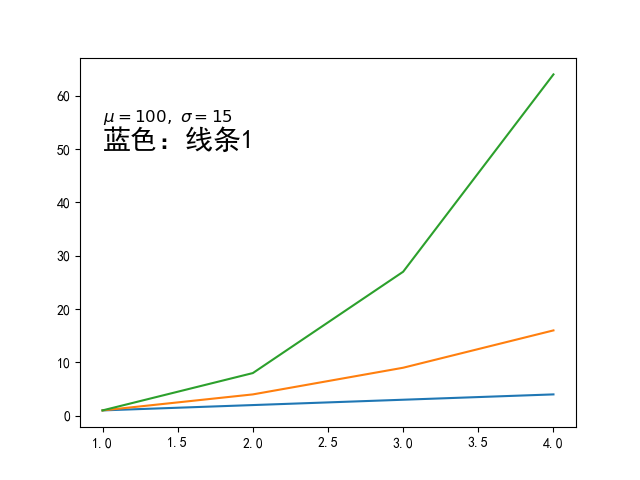
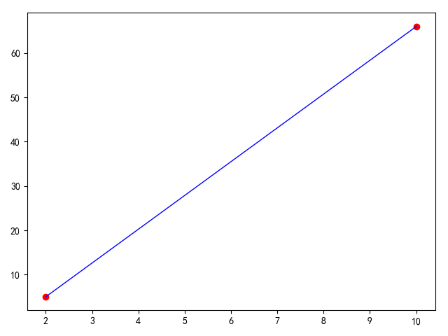

# 折线图

绘制折线图操作

## 格式化绘图样式

关键函数[matplotlib.pyplot.plot](https://matplotlib.org/api/_as_gen/matplotlib.pyplot.plot.html?highlight=plot#matplotlib-pyplot-plot)调用格式如下：

```
plot([x], y, [fmt], data=None, **kwargs)
plot([x], y, [fmt], [x2], y2, [fmt2], ..., **kwargs)
```

使用参数`fmt`格式化线条，输入值是一个字符串

>fmt = '[color][marker][line]'

由`3`部分组成：颜色+标记符+线条类型，每一个值都是可选的。如果给定了`line`，但是没有指定`marker`，那么线条仅仅是线段，没有标记符

支持以下颜色：


* b：蓝色
* g：绿色
* r：红色
* c：青色
* m：紫红
* y：黄色
* k：黑色
* w：白色

支持以下标记符：



支持以下线条类型：


* `-`：实线
* `--`：虚线
* `-.`：点划线
* `:`：点线

```
# -*- coding: utf-8 -*-

"""
折线图（line chart）
"""

import matplotlib.pyplot as plt

y = list(range(1, 5))

fig = plt.figure()

plt.subplot(221)
plt.plot(y, 'ro-')
plt.title('红色圆形实线')

plt.subplot(222)
plt.plot(y, 'b.--')
plt.title('蓝色点形虚线')

plt.subplot(223)
plt.plot(y, 'ms-.')
plt.title('紫红色方形点划线')

plt.subplot(224)
plt.plot(y, 'g^:')
plt.title('绿色上三角形点线')

plt.savefig('line-chart.png')
plt.show()
```



## 设置线条标签

当在`Axes`中绘制多条线时，使用函数[matplotlib.pyplot.legend](https://matplotlib.org/api/_as_gen/matplotlib.pyplot.legend.html?highlight=legend#matplotlib-pyplot-legend)显示线条标签

```
# -*- coding: utf-8 -*-

"""
折线图（line chart）
"""

import matplotlib.pyplot as plt
import numpy as np

x = y = np.array(range(1, 5))

plt.plot(x, y, label='线条1')
plt.plot(x, y ** 2, label='线条2')
plt.plot(x, y ** 3, label='线条3')

plt.legend()

plt.savefig('line-legend-1.png')
plt.show()
```



## 添加文本

使用函数[matplotlib.pyplot.text](https://matplotlib.org/api/_as_gen/matplotlib.pyplot.text.html#matplotlib-pyplot-text)可以在Axes上添加额外文本信息

```
matplotlib.pyplot.text(x, y, s, fontdict=None, withdash=False, **kwargs)
```

参数`x/y`是标量，表示文本坐标，需要匹配相应坐标系
参数`s`表示文本内容
参数`fontsize`用于设置文本大小，默认为`12`

```
# -*- coding: utf-8 -*-

"""
折线图（line chart）
"""

import matplotlib.pyplot as plt
import numpy as np

x = y = np.array(range(1, 5))

plt.plot(x, y, label='线条1')
plt.plot(x, y ** 2, label='线条2')
plt.plot(x, y ** 3, label='线条3')

plt.text(1.0, 55, r'$\mu=100,\ \sigma=15$', fontsize=12)
plt.text(1.0, 50, r'蓝色：线条1', fontsize=20)

plt.savefig('line-text.png')
plt.show()
```

**可以在文本字符串中输入`Tex`数学公式**



## 已知两点坐标绘制直线

参考：[matplotlib画直线](http://www.voidcn.com/article/p-xhhdukmy-wa.html)

使用函数[matplotlib.axes.Axes.add_line](https://matplotlib.org/api/_as_gen/matplotlib.axes.Axes.add_line.html?highlight=add_line#matplotlib.axes.Axes.add_line)绘制图像，使用[matplotlib.lines.Line2D](https://matplotlib.org/api/_as_gen/matplotlib.lines.Line2D.html?highlight=line2d)保存点数据

```
from matplotlib.lines import Line2D
import matplotlib.pyplot as plt

if __name__ == '__main__':
    spots = [[2, 5], [10, 66]]

    (line_xs, line_ys) = zip(*spots)
    print(line_xs)
    print(line_ys)

    figure, ax = plt.subplots()
    plt.scatter(line_xs, line_ys, color='r')
    ax.add_line(Line2D(line_xs, line_ys, linewidth=1, color='b'))
    ax.add_line

    plt.show()
```


