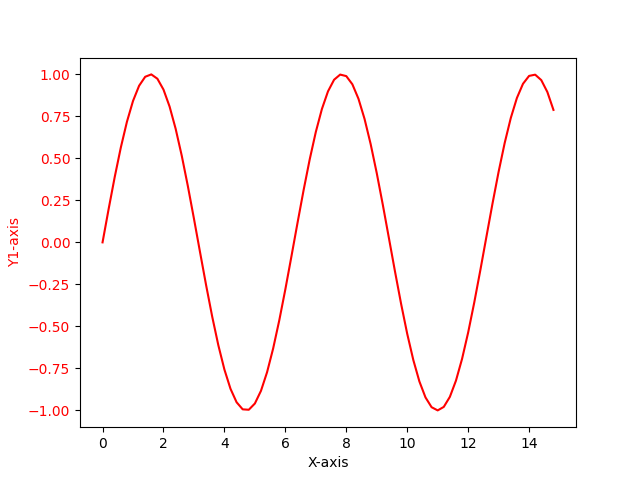
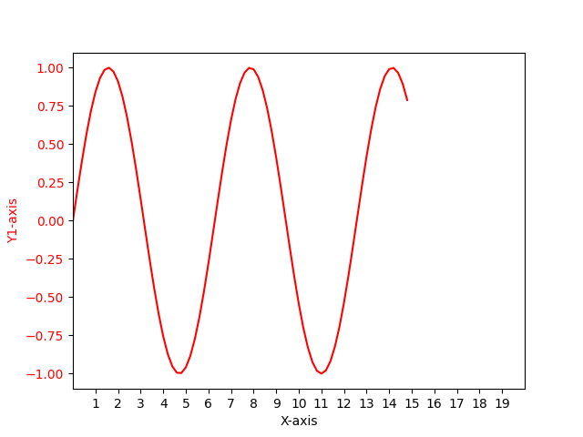

# 指定轴取值范围以及显示轴刻度

## 实现

```
# Import Library

import numpy as np
import matplotlib.pyplot as plt

# Define Data

x = np.arange(0, 15, 0.2)
data_1 = np.sin(x)

# Create Plot

fig, ax1 = plt.subplots()

# ## Get current axis info
# print('xlim:', ax1.get_xlim())
# print('ylim:', ax1.get_ylim())
# print('xticks:', ax1.get_xticks())
# print('yticks:', ax1.get_yticks())
#
# ## Set axis
# xticks = np.arange(1, 20, 1)
# xlim = (0.0, 20.0)
# print('set xlim:', xlim)
# print('set xticks:', xticks)
# ax1.set_xlim(xlim)
# ax1.set_xticks(xticks)

ax1.set_xlabel('X-axis')
ax1.set_ylabel('Y1-axis', color='red')
ax1.plot(x, data_1, color='red')
ax1.tick_params(axis='y', labelcolor='red')

# Show plot

plt.show()
```

## 显示

* Before:



* After:



## 相关阅读

* [python matplotlib.axes相关属性设置（绘图方式、坐标轴、坐标刻度、文本等）](https://blog.csdn.net/weixin_44237337/article/details/116149154)