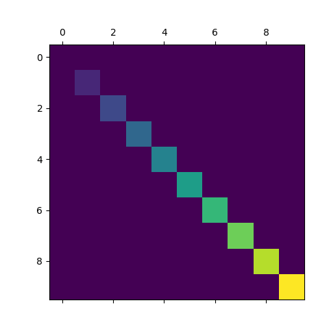

# 矩阵显示

通过图形显示矩阵信息，依据图像颜色反映矩阵各个位置上的数值大小

## 函数定义

参考：[matplotlib.pyplot.matshow](https://matplotlib.org/api/_as_gen/matplotlib.pyplot.matshow.html?highlight=matshow#matplotlib.pyplot.matshow)

```
matplotlib.pyplot.matshow(A, fignum=None, **kwargs)
```

* 参数`A`表示将要图形化的数组
* 参数`fignum`指定图形窗口
  * 默认为`None`，表示新建一个窗口进行绘制
  * 如果为非零整数，那么将绘制到该窗口（如果不存在则新建）
  * 如果为`0`，那么使用当前窗口（如果不存在则新建）

## 示例

参考：[Matshow](https://matplotlib.org/gallery/images_contours_and_fields/matshow.html#sphx-glr-gallery-images-contours-and-fields-matshow-py)

```
import matplotlib.pyplot as plt
import numpy as np
import warnings

warnings.filterwarnings("ignore")

def samplemat(dims):
    """Make a matrix with all zeros and increasing elements on the diagonal"""
    aa = np.zeros(dims)
    for i in range(min(dims)):
        aa[i, i] = i
    return aa


ma = samplemat((10, 10))
print(ma)
# Display matrix
plt.matshow(ma)
plt.show()
```

输出矩阵信息：

```
[[0. 0. 0. 0. 0. 0. 0. 0. 0. 0.]
 [0. 1. 0. 0. 0. 0. 0. 0. 0. 0.]
 [0. 0. 2. 0. 0. 0. 0. 0. 0. 0.]
 [0. 0. 0. 3. 0. 0. 0. 0. 0. 0.]
 [0. 0. 0. 0. 4. 0. 0. 0. 0. 0.]
 [0. 0. 0. 0. 0. 5. 0. 0. 0. 0.]
 [0. 0. 0. 0. 0. 0. 6. 0. 0. 0.]
 [0. 0. 0. 0. 0. 0. 0. 7. 0. 0.]
 [0. 0. 0. 0. 0. 0. 0. 0. 8. 0.]
 [0. 0. 0. 0. 0. 0. 0. 0. 0. 9.]]
```

