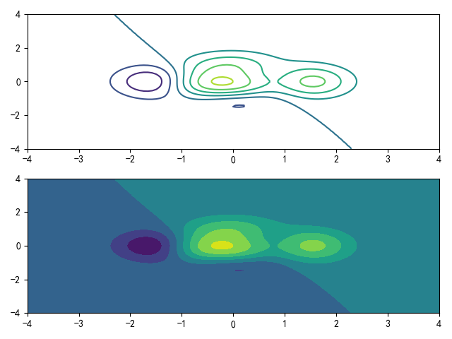
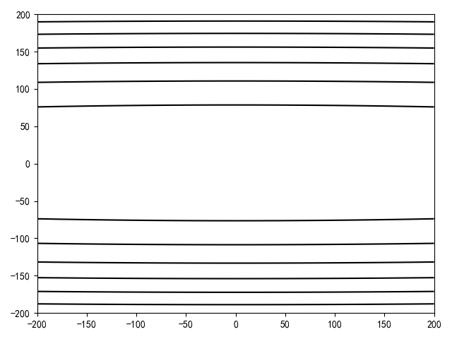
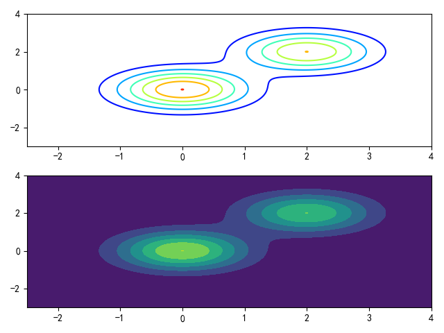
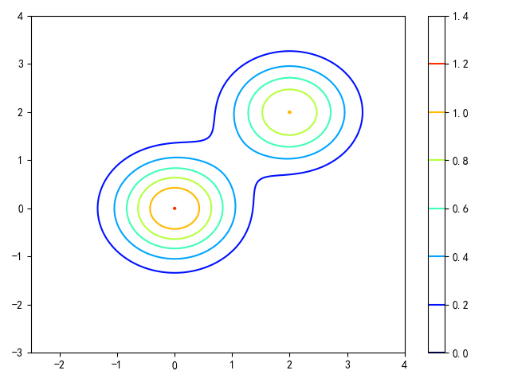
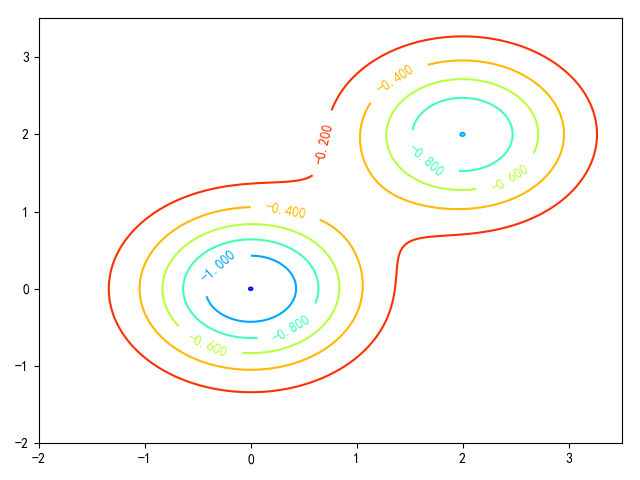

# 等高线图

## 相关函数

* [matplotlib.pyplot.contour](https://matplotlib.org/api/_as_gen/matplotlib.pyplot.contour.html#matplotlib.pyplot.contour)
* [matplotlib.pyplot.contourf](https://matplotlib.org/api/_as_gen/matplotlib.pyplot.contourf.html#matplotlib.pyplot.contourf)

## contour vs contourf

`contour`和`contourf`都用于绘制等高线图，区别在于`contour`绘制等高线，`contourf`填充等高区域，同一版本的两个函数使用相同的参数列表和返回值

> contour([X, Y,] Z, [levels], **kwargs)

* `X/Y`是等高线值`Z`的坐标
    * 如果`X/Y`是`2-D`大小，必须和Z一致
    * 如果`X/Y`是`1-D`大小，那么`len(X)==M`表示`Z`的列数，`len(Y)==N`表示`Z`的行数
    * 如果`X/Y`未给定，初始化为整数下标（`integer indices`），比如，`X=range(M),Y=range(N)`
* `Z`是等高线值，大小为`(N, M)`
* `levels`是可选参数，它确定轮廓线/区域的数量和位置
    * 如果给定为整数`n`，那么绘制`n+1`条轮廓线，轮廓线表示的高度是自动选定的
    * 如果是数组，绘制轮廓线在指定的识别。数组值必须是增序
* `colors`是可选参数，指定等高线颜色，比如`colors='black'`
* `cmap`是可选参数，指定颜色图，比如`cmap=mpl.cm.jet`

`contour/contourf`函数返回的是一个颜色标记对象[QuadContourSet](https://matplotlib.org/api/contour_api.html#matplotlib.contour.QuadContourSet)

* 输入到函数[matplotlib.pyplot.colorbar](https://matplotlib.org/api/_as_gen/matplotlib.pyplot.colorbar.html#matplotlib.pyplot.colorbar)绘制颜色条
* 输入到函数[matplotlib.pyplot.clabel](https://matplotlib.org/api/_as_gen/matplotlib.pyplot.clabel.html?highlight=clabel#matplotlib.pyplot.clabel)绘制等高线值


## 网格坐标

可使用函数[numpy.meshgrid](https://docs.scipy.org/doc/numpy/reference/generated/numpy.meshgrid.html#numpy.meshgrid)扩展`1-D`坐标值为`2-D`网格

```
>>> a = np.arange(3)
>>> a
array([0, 1, 2])
>>> b = np.arange(5,9)
>>> b
array([5, 6, 7, 8])

>>> c,d = np.meshgrid(a,b)
>>> c
array([[0, 1, 2],
       [0, 1, 2],
       [0, 1, 2],
       [0, 1, 2]])
>>> d
array([[5, 5, 5],
       [6, 6, 6],
       [7, 7, 7],
       [8, 8, 8]])
```

其作用是将行坐标向量向列扩展，列坐标向量向行扩展

## 绘制等高线图

参考[matplotlib的基本用法(九)——绘制等高线图](https://blog.csdn.net/Quincuntial/article/details/71104405)实现多个局部最高点

```
import numpy as np
import matplotlib.pyplot as plt


def height(x, y):
    return (1 - x / 2 + x ** 5 + y ** 3) * np.exp(- x ** 2 - y ** 2)

if __name__ == '__main__':
    x = np.linspace(-4, 4, 100)
    y = np.linspace(-4, 4, 100)

    X, Y = np.meshgrid(x, y)
    Z = height(X, Y)

    plt.figure(1)
    plt.subplot(211)
    plt.contour(X, Y, Z)
    plt.subplot(212)
    plt.contourf(X, Y, Z)
    plt.show()
```



参考[路遥知马力——Momentum](https://zhuanlan.zhihu.com/p/21486826)实现

```
import numpy as np
import matplotlib.pyplot as plt


def height(x, y):
    return x ** 2 + 100 * (y - 1) ** 2

if __name__ == '__main__':
    x = np.linspace(-200, 200, 1000)
    y = np.linspace(-200, 200, 1000)

    X, Y = np.meshgrid(x, y)
    Z = height(X, Y)

    plt.figure(1)
    plt.contour(X, Y, Z, colors='black')

    plt.show()
```



参考[【python碎碎念】如何画等高线](https://zhuanlan.zhihu.com/p/51979981)实现双峰等高线

```
import numpy as np
import matplotlib.pyplot as plt
import matplotlib as mpl

def height(x, y):
    return np.exp(-(x - 2) ** 2 - (y - 2) ** 2) + 1.2 * np.exp(-x ** 2 - y ** 2)

if __name__ == '__main__':
    x = np.linspace(-2.5, 4, 1000)
    y = np.linspace(-3, 4, 1000)

    X, Y = np.meshgrid(x, y)
    Z = height(X, Y)

    plt.figure(1)
    plt.subplot(211)
    plt.contour(X, Y, Z, cmap=mpl.cm.jet)
    plt.subplot(212)
    plt.contourf(X, Y, Z)

    plt.show()
```



绘制颜色条

```
import numpy as np
import matplotlib.pyplot as plt
import matplotlib as mpl

def height(x, y):
    return np.exp(-(x - 2) ** 2 - (y - 2) ** 2) + 1.2 * np.exp(-x ** 2 - y ** 2)


if __name__ == '__main__':
    x = np.linspace(-2.5, 4, 1000)
    y = np.linspace(-3, 4, 1000)

    X, Y = np.meshgrid(x, y)
    Z = height(X, Y)

    plt.figure(1)
    C = plt.contour(X, Y, Z, cmap=mpl.cm.jet)
    plt.colorbar(C)

    plt.show()
```



绘制等高线值

```
import numpy as np
import matplotlib.pyplot as plt
import matplotlib as mpl

def height(x, y):
    res = np.exp(-(x - 2) ** 2 - (y - 2) ** 2) + 1.2 * np.exp(-x ** 2 - y ** 2)
    return -1 * res


if __name__ == '__main__':
    x = np.linspace(-2, 3.5, 1000)
    y = np.linspace(-2, 3.5, 1000)

    X, Y = np.meshgrid(x, y)
    Z = height(X, Y)

    plt.figure(1)
    C = plt.contour(X, Y, Z, cmap=mpl.cm.jet)
    plt.clabel(C)

    plt.show()
```

