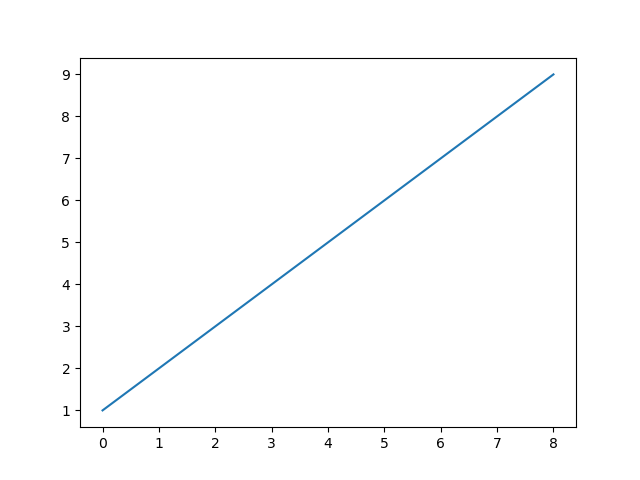
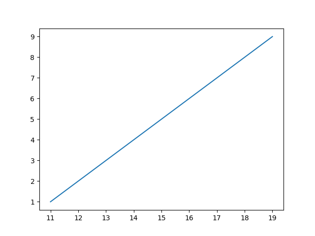
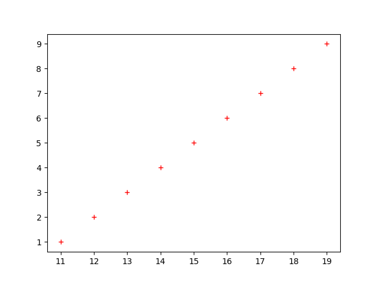
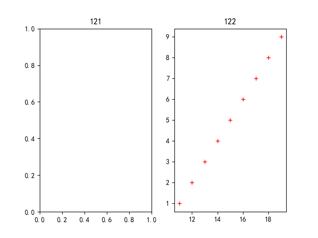
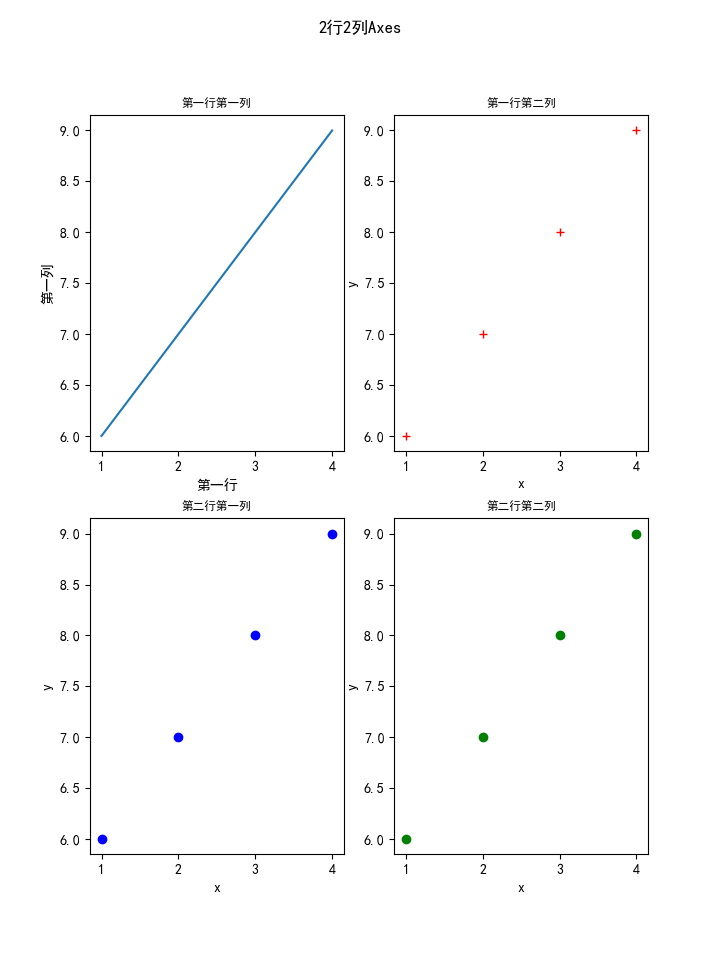

# 绘图关键概念Figure和Axes

解析绘图重要概念：`Figure、Axes`

## `Figure`

`Figure`指的是整张图，绘图操作都在其上进行

程序中可以创建多张图，但是每次图形操作仅针对单张图进行

常用函数：

1. `figure`
2. `suptitle`

### `figure`

调用函数[matplotlib.pyplot.figure](https://matplotlib.org/api/_as_gen/matplotlib.pyplot.figure.html?highlight=figure#matplotlib-pyplot-figure)能够创建一张图

```
matplotlib.pyplot.figure(num=None, figsize=None, dpi=None, facecolor=None, edgecolor=None, frameon=True, FigureClass=<class 'matplotlib.figure.Figure'>, clear=False, **kwargs)[source]
```

关键参数是`num`，默认为空，每次调用`figure`递增图像数字，用以区分创建的不同图形；输入指定数字，如果已存在，则返回已创建的图形，否则，新建一个图形

**注意：如果调用`figure`创建了很多图形，退出之前显式调用`pyplot.close()`，以便`pyplot`能够正确清理内存**

#### 调整大小

设置参数`figsize`来调整大小，默认大小为`640x480`，参考`rcParams["figure.figsize"] = [6.4, 4.8]`

设置图像为`600x800`

```
fig = plt.figure(figsize=(6, 8))
```

#### 保存图形

使用函数[matplotlib.pyplot.savefig](https://matplotlib.org/api/_as_gen/matplotlib.pyplot.savefig.html?highlight=savefig#matplotlib-pyplot-savefig)保存当前`Figure`

```
plt.savefig('xxx.png')
```

使用参数`bbox_inches='tight'`能够在保存图像时减少四周的空白区域

#### 显示图形

使用函数[matplotlib.pyplot.show](https://matplotlib.org/api/_as_gen/matplotlib.pyplot.show.html?highlight=show#matplotlib-pyplot-show)显示`Figure`

```
plt.show()
```

### `suptitle`

调用[matplotlib.pyplot.suptitle](https://matplotlib.org/api/_as_gen/matplotlib.pyplot.suptitle.html?highlight=suptitle#matplotlib-pyplot-suptitle)为一张图形添加居中标题

### 示例代码

创建一张图并添加标题

```
fig = plt.figure(1)
fig.suptitle("hello plt")
fig.show()
```

## `Axes`

`Axes`指的是绘图区域（或者称之为子图），绘图操作是在`Axes`上完成的，可以在`Figure`上实现多个`Axes`

一个`Axes`包含两个（在`3D`中包含三个）`Axis`(轴)对象，可以设置标题、`x`轴标签、`y`轴标签

常用函数：

1. `plot`
2. `subplot`
3. `title/xlabel/ylabel`

### `plot`

函数[matplotlib.pyplot.plot](https://matplotlib.org/api/_as_gen/matplotlib.pyplot.plot.html?highlight=plot#matplotlib-pyplot-plot)能够在当前`Axes`上绘制线段或者标记

```
matplotlib.pyplot.plot(*args, scalex=True, scaley=True, data=None, **kwargs)
```

输入一个列表，表示仅输入`y`轴坐标，输入`y`轴坐标就能够自动生成相应长度的`x`轴坐标

```
y = list(range(1, 10))
plt.plot(y)
plt.show()
```



**注意：`x`轴长度和`y`轴相同，但是从`0`开始计数**

输入两个列表，表示输入`x`轴和`y`轴坐标，注意：两个列表的长度应该相同

```
x = list(range(11, 20))
y = list(range(1, 10))
plt.plot(x, y)
plt.savefig("plot-x-y.png")
plt.show()
```



还可以绘制标记点而不是线段

```
x = list(range(11, 20))
y = list(range(1, 10))

plt.subplot(121)
plt.title('121')

plt.subplot(122) # 1行，2列，第二个
plt.title('122')
plt.plot(x, y, 'r+')

plt.savefig("subplot-1-2-2.png")
plt.show()
```



### `subplot`

函数[matplotlib.pyplot.subplot](https://matplotlib.org/api/_as_gen/matplotlib.pyplot.subplot.html?highlight=subplot#matplotlib.pyplot.subplot)能够指定当前`Figure`上要绘制的`Axes`列表，以及接下来要绘制的`Axes`位置

```
matplotlib.pyplot.subplot(*args, **kwargs)
```

比如指定当前`Figure`有`1`行`2`列共`2`个`Axes`，指定接下来要绘制的是第二个

```
x = list(range(11, 20))
y = list(range(1, 10))
# plt.plot(y)
plt.subplot(122) # 1行，2列，第二个
plt.plot(x, y, 'r+')
plt.savefig("subplot-1-2-2.png")
plt.show()
```



还可以分开表示`Axes`在`Figure`中的行数/列数和指定当前`Axes`

```
subplot(nrows, ncols, index, **kwargs)
subplot(pos, **kwargs)
```

### title/xlabel/ylabel

能够为每个`Axes`设置标签，`x`轴标签和`y`轴标签

#### 设置标题大小

默认为`large`（大小为`12``），参考rcParams['axes.titlesize']`

可以直接设置数值，也可以使用关键字

>['xx-small', 'x-small', 'small', 'medium', 'large','x-large', 'xx-large']

设置如下：

```
fontdict = {'fontsize': 'small'}
plt.title('xxx', fontdict)
```

### 示例程序

实现一个`2`行`2`列子图的图形

```
fig = plt.figure(figsize=(7.2, 9.6))

fontdict = {'fontsize': 'small'}

x = list(range(1, 5))
y = list(range(6, 10))

plt.subplot(221)  # 第一行第一列
plt.plot(x, y)
plt.title('第一行第一列', fontdict)
plt.xlabel('第一行')
plt.ylabel('第一列')

plt.subplot(222)  # 第一行第二列
plt.plot(x, y, 'r+')
plt.title('第一行第二列', fontdict)
plt.xlabel('x')
plt.ylabel('y')

plt.subplot(223)  # 第二行第一列
plt.plot(x, y, 'bo')
plt.title('第二行第一列', fontdict)
plt.xlabel('x')
plt.ylabel('y')

plt.subplot(224)  # 第二行第二列
plt.plot(x, y, 'go')
plt.title('第二行第二列', fontdict)
plt.xlabel('x')
plt.ylabel('y')

plt.suptitle('2行2列Axes')
plt.savefig('axes-2-2.png')
plt.show()
```



## 相关阅读

* [Parts of a Figure](https://matplotlib.org/tutorials/introductory/usage.html#parts-of-a-figure)
* [matplotlib.pyplot.title](https://matplotlib.org/api/_as_gen/matplotlib.pyplot.title.html?highlight=title#matplotlib-pyplot-title)
* [matplotlib.pyplot.xlabel](https://matplotlib.org/api/_as_gen/matplotlib.pyplot.xlabel.html?highlight=xlabel#matplotlib-pyplot-xlabel)
* [matplotlib.pyplot.ylabel](https://matplotlib.org/api/_as_gen/matplotlib.pyplot.ylabel.html?highlight=ylabel#matplotlib-pyplot-ylabel)
* [matplotlib命令与格式：标题(title),标注(annotate),文字说明(text)](https://blog.csdn.net/helunqu2017/article/details/78659490)