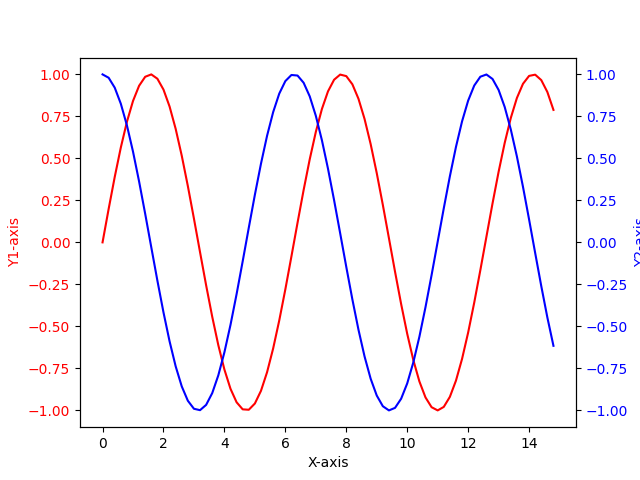

# 设置双Y轴

## 实现

```
# Import Library

import numpy as np
import matplotlib.pyplot as plt

# Define Data

x = np.arange(0, 15, 0.2)
data_1 = np.sin(x)
data_2 = np.cos(x)

# Create Plot

fig, ax1 = plt.subplots()

ax1.set_xlabel('X-axis')
ax1.set_ylabel('Y1-axis', color='red')
ax1.plot(x, data_1, color='red')
ax1.tick_params(axis='y', labelcolor='red')

# Adding Twin Axes

ax2 = ax1.twinx()

ax2.set_ylabel('Y2-axis', color='blue')
ax2.plot(x, data_2, color='blue')
ax2.tick_params(axis='y', labelcolor='blue')

# Show plot

plt.show()
```

## 显示



## 相关阅读

* [Matplotlib two y axes](https://pythonguides.com/matplotlib-two-y-axes/)
* [python matplotlib.axes相关属性设置（绘图方式、坐标轴、坐标刻度、文本等）](https://blog.csdn.net/weixin_44237337/article/details/116149154)