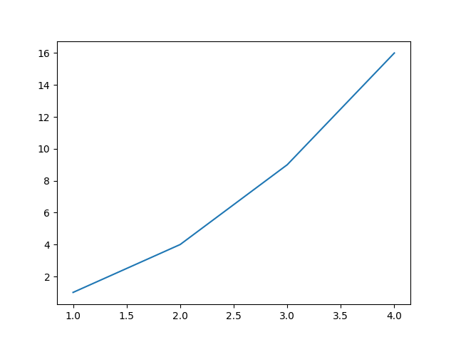

# [译]Pyplot教程

原文地址：[pyplot-tutorial](https://matplotlib.org/tutorials/introductory/pyplot.html#pyplot-tutorial)

## `Pyplot`介绍

[matplotlib.pyplot](https://matplotlib.org/api/_as_gen/matplotlib.pyplot.html#module-matplotlib.pyplot)是命令样式函数的集合，目的是让`matplotlib`像`MATLAB`一样工作。每个`pyplot`函数都对图像做一些改变：比如，创建一张图像、在图形中创建绘图区域、在绘图区域中绘制一些线条、用标签装饰绘图，等等

在`matplotlib.pyplot`中，不同的状态在函数调用之间被保留，这样它就可以跟踪当前图形和绘图区域，并且绘图功能被定向到当前轴（请注意，这里的“轴”以及文档中大多数地方指的是绘图区域，参考下图，而不是严格意义上的数学术语）


*注意：`Pyplot API`通常不如面向对象的`API`灵活。您在这里看到的大多数函数调用也可以作为来自`axes`对象的方法调用。我们建议浏览教程和示例，以了解这是如何工作的*

使用pyplot生成可视化非常便捷

```
import matplotlib.pyplot as plt
plt.plot([1, 2, 3, 4])
plt.ylabel('some numbers')
plt.show()
```


你肯定想知道为什么`x`轴取值为`0-3`而`y`轴取值为`1-4`。如果你输入单个列表或者数组到命令`plot()`，`matplotlib`假定它是`y`轴的序列值，同时自动生成`x`轴值。因为`python`从`0`开始，生成的`x`轴向量和`y`轴向量长度相同，但是从`0`开始。因此`x`轴数据是`[0,1,2,3]`

`plot()`是一个通用的命令，可以接受任意数量的参数。例如，要绘制`x`与`y`，可以发出以下命令：

```
plt.plot([1, 2, 3, 4], [1, 4, 9, 16])
```



## 格式化绘图样式

对于每对`x，y`参数，都有一个可选的第三个参数，它是指示绘图颜色和线条类型的格式字符串。格式字符串的字母和符号来自`matlab`，你可以将颜色字符串与线样式字符串连接起来。默认的格式字符串是
`b-`，表示一条实心蓝线。比如，用红色圆圈绘图，可以输入`ro`

```
plt.plot([1, 2, 3, 4], [1, 4, 9, 16], 'ro')
plt.axis([0, 6, 0, 20])
plt.show()
```


查看[matplotlib.pyplot.plot](https://matplotlib.org/api/_as_gen/matplotlib.pyplot.plot.html#matplotlib.pyplot.plot)文档关于完整的线类型和格式字符串的列表。上面的`axis()`命令输入一组`[xmin, xmax, ymin, ymax]`，同时指定轴的视区

如果`matplotlib`仅限于使用列表，那么它对于数字处理将相当无用。通常，您将使用`numpy`数组。实际上，所有序列都在内部转换为`numpy`数组。下面的示例说明如何使用数组在一个命令中绘制具有不同格式样式的多条线

```
import numpy as np

# evenly sampled time at 200ms intervals
t = np.arange(0., 5., 0.2)

# red dashes, blue squares and green triangles
plt.plot(t, t, 'r--', t, t**2, 'bs', t, t**3, 'g^')
plt.show()
```


## 使用关键字字符串绘图

某些情况下允许您使用字符串访问特定变量。比如[numpy.recarray](https://docs.scipy.org/doc/numpy/reference/generated/numpy.recarray.html#numpy.recarray)或者[pandas.DataFrame](https://pandas.pydata.org/pandas-docs/stable/reference/api/pandas.DataFrame.html#pandas.DataFrame)

`matplotlib`允许您为此类对象提供`data`关键字参数。如果提供，则可以使用与这些变量对应的字符串生成绘图

```
data = {'a': np.arange(50),
        'c': np.random.randint(0, 50, 50),
        'd': np.random.randn(50)}
data['b'] = data['a'] + 10 * np.random.randn(50)
data['d'] = np.abs(data['d']) * 100

plt.scatter('a', 'b', c='c', s='d', data=data)
plt.xlabel('entry a')
plt.ylabel('entry b')
plt.show()
```


## 使用分类变量绘图

也可以使用分类变量创建一个图。`Matplotlib`允许您将分类变量直接传递给许多绘图函数。例如：

```
names = ['group_a', 'group_b', 'group_c']
values = [1, 10, 100]

plt.figure(1, figsize=(9, 3))

plt.subplot(131)
plt.bar(names, values)
plt.subplot(132)
plt.scatter(names, values)
plt.subplot(133)
plt.plot(names, values)
plt.suptitle('Categorical Plotting')
plt.show()
```


## 控制线条属性

线条具有许多可以设置的属性：线条宽度、虚线样式、抗锯齿等；参见[matplotlib.lines.line2D](https://matplotlib.org/api/_as_gen/matplotlib.lines.Line2D.html#matplotlib.lines.Line2D)。有几种设置线条属性的方法

* 使用关键字参数

```
plt.plot(x, y, linewidth=2.0)
```

* 使用`Line2D`实例的`setter`方法。`plot`返回一列`Line2D`对象，比如`line1, line2 = plot(x1, y1, x2, y2)`。在下面的代码中，我们假设只有一行，因此返回的列表长度为`1`。我们使用元组解压的方式来获取该列表的第一个元素：

```
line, = plt.plot(x, y, '-')
line.set_antialiased(False) # turn off antialising
```

* 使用[setp()](https://matplotlib.org/api/_as_gen/matplotlib.pyplot.setp.html#matplotlib.pyplot.setp)属性。下面示例使用`matlab`样式的命令在一个行列表上设置多个属性。`setp`透明地处理对象列表或单个对象。您可以使用`python`关键字参数或`matlab`样式的字符串/值对：

```
lines = plt.plot(x1, y1, x2, y2)
# use keyword args
plt.setp(lines, color='r', linewidth=2.0)
# or MATLAB style string value pairs
plt.setp(lines, 'color', 'r', 'linewidth', 2.0)
```

以下是有效的[Line2D](https://matplotlib.org/api/_as_gen/matplotlib.lines.Line2D.html#matplotlib.lines.Line2D)属性


要获取可设置行属性的列表，请使用`line`或`lines`作为参数调用`setp()`函数

```
>>> import matplotlib.pyplot as plt
>>> lines = plt.plot([1, 2, 3])
>>> plt.setp(lines)
  agg_filter: a filter function, which takes a (m, n, 3) float array and a dpi value, and returns a (m, n, 3) array 
  alpha: float
  animated: bool
  ...
  ...
```

## 使用多个图形和轴

`matlab`和[pyplot](https://matplotlib.org/api/_as_gen/matplotlib.pyplot.html#module-matplotlib.pyplot)都有当前图形和当前轴的概念。所有绘图命令都应用于当前轴。函数[gca()](https://matplotlib.org/api/_as_gen/matplotlib.pyplot.gca.html#matplotlib.pyplot.gca)返回当前轴（[matplotlib.axes.Axes](https://matplotlib.org/api/axes_api.html#matplotlib.axes.Axes)实例），[gcf()](https://matplotlib.org/api/_as_gen/matplotlib.pyplot.gcf.html#matplotlib.pyplot.gcf)返回当前图形（[matplotlib.figure.figure](https://matplotlib.org/api/_as_gen/matplotlib.figure.Figure.html#matplotlib.figure.Figure)实例）。通常情况下，你不必担心这件事，因为它都是在幕后处理的。下面是创建两个子图的脚本

```
def f(t):
    return np.exp(-t) * np.cos(2*np.pi*t)

t1 = np.arange(0.0, 5.0, 0.1)
t2 = np.arange(0.0, 5.0, 0.02)

plt.figure(1)
plt.subplot(211)
plt.plot(t1, f(t1), 'bo', t2, f(t2), 'k')

plt.subplot(212)
plt.plot(t2, np.cos(2*np.pi*t2), 'r--')
plt.show()
```


这里的[figure()](https://matplotlib.org/api/_as_gen/matplotlib.pyplot.figure.html#matplotlib.pyplot.figure)命令是可选的，因为默认情况下将创建`figure(1)`，正如如果不手动指定任何轴，默认情况下将创建`subplot(111)`。[subplot()](https://matplotlib.org/api/_as_gen/matplotlib.pyplot.subplot.html#matplotlib.pyplot.subplot)命令指定了数字行(`numrows`)、数字列(`numcols`)、绘图编号(`plot_number`)，其中绘图编号的取值范围是`[1, numrows*numcols]`。如果`numrows*numcols<10`，那么`subplot`命令中可以不使用逗号（`comma`）隔开，所以`subplot(211)`等同于`subplot(2, 1, 1)`

你可以创建任意数量的子图和轴。如果你想要手动放置一个轴，比如，不是常规的网格，使用`axes()`命令，该命令允许您将位置指定为`axes`([左、下、宽、高])，其中所有值都以分数（`0`到`1`）坐标表示。参考一个手动放置实例[Axes Demo](https://matplotlib.org/gallery/subplots_axes_and_figures/axes_demo.html)以及一个放置许多子图的实例[Basic Subplot Demo](https://matplotlib.org/gallery/subplots_axes_and_figures/subplot_demo.html)

可以使用带有递增数字的多个`figure()`调用来创建多个图像。当然，每个图形可以包含尽可能多的轴和子图：

```
import matplotlib.pyplot as plt
plt.figure(1)                # the first figure
plt.subplot(211)             # the first subplot in the first figure
plt.plot([1, 2, 3])
plt.subplot(212)             # the second subplot in the first figure
plt.plot([4, 5, 6])


plt.figure(2)                # a second figure
plt.plot([4, 5, 6])          # creates a subplot(111) by default

plt.figure(3)                # figure 1 current; subplot(212) still current
plt.subplot(211)             # make subplot(211) in figure1 current
plt.title('Easy as 1, 2, 3') # subplot 211 title

plt.show()
```


使用命令`clf()`可以清理当前图像，使用命令`cla()`清理当前轴。如果你觉得在幕后维护状态（特别是当前图像、图形和轴）很烦人，不要失望：这只是围绕面向对象`API`的一个薄的有状态包装器，您可以使用其他来代替（请参见[艺术家教程](https://matplotlib.org/tutorials/intermediate/artists.html)）

## 文本工作

[text()](https://matplotlib.org/api/_as_gen/matplotlib.pyplot.text.html#matplotlib.pyplot.text)命令可用于在任意位置添加文本，[xlable()](https://matplotlib.org/api/_as_gen/matplotlib.pyplot.xlabel.html#matplotlib.pyplot.xlabel)、[ylabel()](https://matplotlib.org/api/_as_gen/matplotlib.pyplot.ylabel.html#matplotlib.pyplot.ylabel)和[title()](https://matplotlib.org/api/_as_gen/matplotlib.pyplot.title.html#matplotlib.pyplot.title)用于在指定位置添加文本。

```
mu, sigma = 100, 15
x = mu + sigma * np.random.randn(10000)

# the histogram of the data
n, bins, patches = plt.hist(x, 50, density=1, facecolor='g', alpha=0.75)


plt.xlabel('Smarts')
plt.ylabel('Probability')
plt.title('Histogram of IQ')
plt.text(60, .025, r'$\mu=100,\ \sigma=15$')
plt.axis([40, 160, 0, 0.03])
plt.grid(True)
plt.show()
```


所有的[text()](https://matplotlib.org/api/_as_gen/matplotlib.pyplot.text.html#matplotlib.pyplot.text)命令都返回[matplotlib.text.text](https://matplotlib.org/api/text_api.html#matplotlib.text.Text)实例。与上面的行一样，可以通过将关键字参数传递到文本函数或使用[setp()](https://matplotlib.org/api/_as_gen/matplotlib.pyplot.setp.html#matplotlib.pyplot.setp)自定义属性：

```
t = plt.xlabel('my data', fontsize=14, color='red')
```

更多详细属性在[Text properties and layout](https://matplotlib.org/tutorials/text/text_props.html)

## 在文本中使用数学表达式

`matplotlib`接受任何文本表达式中的`tex`表达式。比如在标题中写入`$\sigma_{i}=15$`，可以写一个`TeX`表达式，用`$`符号括起来：

```
plt.title(r'$\sigma_i=15$')
```

标题字符串前面的`r`很重要——它表示该字符串是原始字符串，而不是将反斜杠视为`python`转义。`matplotlib`有一个内置的`tex`表达式解析器和布局引擎，并提供自己的数学字体——有关详细信息，请参阅[Writing mathematical expressions](https://matplotlib.org/tutorials/text/mathtext.html)。因此，您可以跨平台使用数学文本，而无需安装`tex`。对于安装了`LaTex`和`Dvipng`的用户，还可以使用`LaTex`来格式化文本，并将输出直接合并到显示图形或保存的`PostScript`中，参考[Text rendering With LaTeX](https://matplotlib.org/tutorials/text/usetex.html)

## 注解文本

上面使用的基础[text()](https://matplotlib.org/api/_as_gen/matplotlib.pyplot.text.html#matplotlib.pyplot.text)命令将文本放置在轴上的任意位置。文本的一个常见用途是注释绘图的某些特征。[annotate()](https://matplotlib.org/api/_as_gen/matplotlib.pyplot.annotate.html#matplotlib.pyplot.annotate)方法提供了帮助器功能，使注释变得容易。在注释中，需要考虑两点：由参数`xy`表示的注释位置和文本`xytext`的位置。这两个参数都是`(x，y)`元组格式。

```
ax = plt.subplot(111)

t = np.arange(0.0, 5.0, 0.01)
s = np.cos(2*np.pi*t)
line, = plt.plot(t, s, lw=2)

plt.annotate('local max', xy=(2, 1), xytext=(3, 1.5),
             arrowprops=dict(facecolor='black', shrink=0.05),
             )

plt.ylim(-2, 2)
plt.show()
```


在这个基本示例中，`xy`（箭头尖端）和`xytext`位置（文本位置）都在数据坐标中。您可以选择其他各种坐标系——有关详细信息，请参见[基本注释](https://matplotlib.org/tutorials/text/annotations.html#annotations-tutorial)和[高级注释](https://matplotlib.org/tutorials/text/annotations.html#plotting-guide-annotation)。更多的例子可以在[注释图](https://matplotlib.org/gallery/text_labels_and_annotations/annotation_demo.html)中找到

## 对数轴和其他非线性轴

[pyplot](https://matplotlib.org/api/_as_gen/matplotlib.pyplot.html#module-matplotlib.pyplot)不仅支持线性轴比例，还支持对数和逻辑比例。如果数据跨越多个数量级，则通常使用这种方法。更改轴的比例很容易：

```
plt.xscale('log')
```

下面是四个具有相同数据和不同比例的`Y`轴绘图的示例

```
from matplotlib.ticker import NullFormatter  # useful for `logit` scale

# Fixing random state for reproducibility
np.random.seed(19680801)

# make up some data in the interval ]0, 1[
y = np.random.normal(loc=0.5, scale=0.4, size=1000)
y = y[(y > 0) & (y < 1)]
y.sort()
x = np.arange(len(y))

# plot with various axes scales
plt.figure(1)

# linear
plt.subplot(221)
plt.plot(x, y)
plt.yscale('linear')
plt.title('linear')
plt.grid(True)


# log
plt.subplot(222)
plt.plot(x, y)
plt.yscale('log')
plt.title('log')
plt.grid(True)


# symmetric log
plt.subplot(223)
plt.plot(x, y - y.mean())
plt.yscale('symlog', linthreshy=0.01)
plt.title('symlog')
plt.grid(True)

# logit
plt.subplot(224)
plt.plot(x, y)
plt.yscale('logit')
plt.title('logit')
plt.grid(True)
# Format the minor tick labels of the y-axis into empty strings with
# `NullFormatter`, to avoid cumbering the axis with too many labels.
plt.gca().yaxis.set_minor_formatter(NullFormatter())
# Adjust the subplot layout, because the logit one may take more space
# than usual, due to y-tick labels like "1 - 10^{-3}"
plt.subplots_adjust(top=0.92, bottom=0.08, left=0.10, right=0.95, hspace=0.25,
                    wspace=0.35)

plt.show()
```


也可以添加自己的比例，有关详细信息，请参阅[Developer's guide for creating scales and transformations](https://matplotlib.org/devel/add_new_projection.html#adding-new-scales)

下载`Python`源码：[pyplot.py](https://matplotlib.org/_downloads/1c90e776d7b59df446c3848b11c0dc82/pyplot.py)

下载`Jupyter notebook`：[pyplot.ipynb](https://matplotlib.org/_downloads/f1604025de358a438d71d7c524752d11/pyplot.ipynb)