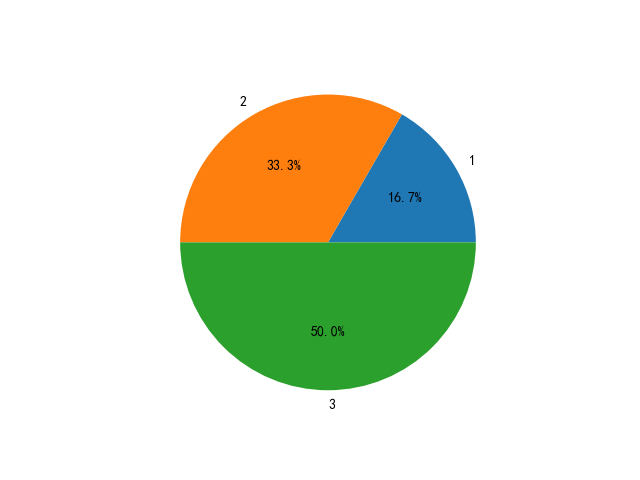
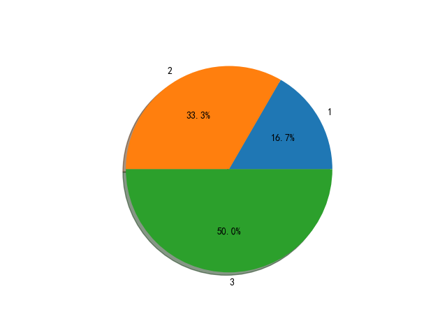
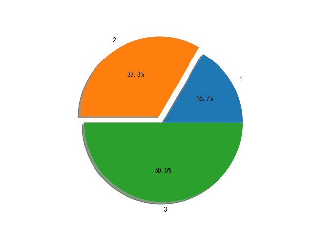

# 饼图

使用函数[matplotlib.pyplot.pie](https://matplotlib.org/api/_as_gen/matplotlib.pyplot.pie.html?highlight=pie#matplotlib.pyplot.pie)进行饼图的绘制

```
matplotlib.pyplot.pie(x, explode=None, labels=None, colors=None, autopct=None, pctdistance=0.6, shadow=False, labeldistance=1.1, startangle=None, radius=None, counterclock=True, wedgeprops=None, textprops=None, center=(0, 0), frame=False, rotatelabels=False, *, data=None)
```

* 必选参数`x`是一个标量数组，表示生成饼图的楔子(`wedge`)个数和分数(`fractional`)比例，其中分数比例通过`x/sum(x)`计算得出。如果`sum(x)<1`，那么饼图会有一部分（`1-sum(x)`）面积空白

* 可选参数`explode`是一个标量数组，长度和楔子数组`x`相同，表示楔子分离距离

* 可选参数`labels`是一个字符列表，长度和`x`相同，提供每个楔子的标签

* 可选参数`autopct`可输入字符串或函数，用于标记每个楔子的数值大小，显示在楔子内部

* 可选参数`shadow`用于绘制饼图阴影

* 可选参数`startangle`决定启动绘制的角度。注意：*从`x`轴正方向沿着逆时针开始*

**默认绘制饼图从`x`轴开始，逆时针(`counterclockwise`)方向绘制**

**确保饼图绘制为圆形，使用等高比例`plt.axis('equal')`**

## 绘制饼图

完整饼图

```
# -*- coding: utf-8 -*-

"""
饼图（pie chart）
"""

import matplotlib.pyplot as plt

x = [1, 2, 3]

plt.pie(x)

plt.savefig('pie-1.png')
plt.show()
```


不完整饼图

```
# -*- coding: utf-8 -*-

"""
饼图（pie chart）
"""

import matplotlib.pyplot as plt

x = [0.1, 0.2, 0.3]

plt.pie(x)

plt.savefig('pie-2.png')
plt.show()
```


## 提供标签

```
# -*- coding: utf-8 -*-

"""
饼图（pie chart）
"""

import matplotlib.pyplot as plt

x = [1, 2, 3]
labels = ["1", "2", "3"]

plt.pie(x, labels=labels)

plt.savefig('pie-3.png')
plt.show()
```


## 显示百分比

```
# -*- coding: utf-8 -*-

"""
饼图（pie chart）
"""

import matplotlib.pyplot as plt

x = [1, 2, 3]
labels = ["1", "2", "3"]

plt.pie(x, labels=labels, autopct='%1.1f%%')

plt.savefig('pie-4.png')
plt.show()
```



## 绘制阴影

```
# -*- coding: utf-8 -*-

"""
饼图（pie chart）
"""

import matplotlib.pyplot as plt

x = [1, 2, 3]
labels = ["1", "2", "3"]

plt.pie(x, labels=labels, autopct='%1.1f%%', shadow=True)

plt.savefig('pie-5.png')
plt.show()
```



## 分离楔子

```
# -*- coding: utf-8 -*-

"""
饼图（pie chart）
"""

import matplotlib.pyplot as plt

x = [1, 2, 3]
labels = ["1", "2", "3"]
explode = [0, 0.1, 0]

plt.pie(x, explode=explode, labels=labels, autopct='%1.1f%%', shadow=True)

plt.axis('equal')
plt.savefig('pie-6.png')
plt.show()
```



## 相关阅读

* [Basic pie chart](https://matplotlib.org/gallery/pie_and_polar_charts/pie_features.html?highlight=pie%20chart#basic-pie-chart)

* [Pie Demo2](https://matplotlib.org/gallery/pie_and_polar_charts/pie_demo2.html#pie-demo2)

* [Labeling a pie and a donut](https://matplotlib.org/gallery/pie_and_polar_charts/pie_and_donut_labels.html#labeling-a-pie-and-a-donut)
