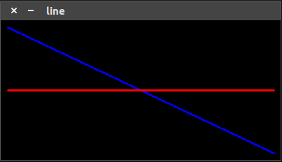

# [line]绘制线段

使用`OpenCV`函数[line](https://docs.opencv.org/4.1.0/d6/d6e/group__imgproc__draw.html#ga7078a9fae8c7e7d13d24dac2520ae4a2)绘制两点之间的线段

## 函数解析

```
CV_EXPORTS_W void line(InputOutputArray img, Point pt1, Point pt2, const Scalar& color,
                     int thickness = 1, int lineType = LINE_8, int shift = 0);
```

* `img`：绘制图像
* `pt1`：起始点
* `pt2`：终止点
* `color`：线条颜色
* `thickness`：线条粗细
* `lineType`：线条绘制类型。参考[LineTypes](https://docs.opencv.org/4.1.0/d6/d6e/group__imgproc__draw.html#gaf076ef45de481ac96e0ab3dc2c29a777)
* `shift`：点坐标中的小数位数

## 示例

```
#include <iostream>
#include <opencv2/opencv.hpp>

using namespace std;
using namespace cv;

int main() {
    int width = 400;
    int height = 200;

    // 3通道8位大小图像
    Mat src = Mat(height, width, CV_8UC3);
    cout << src.size() << endl;

    // 过中心点的斜线
    line(src, Point(10, 10), Point(390, 190), Scalar(255, 0, 0), 2);
    // 过中心点的直线
    line(src, Point(10, 100), Point(390, 100), Scalar(0, 0, 255), 2);

    imshow("line", src);
    waitKey(0);

    return 0;
}
```

新建图像`src`，大小为`200x400`，绘制两条线段

