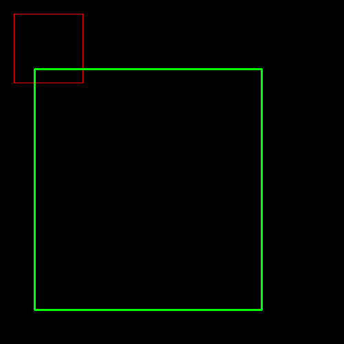

# [rectangle]绘制边框

## 定义

```
def rectangle(img, pt1, pt2, color, thickness=None, lineType=None, shift=None):
```

* `img`：图像
* `pt1`：左上角坐标点
* `pt2`：右下角坐标点
* `color`：颜色
* `thickness`：线条粗细程度
* `lineType`：线条类型，参考[LineTypes](https://docs.opencv.org/4.1.0/d6/d6e/group__imgproc__draw.html#gaf076ef45de481ac96e0ab3dc2c29a777)

**Note：在输入图像上进行边框绘制**

## 示例

```
import cv2
import numpy as np

if __name__ == '__main__':
    # 创建空白3通道图像
    img = np.ones((500, 500, 3)) * 255

    cv2.rectangle(img, (20, 20), (120, 120), (0, 0, 255), thickness=1)
    cv2.rectangle(img, (50, 100), (380, 450), (0, 255, 0), thickness=2)

    cv2.imshow('img', img)
    cv2.waitKey(0)
```



## 相关阅读

* [opencv 绘图 cvLine cvRectangle cvCircle cvEllipse cvEllipseBox cvFillPoly cvConvexPoly cvPolyLine](https://blog.csdn.net/u012005313/article/details/46802565)

* [ rectangle() ](https://docs.opencv.org/4.1.0/d6/d6e/group__imgproc__draw.html#ga07d2f74cadcf8e305e810ce8eed13bc9)
