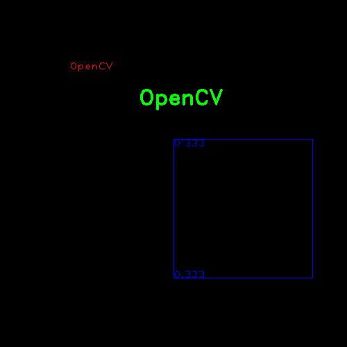

# [text]绘制文本

## 定义

```
def putText(img, text, org, fontFace, fontScale, color, thickness=None, lineType=None, bottomLeftOrigin=None): # 
```

* `img`：输入图像
* `text`：绘制文本
* `org`：左下角坐标点
* `fontFace`：字体，参考[HersheyFonts](https://docs.opencv.org/4.1.0/d6/d6e/group__imgproc__draw.html#ga0f9314ea6e35f99bb23f29567fc16e11)
* `fontscale`：字体比例因子(*最后字体大小需要该因子乘以特定字体的基本大小*)
* `color`：颜色
* `thicknes`：粗细程度
* `bottomLeftOrigin`：如果设置为`True`，那么`org`表示左上角坐标点

## 示例

```
import cv2
import numpy as np

if __name__ == '__main__':
    # 创建空白3通道图像
    img = np.zeros((500, 500, 3))

    cv2.putText(img, 'OpenCV', (100, 100), 1, cv2.FONT_HERSHEY_PLAIN, (0, 0, 255), thickness=1)
    cv2.putText(img, 'OpenCV', (200, 150), 2, cv2.FONT_HERSHEY_PLAIN, (0, 255, 0), thickness=2)

    # 配合边框使用
    cv2.rectangle(img, (250, 200), (450, 400), (255, 0, 0), thickness=1)
    cv2.putText(img, '0.333', (250, 400), 1, cv2.FONT_HERSHEY_PLAIN, (255, 0, 0), thickness=1)
    # 使用左上角坐标点
    cv2.putText(img, '0.333', (250, 200), 1, cv2.FONT_HERSHEY_PLAIN, (255, 0, 0), thickness=1, bottomLeftOrigin=True)

    cv2.imshow('img', img)
    cv2.waitKey(0)
```



## 相关阅读

* [opencv 绘图 cvLine cvRectangle cvCircle cvEllipse cvEllipseBox cvFillPoly cvConvexPoly cvPolyLine](https://blog.csdn.net/u012005313/article/details/46802565)

* [putText()](https://docs.opencv.org/4.1.0/d6/d6e/group__imgproc__draw.html#ga5126f47f883d730f633d74f07456c576)
