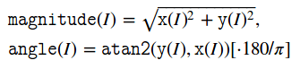

# [cartToPolar]二维向量的大小和角度

`OpenCV`提供函数[cv::cartToPolar](https://docs.opencv.org/4.0.1/d2/de8/group__core__array.html#gac5f92f48ec32cacf5275969c33ee837d0)用于计算`2`维向量的大小和角度

## 函数解析

```
CV_EXPORTS_W void cartToPolar(InputArray x, InputArray y,
                              OutputArray magnitude, OutputArray angle,
                              bool angleInDegrees = false);
```

* `x`：`x`轴坐标数组；这必须是单精度或双精度浮点数组
* `y`：`y`轴坐标数组，其大小和类型必须与`x`相同
* `magnitude`：输出与`x`相同大小和类型的大小数组
* `angle`：与x具有相同大小和类型的角度的输出数组；角度以弧度（从`0`到`2*Pi`）或度（`0`到`360`度）度量
* `angleInDegrees`：标志，指示结果是以弧度（默认情况下是以弧度）还是以度度量

**注意：输入数组必须具有相同精度**

输入`x/y`均为`2`维向量，其实现如下：



源码地址：`/path/to/modules/core/test/test_arithm.cpp`

## 示例

```
#include <iostream>
#include <opencv2/opencv.hpp>

using namespace std;
using namespace cv;

int main() {
    Mat xx = Mat(2, 3, CV_32FC1, Scalar(6, 0, 0));
    Mat yy = Mat(2, 3, CV_32FC1, Scalar(6, 0, 0));

    cout << xx << endl;
    cout << yy << endl;

    Mat mag, angle;
    // 输出角度 等边直角三角形，小角=45度
    cartToPolar(xx, yy, mag, angle, true);
    cout << mag << endl;
    cout << angle << endl;
}
// out
[6, 6, 6;
 6, 6, 6]
[6, 6, 6;
 6, 6, 6]
[8.485281, 8.485281, 8.485281;
 8.485281, 8.485281, 8.485281]
[44.990456, 44.990456, 44.990456;
 44.990456, 44.990456, 44.990456]
```

