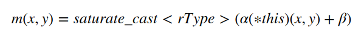

# [convertTo]数据转换

图像处理过程中经常需要缩放数据值以及转换数据类型，`OpenCV`提供了函数`cv::convertTo`来完成

## 函数解析

```
void convertTo( Mat& m, int rtype, double alpha=1, double beta=0 ) const;
```

* `m`：输出矩阵；如果在操作之前没有分配适当的大小或类型，则会根据操作重新分配
* `rtype`：输出数据类型，如果为负，表示和原图一致
* `alpha`：缩放因子
* `beta`：增加到缩放后数据的因子

函数`convertTo`执行如下操作：



## 示例

```
#include <iostream>
#include <opencv2/opencv.hpp>
#include <opencv2/core/mat.hpp>

using namespace std;
using namespace cv;

void print(const Mat &src, const Mat &dst) {
    cout << "数据类型" << endl;
    cout << src.type() << endl;
    cout << dst.type() << endl;

    cout << "结果" << endl;
    cout << src << endl;
    cout << dst << endl;
}

int main() {
    Mat src = Mat(1, 3, CV_8UC1);

    src.at<uchar>(0) = 3;
    src.at<uchar>(1) = 4;
    src.at<uchar>(2) = 5;

    Mat dst;
    src.convertTo(dst, CV_32F, 0.5);
    print(src, dst);
}
```

转换成浮点类型，并进行缩放

```
数据类型
0
5
结果
[  3,   4,   5]
[1.5, 2, 2.5]
```

## 相关阅读

* [convertTo()](https://docs.opencv.org/4.1.0/d3/d63/classcv_1_1Mat.html#adf88c60c5b4980e05bb556080916978b)