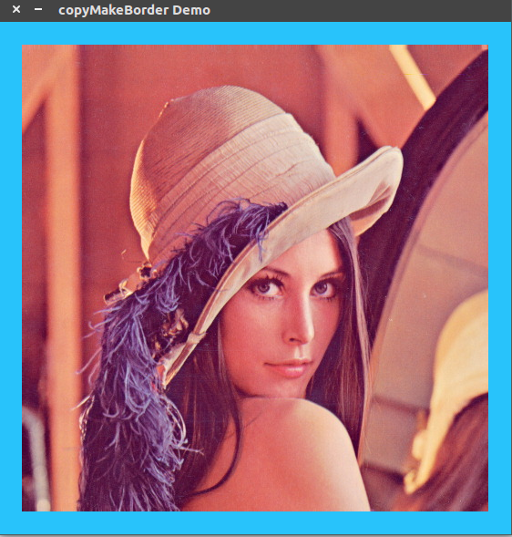
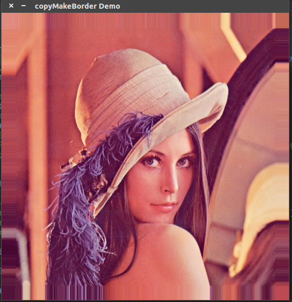

# [copyMakeBorder]添加边界

`OpenCV`提供函数[copyMakeBorder()](https://docs.opencv.org/4.1.0/d2/de8/group__core__array.html#ga2ac1049c2c3dd25c2b41bffe17658a36)来添加图像边界

## 声明

头文件声明：`#include <opencv2/core.hpp>`

## 解析

```
CV_EXPORTS_W void copyMakeBorder(InputArray src, OutputArray dst,
                                 int top, int bottom, int left, int right,
                                 int borderType, const Scalar& value = Scalar() );
```

* `src`：原图
* `dst`：结果图像，其大小为`Size(src.cols+left+right, src.rows+top+bottom)`
* `top`：指定图像上方填充多少像素。其他方向同理
* `bottom`
* `left`
* `right`
* `borderType`：填充类型
* `value：borderType==BORDER_CONSTANT`的填充值。默认值为`0`的`Scalar`

函数将源图像复制到目标图像的中间。在源图像左侧、右侧、上方和下方的区域进行像素填充

### 填充类型

* `borderType == BORDER_CONSTRAINT`：指定像素值进行填充
* `borderType== BORDER_REPLICATE`：使用边缘像素值进行填充

## 示例

```
#include "opencv2/imgproc.hpp"
#include "opencv2/imgcodecs.hpp"
#include "opencv2/highgui.hpp"

using namespace cv;
// Declare the variables
Mat src, dst;
int top, bottom, left, right;
int borderType = BORDER_CONSTANT;
const char *window_name = "copyMakeBorder Demo";
RNG rng(12345);

int main(int argc, char **argv) {
    const char *imageName = argc >= 2 ? argv[1] : "../lena.jpg";

    // Loads an image
    src = imread(imageName, IMREAD_COLOR); // Load an image
    // Check if image is loaded fine
    if (src.empty()) {
        printf(" Error opening image\n");
        printf(" Program Arguments: [image_name -- default ../data/lena.jpg] \n");
        return -1;
    }

    // Brief how-to for this program
    printf("\n \t copyMakeBorder Demo: \n");
    printf("\t -------------------- \n");
    printf(" ** Press 'c' to set the border to a random constant value \n");
    printf(" ** Press 'r' to set the border to be replicated \n");
    printf(" ** Press 'ESC' to exit the program \n");

    namedWindow(window_name, WINDOW_AUTOSIZE);
    // Initialize arguments for the filter
    top = (int) (0.05 * src.rows);
    bottom = top;
    left = (int) (0.05 * src.cols);
    right = left;
    for (;;) {
        Scalar value(rng.uniform(0, 255), rng.uniform(0, 255), rng.uniform(0, 255));
        copyMakeBorder(src, dst, top, bottom, left, right, borderType, value);
        imshow(window_name, dst);
        char c = (char) waitKey(500);
        if (c == 27) { break; }
        else if (c == 'c') { borderType = BORDER_CONSTANT; }
        else if (c == 'r') { borderType = BORDER_REPLICATE; }
    }

    return 0;
}
```

设置为`BORDER_CONSTRAINT`时



设置为`BORDER_REPLICATE`时



## 相关阅读

* [Adding borders to your images](https://docs.opencv.org/4.1.0/dc/da3/tutorial_copyMakeBorder.html)