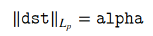
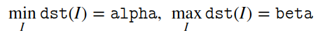

# [normalize]标准化数据

图像处理过程中常用的操作之一就是数据标准化，`OpenCV`提供了函数`cv::normalize`来完成

## 函数解析

```
CV_EXPORTS_W void normalize( InputArray src, InputOutputArray dst, double alpha = 1, double beta = 0,
                             int norm_type = NORM_L2, int dtype = -1, InputArray mask = noArray());
```

* `src`：输入数组
* `dst`：输出数组，大小和原图一致
* `alpha`：标准化值或者按范围标准化的下范围边界
* `beta`：按范围标准化时的上范围边界；它不作用于范数标准化
* `norm_type`：标准化类型，参考[cv::NormTypes](https://docs.opencv.org/4.1.0/d2/de8/group__core__array.html#gad12cefbcb5291cf958a85b4b67b6149f)
* `dtype`：如果为负（默认），则输出数组的类型与`src`相同；否则，其通道数与`src`相同，数据深度=[CV_MAT_DEPTH(dtype)](https://docs.opencv.org/4.1.0/d1/d1b/group__core__hal__interface.html#ga39f3412d63cac68d4f1d138ab52a6fc8)
* `mask`：操作掩码（可选）

## 标准化方式

函数`normalize`根据参数`norm_type`决定数据标准化方式

当`normType=NORM_INF/NORM_L1/NORM_L2`时，其计算方式如下：



当`normType=NORM_MINMAX`时，其计算方式如下：



## 示例

假定测试数据如下：

```
vector<double> positiveData = { 2.0, 8.0, 10.0 };
```

当`normType=NORM_L1`时，通过`L1`范数计算总数，然后缩放到`alpha`大小，比如

```
normalize(positiveData, normalizedData_l1, 1.0, 0.0, NORM_L1);
```

则计算结果为

```
sum(numbers) = 20.0
2.0      0.1     (2.0/20.0)
8.0      0.4     (8.0/20.0)
10.0     0.5     (10.0/20.0)
```

当`normType=NORM_L2`时，通过`L2`范数计算总数，然后缩放到`alpha`大小，比如

```
normalize(positiveData, normalizedData_l2, 1.0, 0.0, NORM_L2);
```

计算结果如下

```
sum(numbers) = sqrt(2*2 + 8*8 + 10*10) = sqrt(168) = 12.96
Norm to unit vector: ||positiveData|| = 1.0
2.0      0.15    (2 / 12.96)
8.0      0.62    (8 / 12.96)
10.0     0.77    (10/ 12.96)
```

当`normType=NORM_MINMAX`时，将数据缩放到`[alpha, beta]`大小，比如

```
normalize(positiveData, normalizedData_minmax, 1.0, 0.0, NORM_MINMAX);
```

将数据缩放到`[0.0, 1.0]`大小，计算结果如下：

```
2.0      0.0     (shift to left border)
8.0      0.75    (6.0/8.0)
10.0     1.0     (shift to right border)
```

## 相关阅读

* [normalize() [1/2]](https://docs.opencv.org/4.1.0/d2/de8/group__core__array.html#ga87eef7ee3970f86906d69a92cbf064bd)]