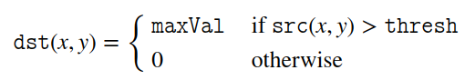
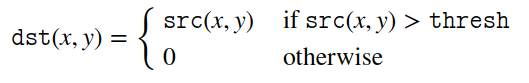

# [threshold]基本阈值操作

使用`OpenCV`函数[cv::threshold](https://docs.opencv.org/3.4/d7/d1b/group__imgproc__misc.html#gae8a4a146d1ca78c626a53577199e9c57)实现基本阈值操作

## 什么是阈值操作

阈值操作是最简单的分割方法，通过像素值的判断分离出目标和背景。函数`cv::threshold`提供了多种阈值操作，参考[ThresholdTypes](https://docs.opencv.org/3.4/d7/d1b/group__imgproc__misc.html#gaa9e58d2860d4afa658ef70a9b1115576)

* `THRESH_BINARY`
* `THRESH_BINARY_INV`
* `THRESH_TRUNC`
* `THRESH_TOZERO`
* `THRESH_TOZERO_INV`
* `THRESH_OTSU`
* `THRESH_TRIANGLE`

假定将原图变形为一行，其像素值和阈值关系如下图所示


*每列红色表示像素值大小，蓝色直线表示阈值*

### THRESH_BINARY

阈值操作如下：



如果像素值比阈值大，则设为最大值，否则，设为`0`。结果如下图所示


### THRESH_BINARY_INV

阈值操作如下：


其操作与`THRESH_BINARY`相反。如果像素值比阈值大，则设为`0`，否则，设为最大值。结果如下图所示


### THRESH_TRUNC

阈值操作如下：


如果像素值比阈值大，则设为最大值，否则，仍就是像素值。结果如下图所示


### THRESH_TOZERO

阈值操作如下：



如果像素值比阈值大，仍就是像素值，否则，设为`0`。结果如下图所示


### THRESH_TOZERO_INV

阈值操作如下：


其操作与`THRESH_TOZERO`相反。如果像素值比阈值大，则设为`0`，否则，仍就是像素值。结果如下图所示


### THRESH_OTSU

使用`OTSU`算法计算最佳阈值。其实现参考：[opencv 最大类间方差（大津法OTSU）](https://blog.csdn.net/u012005313/article/details/51945075)

### THRESH_TRIANGLE

使用`Triangle`算法计算最佳阈值

## 函数解析

```
CV_EXPORTS_W double threshold( InputArray src, OutputArray dst,
                               double thresh, double maxval, int type );
```

* `src`：原图。可以是多通道，`8`位深度或者`32`位深度
* `dst`：结果图像。大小和类型与原图一致
* `thresh`：阈值
* `maxval`：最大阈值。当阈值类型为`THRESH_BINARY`或`THRESH_BINARY_INV`时使用
* `type`：阈值类型

头文件声明：`#include <opencv2/imgproc.hpp>`

源文件地址：`/path/to/modules/imgproc/src/thresh.cpp`

## 示例

```
#include "opencv2/imgproc.hpp"
#include "opencv2/imgcodecs.hpp"
#include "opencv2/highgui.hpp"
#include <iostream>

using namespace cv;
using std::cout;

int threshold_value = 0;
int threshold_type = 3;
int const max_value = 255;
int const max_type = 6;
int const max_binary_value = 255;
Mat src, src_gray, dst;
const char *window_name = "Threshold Demo";
const char *trackbar_type =
        "Type: \n 0: Binary \n 1: Binary Inverted \n 2: Truncate \n 3: To Zero \n 4: To Zero Inverted \n 5: Ostu \n "
        "6: Triangle";
const char *trackbar_value = "Value";

static void Threshold_Demo(int, void *) {
    /* 0: Binary
     1: Binary Inverted
     2: Threshold Truncated
     3: Threshold to Zero
     4: Threshold to Zero Inverted
    */
    if (threshold_type == 5) {
        threshold_type = THRESH_OTSU;
    } else if (threshold_type == 6) {
        threshold_type = THRESH_TRIANGLE;
    }
    threshold(src_gray, dst, threshold_value, max_binary_value, threshold_type);
    imshow(window_name, dst);
}

int main(int argc, char **argv) {
    String imageName("../stuff.jpg"); // by default
    if (argc > 1) {
        imageName = argv[1];
    }
    src = imread(samples::findFile(imageName), IMREAD_COLOR); // Load an image
    if (src.empty()) {
        cout << "Cannot read the image: " << imageName << std::endl;
        return -1;
    }
    cvtColor(src, src_gray, COLOR_BGR2GRAY); // Convert the image to Gray

    namedWindow(window_name, WINDOW_AUTOSIZE); // Create a window to display results
    createTrackbar(trackbar_type,
                   window_name, &threshold_type,
                   max_type, Threshold_Demo); // Create a Trackbar to choose type of Threshold
    createTrackbar(trackbar_value,
                   window_name, &threshold_value,
                   max_value, Threshold_Demo); // Create a Trackbar to choose Threshold value
    Threshold_Demo(0, 0); // Call the function to initialize

    waitKey();
    return 0;
}
```

创建两个滑动条，一个改变阈值类型，一个改变最小阈值

## 相关阅读

* [Basic Thresholding Operations](https://docs.opencv.org/3.4/db/d8e/tutorial_threshold.html)

* [opencv cvThreshold() cvAdaptiveThreshold()](https://blog.csdn.net/u012005313/article/details/46786243)