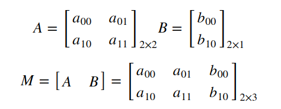
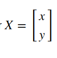
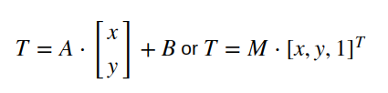
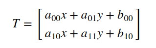
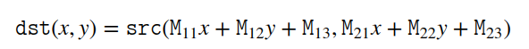
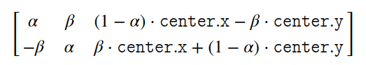
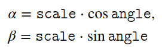
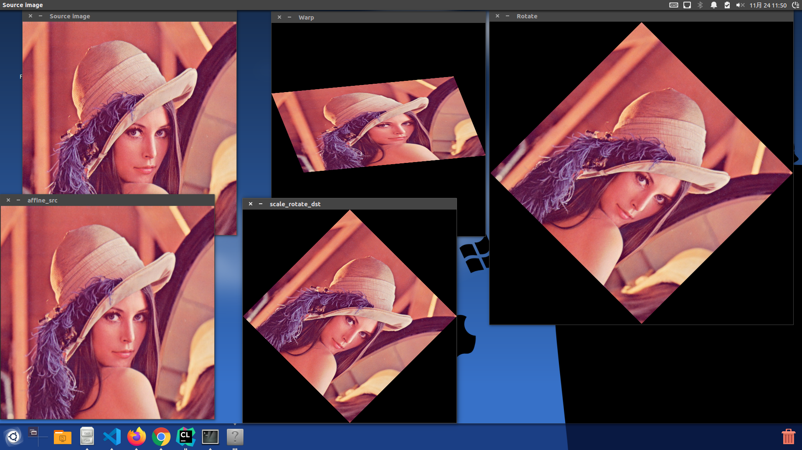
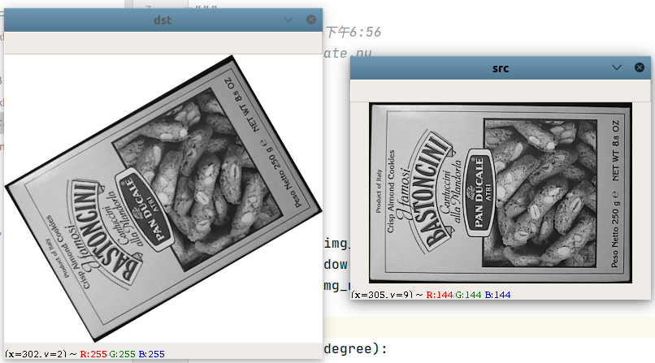

# [旋转][平移][缩放]仿射变换

使用`OpenCV`完成图像旋转、平移和缩放操作

## 仿射变换

本质上看仿射变换表示两个图像之间的关系。任何仿射变换均可以由矩阵乘法（线性变换，`linear transformation`）加上向量加法（`translation`，平移变换）组成。所以通过仿射变换能够完成以下`3`个功能

1. 旋转（`rotation, linear transformation`）
2. 平移（`translation, vector addition`）
3. 缩放（`scale opeation, linear transformation`）

使用`2x3`大小数组`M`来进行仿射变换。数组由两个矩阵`A/B`组成，其中矩阵`A`（大小为`2x2`）用于矩阵乘法，矩阵`B`（大小为`2x1`）用于向量加法



将二维图像的坐标点`x/y`组成二维数组`X`，大小为`2xN`，其操作如下：

 
 

*得到转换后的坐标点再将赋予像素值*

### 如何计算仿射矩阵？

因为仿射变换均有以下性质：

1. 点之间的共线性，例如通过同一线之点 （即称为共线点)在变换后仍呈共线
2. 向量沿着同一方向的比例


所以仅需原图和结果图像的`3`个对应点坐标即可计算出仿射矩阵

## 函数解析

有以下关键函数：

1. [cv::warpAffine](https://docs.opencv.org/4.1.0/da/d54/group__imgproc__transform.html#ga0203d9ee5fcd28d40dbc4a1ea4451983)：完成仿射变换
2. [getRotationMatrix2D()](https://docs.opencv.org/4.1.0/da/d54/group__imgproc__transform.html#gafbbc470ce83812914a70abfb604f4326)：计算旋转矩阵
3. [getAffineTransform() ](https://docs.opencv.org/4.1.0/da/d54/group__imgproc__transform.html#ga8f6d378f9f8eebb5cb55cd3ae295a999)：从三对对应点中计算仿射变换矩阵
4. [RotatedRect()](https://docs.opencv.org/4.1.0/db/dd6/classcv_1_1RotatedRect.html#ae1be388780b8d5faf450be18cbbf30f1)：计算仿射图像大小

### warpAffine

```
CV_EXPORTS_W void warpAffine( InputArray src, OutputArray dst,
                              InputArray M, Size dsize,
                              int flags = INTER_LINEAR,
                              int borderMode = BORDER_CONSTANT,
                              const Scalar& borderValue = Scalar());
```

* `src`：原图
* `dst`：结果图像。数据深度和类型与原图一致
* `M`：`2x3`大小旋转矩阵
* `dsize`：输出图像的大小
* `flags`：插值方法组合（参考[InterpolationFlags](https://docs.opencv.org/4.1.0/da/d54/group__imgproc__transform.html#ga5bb5a1fea74ea38e1a5445ca803ff121)）。如果设置为`WARP_INVERSE_MAP`，表示`M`是逆变换
* `borderMode`：边界填充方法，参考[BorderTypes](https://docs.opencv.org/4.1.0/d2/de8/group__core__array.html#ga209f2f4869e304c82d07739337eae7c5)。当设置为`BORDER_TRANSPARENT`，这意味着目标图像中与源图像中的“异常值”相对应的像素不被函数修改
* `borderValue`：用于固定填充的值；默认情况下为`0`

函数`warpAffine`执行以下操作：



### getRotationMatrix2D

```
CV_EXPORTS_W Mat getRotationMatrix2D( Point2f center, double angle, double scale );
```

* `center`：源图像中的旋转中心
* `angle`：旋转角度（度）。正值表示逆时针旋转（坐标原点假定为左上角）
* `scale`：各向同性比例因子，就是缩放因子，如果不进行缩放则设置为`1.0`

函数`getRotationMatrix2D`执行如下操作：



其中`α`和`β`由以下方法得到



### getAffineTransform

```
CV_EXPORTS Mat getAffineTransform( const Point2f src[], const Point2f dst[] );
```

* `src[]`：原图点坐标
* `dst[]`：结果图对应点坐标

### RotatedRect

```
inline
RotatedRect::RotatedRect(const Point2f& _center, const Size2f& _size, float _angle)
    : center(_center), size(_size), angle(_angle) {}
```

* `_center`：旋转中心
* `_size`：原图大小
* `_angle`：旋转角度

调用函数`cv::warpAffine`时设置结果图像大小和原图一致，则仿射图像有可能截断部分内容

## C++

`CMakeLists.txt`文件如下：

```
cmake_minimum_required(VERSION 3.16)
project(OpenCVTests)

set(CMAKE_CXX_STANDARD 11)

set(CMAKE_PREFIX_PATH /home/zj/opencv/opencv-4.2.0/install)
find_package(OpenCV REQUIRED)
# 打印OpenCV版本
MESSAGE("OpenCV version: ${OpenCV_VERSION}")
# 添加include地址
include_directories(${OpenCV_INCLUDE_DIRS})

add_executable(OpenCVTests rotate.cpp)
# 添加libs地址
target_link_libraries(OpenCVTests ${OpenCV_LIBS})
```

`rotate.cpp`文件如下：

```
#include "opencv2/imgcodecs.hpp"
#include "opencv2/highgui.hpp"
#include "opencv2/imgproc.hpp"
#include <iostream>

using namespace cv;
using namespace std;

int main(int argc, char **argv) {
    CommandLineParser parser(argc, argv, "{@input | ../lena.jpg | input image}");
    Mat src = imread(parser.get<String>("@input"));
    if (src.empty()) {
        cout << "Could not open or find the image!\n" << endl;
        cout << "Usage: " << argv[0] << " <Input image>" << endl;
        return -1;
    }

    // 已知点坐标计算仿射矩阵和结果图像
    Point2f srcTri[3];
    srcTri[0] = Point2f(0.f, 0.f);
    srcTri[1] = Point2f(src.cols - 1.f, 0.f);
    srcTri[2] = Point2f(0.f, src.rows - 1.f);
    Point2f dstTri[3];
    dstTri[0] = Point2f(0.f, src.rows * 0.33f);
    dstTri[1] = Point2f(src.cols * 0.85f, src.rows * 0.25f);
    dstTri[2] = Point2f(src.cols * 0.15f, src.rows * 0.7f);
    Mat warp_mat = getAffineTransform(srcTri, dstTri);

    Mat warp_dst = Mat::zeros(src.rows, src.cols, src.type());
    warpAffine(src, warp_dst, warp_mat, warp_dst.size());

    // 图像以图像中央为旋转中心，顺时针旋转45度
    Point center = Point(warp_dst.cols / 2, warp_dst.rows / 2);
    double angle = -45.0;
    double scale = 1.0;
    Mat rot_mat = getRotationMatrix2D(center, angle, scale);
    Rect bbox = cv::RotatedRect(center, src.size(), angle).boundingRect();
    rot_mat.at<double>(0, 2) += bbox.width / 2.0 - center.x;
    rot_mat.at<double>(1, 2) += bbox.height / 2.0 - center.y;
    cout << "旋转45度: " << rot_mat << endl;

    Mat rotate_dst;
    warpAffine(src, rotate_dst, rot_mat, bbox.size());

    // 旋转+缩放
    scale = src.rows / sqrt(pow(src.rows, 2) * 2);
    rot_mat = getRotationMatrix2D(center, angle, scale);
    cout << "旋转45度并缩放" << rot_mat << endl;

    Mat scale_rotate_dst;
    warpAffine(src, scale_rotate_dst, rot_mat, src.size());

    // 根据仿射图像得到原图，将图像逆时针旋转45度，然后从中提取原图大小
    angle = 45;
    scale = 1.0;
    center = Point((int) (rotate_dst.cols / 2.0), (int) (rotate_dst.rows / 2.0));
    rot_mat = getRotationMatrix2D(center, angle, scale);

    Mat affine_src_tmp, affine_src;
    warpAffine(rotate_dst, affine_src_tmp, rot_mat, bbox.size());
    affine_src = affine_src_tmp(Rect((bbox.width - src.cols) / 2, (bbox.height - src.rows) / 2, src.cols, src.rows));

    imshow("Source image", src);
    imshow("Warp", warp_dst);
    imshow("Rotate", rotate_dst);
    imshow("scale_rotate_dst", scale_rotate_dst);
    imshow("affine_src", affine_src);
    waitKey();

    return 0;
}
```

完成图像变形、旋转、旋转+缩放以及逆旋转的功能



## Python

实现如下功能： 已知旋转角度进行图像旋转。其计算公式如下：

$$
dst_w = w\cos \theta+ h\sin \theta \\
dst_h =  w\sin \theta + h\cos \theta
$$

```
import cv2
import math


def imshow(img, img_name):
    cv2.namedWindow(img_name, cv2.WINDOW_AUTOSIZE)
    cv2.imshow(img_name, img)


def rotate(img, degree):
    h, w = img.shape[:2]
    center = (w // 2, h // 2)

    dst_h = int(w * math.fabs(math.sin(math.radians(degree))) + h * math.fabs(math.cos(math.radians(degree))))
    dst_w = int(h * math.fabs(math.sin(math.radians(degree))) + w * math.fabs(math.cos(math.radians(degree))))

    matrix = cv2.getRotationMatrix2D(center, degree, 1)
    matrix[0, 2] += dst_w // 2 - center[0]
    matrix[1, 2] += dst_h // 2 - center[1]
    dst_img = cv2.warpAffine(img, matrix, (dst_w, dst_h), borderValue=(255, 255, 255))

    imshow(img, 'src')
    imshow(dst_img, 'dst')
    cv2.waitKey(0)


if __name__ == '__main__':
    img = cv2.imread('box.png')
    angle = 30

    rotate(img, angle)
```



## 相关阅读

* [Affine Transformations](https://docs.opencv.org/4.1.0/d4/d61/tutorial_warp_affine.html)

* [opencv 拉伸、扭曲、旋转图像-透视变换](https://blog.csdn.net/u012005313/article/details/46715397)

* [opencv 拉伸、扭曲、旋转图像-仿射变换 opencv1 / opencv2 / python cv2（代码）](https://blog.csdn.net/u012005313/article/details/46714637)

* [仿射变换](http://www.opencv.org.cn/opencvdoc/2.3.2/html/doc/tutorials/imgproc/imgtrans/warp_affine/warp_affine.html)

* [python-opencv 图像平移旋转变换、以及图像旋转前后坐标值映射关系](https://blog.csdn.net/MrR1ght/article/details/89196611)

* [仿射变换](https://baike.baidu.com/item/%E4%BB%BF%E5%B0%84%E5%8F%98%E6%8D%A2/4289056?fr=aladdin)