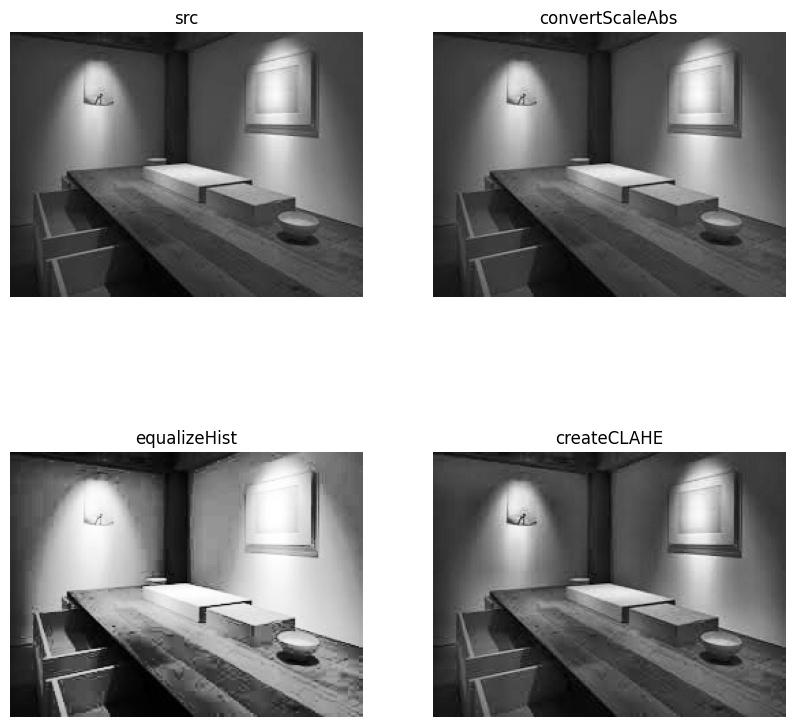

# 对比度增强

在`OpenCV`中找到`3`种方式实现图像对比度增强

## 实现

```
import cv2
import time


def process_contrast(image):
    return cv2.convertScaleAbs(image, alpha=1.0, beta=10)


def process_equalize_hist(image):
    return cv2.equalizeHist(image)


def process_clahe(image):
    clahe = cv2.createCLAHE(clipLimit=1.0, tileGridSize=(8, 8))
    return clahe.apply(image)


if __name__ == '__main__':
    image = cv2.imread('assets/contrast.jpeg', cv2.IMREAD_GRAYSCALE)

    start = time.time()
    img_bright = process_contrast(image)
    end1 = time.time()
    cv2.imwrite('outputs/contrast.jpg', img_bright)

    img_bright = process_equalize_hist(image)
    end2 = time.time()
    cv2.imwrite('outputs/equalize_hist.jpg', img_bright)

    img_bright = process_clahe(image)
    end3 = time.time()
    cv2.imwrite('outputs/clahe.jpg', img_bright)

    print('process_contrast: {}'.format(end1 - start))
    print('process_equalize_hist: {}'.format(end2 - end1))
    print('process_clahe: {}'.format(end3 - end2))
```

测试时间如下：

```
process_contrast: 2.5033950805664062e-05
process_equalize_hist: 0.0005655288696289062
process_clahe: 0.0009024143218994141
```

## 绘图

```
def draw():
    img1 = Image.open('outputs/contrast.jpeg').convert('L')
    img2 = Image.open('outputs/contrast.jpg').convert('L')
    img3 = Image.open('outputs/equalize_hist.jpg').convert('L')
    img4 = Image.open('outputs/clahe.jpg').convert('L')

    fig = plt.figure(figsize=(10, 10))

    plt.subplot(221)
    plt.imshow(img1, cmap='gray'), plt.axis('off')
    plt.title('src')

    plt.subplot(222)
    plt.imshow(img2, cmap='gray'), plt.axis('off')
    plt.title('convertScaleAbs')

    plt.subplot(223)
    plt.imshow(img3, cmap='gray'), plt.axis('off')
    plt.title('equalizeHist')

    plt.subplot(224)
    plt.imshow(img4, cmap='gray'), plt.axis('off')
    plt.title('createCLAHE')

    plt.savefig('outputs/res.jpg', bbox_inches='tight')
    plt.show()
```



## 相关阅读

* [convertScaleAbs](https://docs.opencv.org/4.5.1/d2/de8/group__core__array.html#ga3460e9c9f37b563ab9dd550c4d8c4e7d)
* [createCLAHE](https://docs.opencv.org/4.5.1/d6/dc7/group__imgproc__hist.html#gad689d2607b7b3889453804f414ab1018)
* [直方图](https://blog.zhujian.life/posts/f1eacfb6.html)
* [图像增强 | CLAHE 限制对比度自适应直方图均衡化](https://cloud.tencent.com/developer/article/1667213)