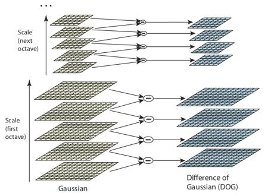
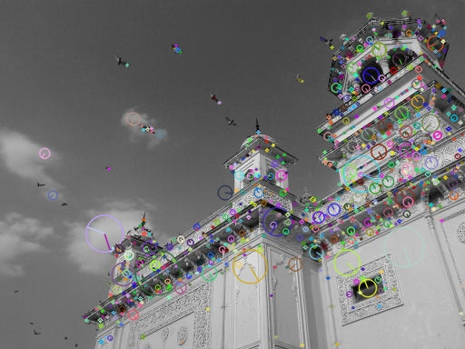

# [SIFT]特征和描述符计算

`SIFT(Scale Invariant Feature Transform，尺度不变特征变换)`算子具有尺度和旋转不变性，同时对于仿射变换、噪声和光照具有很强的鲁棒性

## 原理

分`4`步计算`SIFT`算子：

1. `Scale-space Extrema Detection`（尺度空间极值检测）
2. `Keypoint Localization`（关键点定位）
3. `Orientation Assignment`（方向赋值）
4. `Keypoint Descriptor`（关键点描述符）

### 尺度空间极值检测

1. 什么是尺度空间？

>参考：[SIFT算法系列之尺度空间](https://blog.csdn.net/Small_Munich/article/details/79968229)
>现实情况下物体距离观察者所处位置的远近而呈现出不同的表达，如人眼观察物体在不同的尺度下感受不同，距离较远时观察到的是主要轮廓区域，近距离下观察到更多的细节信息。大尺度参数情况下，高频信息丢失严重，主要显示大致轮廓信息，高频段细节被称作图像中显著的特征。高频信息在视觉领域易于发现与辨识，能够运用于进行特征提取、目标识别等任务。这就是不同尺度下所带来的效应。计算机视觉中的多尺度技术想要表达的基本思想是大尺度情况下图像模糊轮廓形状是小尺度情况下图像轮廓形状的采样

>参考：[高斯金字塔在图像处理过程中具体是如何实现的？](https://www.zhihu.com/question/19911080)
>SIFT里高斯金字塔实际上是作者用来模拟一个图片的不同尺度的情况，从而形成这张图片的一个尺度空间，我们知道，当一个物体由近到远时，物体的细节信息慢慢消失，最后只留下一些轮廓之类的很粗糙的信息，而高斯金字塔中的高斯模糊和降采样都是在模拟物体细节信息慢慢消失。我想到的更直观一点的想法是这样的：物体由近到远时，看上去会变得更小更模糊，而降采样就是在模拟更小，高斯则是在模拟模糊（当然更小和模糊之间并不是独立的，因此我这个直观的想法不一定正确）。

就是从远处走过来一个人，在很远的时候，只能够通过轮廓去判断，当走近一些，就会注意到更多的细节（这个时候轮廓可能不是最重要的特征）。对于计算机视觉而言，可以通过图像金字塔的方式来构造远近的概念，通过高斯核函数来构造模糊的概念

SIFT算子构建的尺度空间可以归纳为：对图像金字塔的每级图像执行不同大小的高斯核函数，以此来构建高斯金字塔模式的尺度空间

1. IoG和DoG

`IoG`指的是`Laplacian of Gaussian`，指的是图像和高斯核函数进行滤波后再进行拉普拉斯变换

`Laplace`算子计算公式如下：

$$
∇^{2}f(x,y) = \frac {∂^{2}f}{∂x^{2}} + \frac {∂^{2}f}{∂y^{2}}
$$

二维高斯核函数如下：

$$
G_{σ}(x, y) = \frac {1}{\sqrt {2\pi σ^{2}}} \exp (- \frac {x^{2} + y^{2}}{2σ^{2}})
$$

`IoG`计算公式如下：

$$
Δ[G_{σ}(x,y)∗f(x,y)]=[ΔG_{σ}(x,y)]∗f(x,y)
$$

$$
LoG=ΔG_{σ}(x,y)=\frac {∂^{2}G_{σ}(x,y)}{∂x^{2}}+\frac {∂^{2}G_{σ}(x,y)}{∂y^{2}}=\frac {x^{2}+y^{2}−2σ^{2}}{σ^{4}}e^{−(x^{2}+y^{2})/2σ^{2}}
$$

`DoG`指的是`Difference of Gaussian`，通过不同$σ$值的高斯滤波图像之间的差分来模拟`IoG`



1. 如何检测极值

比较每个像素点和它周围所有的相邻点（包括同一图像中的`8`个以及上下差分图像中的各`9`个像素点），是否是最大或者最小


### 关键点定位

对极值点进行过滤，

* 设置对比度阈值（contrastThreshold，文中为0.3），用于去除小于该阈值的极值点
* 设置边阈值（edgeThreshold，文中为10），对极值点使用$2\times 2$ Hessian矩阵计算主曲率，如果大于边阈值，那么舍弃该极值点

### 方向赋值和关键点描述符

为每个关键点赋予方向，以实现图像的旋转不变性；同时为每个关键点创建一个128维的向量，作为关键点描述符。参考：[SIFT特征--方向赋值与关键点描述](https://blog.csdn.net/jinshengtao/article/details/50167533)

### 关键点匹配

## Python实现

* 创建`SIFT`对象
* 检测`SIFT`关键点
* 检测`SIFT`描述符
* 绘制`SIFT`关键点

### 创建SIFT对象

```
static Ptr<SIFT> cv::SIFT::create 	( 	int  	nfeatures = 0,
		int  	nOctaveLayers = 3,
		double  	contrastThreshold = 0.04,
		double  	edgeThreshold = 10,
		double  	sigma = 1.6 
	) 		
```

* `nfeatures`：保留的关键点个数（默认所有）。其通过局部对比度进行排序
* `nOctaveLayers`：每一级的`DoG`个数，默认为`3`
* `contrastThreshold`：对比度阈值
* `edgeThreshold`：边阈值
* `sigma`：应用于第`0`级金字塔的高斯因子，如果使用`a weak camera with soft lenses`，可以减小该值

### 检测SIFT关键点并绘制

* 创建`sift`对象
* 调用`detect`函数检测关键点
* 调用`drawKeypoints`函数绘制关键点

`detect`函数计算后返回关键点列表，每个关键点类型为`OpenCV`自定义的`KeyPoint`

```
import numpy as np
import cv2 as cv

def sift_keypoint_draw():
    img = cv.imread('home.jpg')
    gray = cv.cvtColor(img, cv.COLOR_BGR2GRAY)

    sift = cv.xfeatures2d.SIFT_create()
    kp = sift.detect(gray, None)
    
    cv.drawKeypoints(gray, kp, img, flags=cv.DRAW_MATCHES_FLAGS_DRAW_RICH_KEYPOINTS)
    cv.imwrite('sift_keypoints.jpg', img)
```



对于`drawKeypoints`而言：

* `gray`：表示输入图像
* `kp`：表示关键点
* `img`：表示输出图像

也可以使用彩色图像计算关键点和绘制

```
def sift_keypoint_draw():
    img = cv.imread('home.jpg')
    gray = cv.cvtColor(img, cv.COLOR_BGR2GRAY)

    sift = cv.xfeatures2d.SIFT_create()
    kp = sift.detect(img, None)

    cv.drawKeypoints(img, kp, img, flags=cv.DRAW_MATCHES_FLAGS_DRAW_RICH_KEYPOINTS)
    cv.imwrite('sift_keypoints.jpg', img)
```


*其输出关键点个数和灰度图像一样，估计是里面做了彩色转灰度操作*

### 计算描述符

```
def sift_descriptor_compute():
    img = cv.imread('home.jpg')
    gray = cv.cvtColor(img, cv.COLOR_BGR2GRAY)

    sift = cv.xfeatures2d.SIFT_create()
    kp = sift.detect(gray, None)

    kp, des = sift.compute(gray, kp)
```

返回的`kp`仍旧是关键点，`des`表示描述符，列表形式，长度和`kp`相同，每个描述符是一个`np.ndarray`类型的`128`维向量

### 同时检测关键点并计算描述符

函数`detectAndCompute`集成了关键点检测和描述符计算功能

```
keypoints, descriptors	=	cv.Feature2D.detectAndCompute(	image, mask[, descriptors[, useProvidedKeypoints]]	)
```

* `img`：输入图像
* `mask`：掩码，计算指定区域`SIFT`特征

示例如下：

```
def sift_keypoint_descriptor():
    img = cv.imread('home.jpg')
    gray = cv.cvtColor(img, cv.COLOR_BGR2GRAY)

    sift = cv.xfeatures2d.SIFT_create()
    kp, des = sift.detectAndCompute(gray, None)
```

## 相关阅读

* [SIFT特征--构造DOG尺度空间](https://blog.csdn.net/jinshengtao/article/details/50043797)
* [图像特征之LoG算子与DoG算子](https://senitco.github.io/2017/06/20/image-feature-LoG-DoG/)
* [sift算法特征点如何匹配？](https://www.zhihu.com/question/23371175)
* [SIFT_create](https://docs.opencv.org/4.4.0/d7/d60/classcv_1_1SIFT.html#ad337517bfdc068ae0ba0924ff1661131)