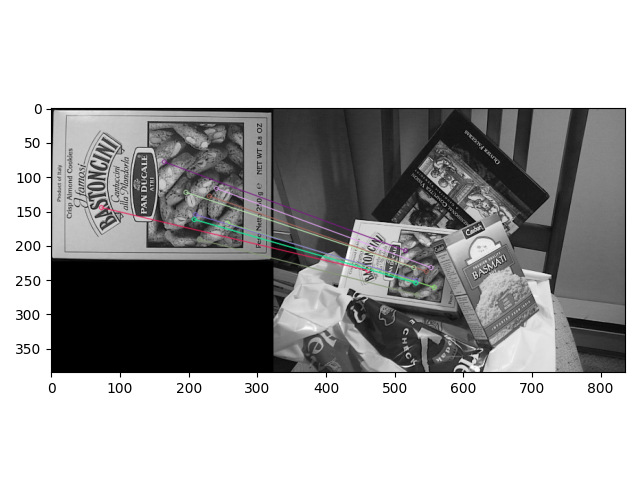

# [Brute-Force][FLANN]特征匹配

计算好特征点以及描述符之后，就可以通过特征匹配器计算两个图像之间的匹配了。`OpenCV`提供了两个特征匹配算法：

1. `Brute-Force Matcher`
2. `FLANN Matcher`

## Brute-Force

执行步骤如下：

1. 利用特征提取算法计算关键点和描述符
2. 创建特征匹配器，选择距离计算方法以及计算方式
3. 计算匹配对并进行筛选
4. 绘制匹配对

### 计算关键点和描述符

使用`SIFT`算子实现

```
import cv2 as cv
import matplotlib.pyplot as plt

def sift_compute():
    img1 = cv.imread('box.png', cv.IMREAD_GRAYSCALE)  # queryImage
    img2 = cv.imread('box_in_scene.png', cv.IMREAD_GRAYSCALE)  # trainImage
    # Initiate SIFT detector
    sift = cv.xfeatures2d.SIFT_create()
    # find the keypoints and descriptors with SIFT
    kp1, des1 = sift.detectAndCompute(img1, None)
    kp2, des2 = sift.detectAndCompute(img2, None)

    return img1, img2, kp1, kp2, des1, des2
```

使用了两个图像进行匹配，一个称之为查询图像（目标），另一个称之为训练图像（包含目标）

### 创建特征匹配器

使用函数`cv.BFMatcher`创建`Brute-Force`特征匹配器，可配置两个属性：

1. `normType`：距离计算方式，包括了`NORM_L1, NORM_L2（默认）, NORM_HAMMING, NORM_HAMMING2`。对于`SIFT`算子，推荐使用`L1/L2 norm`
2. `crossCheck`：默认为`False`。如果为`True`，则匹配的关键点对`（i,j）`符合以下特性：对训练图像的第`i`个关键点而言，和查询图像的第`j`个关键点之间的距离是最短的，反之同样成立

```
bf = cv.BFMatcher(cv.NORM_L2, crossCheck=True)
```

### 计算匹配对并进行筛选

`BF`提供了两种匹配函数：

1. `match`：从查询集中查找每个描述符的最佳匹配项
2. `knnMatch`：从查询集中查找前`k`个最佳匹配项

**Note：如果使用`knnMatch`，那么不能在创建`BF`对象时设置属性`crossCheck`为`True`**

#### match

使用`match`函数得到一列`DMatch`对象，表示最佳匹配对，其属性如下：

* `DMatch.distance`：两个描述符之间的距离，越小越好
* `DMatch.trainIdx`：训练图像的描述符下标
* `DMatch.queryIdx`：查询图像的描述符下标
* `DMatch.imgIdx`：训练图像下标

通过匹配对之间的距离进行排序，可以得到最佳的匹配对

```
matches = sorted(matches, key=lambda x: x.distance)
```

#### knnMatch

使用`knnMatch`函数得到一列对象，其中每个对象包含`k`个匹配对（类型为`DMatch`），其按描述符距离升序排序

通过`k`个匹配对之间的距离可以进一步搜索出好的匹配对

```
    matches = bf.knnMatch(des1, des2, k=2)
    # Apply ratio test
    good = []
    for m, n in matches:
        # 当最小的两个距离的比率超过一定时，判断为好的点
        if m.distance < ratio * n.distance:
            good.append([m])
```

### 绘制匹配对

使用函数`drawMatches`和`drawMatchesKnn`分别训练由函数`match`和`knnMatch`生成的匹配对

### 完整代码

```
import numpy as np
import cv2 as cv
import matplotlib.pyplot as plt


def sift_compute():
    img1 = cv.imread('box.png', cv.IMREAD_GRAYSCALE)  # queryImage
    img2 = cv.imread('box_in_scene.png', cv.IMREAD_GRAYSCALE)  # trainImage
    # Initiate SIFT detector
    sift = cv.xfeatures2d.SIFT_create()
    # find the keypoints and descriptors with SIFT
    kp1, des1 = sift.detectAndCompute(img1, None)
    kp2, des2 = sift.detectAndCompute(img2, None)

    return img1, img2, kp1, kp2, des1, des2


def sift_match(img1, img2, kp1, kp2, des1, des2):
    # create BFMatcher object
    bf = cv.BFMatcher(cv.NORM_L2, crossCheck=True)
    # Match descriptors.
    matches = bf.match(des1, des2)
    # Sort them in the order of their distance.
    matches = sorted(matches, key=lambda x: x.distance)
    print(len(matches))
    # Draw first 10 matches.
    img3 = cv.drawMatches(img1, kp1, img2, kp2, matches[:10], None, flags=cv.DrawMatchesFlags_NOT_DRAW_SINGLE_POINTS)
    plt.imshow(img3), plt.show()


def sift_match_knn(img1, img2, kp1, kp2, des1, des2, ratio=0.5):
    # BFMatcher with default params
    bf = cv.BFMatcher(cv.NORM_L2)
    matches = bf.knnMatch(des1, des2, k=2)
    # Apply ratio test
    good = []
    for m, n in matches:
        # 当最小的两个距离的比率超过一定时，判断为好的点
        if m.distance < ratio * n.distance:
            good.append([m])
    good = sorted(good, key=lambda x: x[0].distance)
    # cv.drawMatchesKnn expects list of lists as matches.
    img3 = cv.drawMatchesKnn(img1, kp1, img2, kp2, good[:10], None, flags=cv.DrawMatchesFlags_NOT_DRAW_SINGLE_POINTS)
    plt.imshow(img3), plt.show()


if __name__ == '__main__':
    img1, img2, kp1, kp2, des1, des2 = sift_compute()
    # sift_match(img1, img2, kp1, kp2, des1, des2)
    sift_match_knn(img1, img2, kp1, kp2, des1, des2)
```

使用`match`函数，绘制前`10`个最佳匹配对



使用`knnMatch`函数，设置`k=2`，判断同一描述符的匹配对距离比大于`0.5`的是好的匹配结果，再按匹配距离进行排序，绘制前`10`个最佳


## FLANN

。。。

## 相关阅读

* [Feature Matching ](https://docs.opencv.org/master/dc/dc3/tutorial_py_matcher.html)