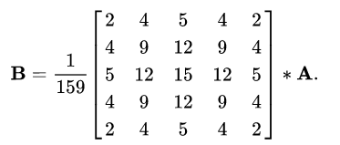
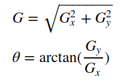
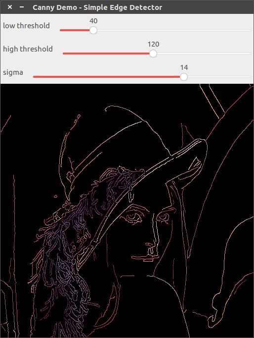

# [Canny]边缘检测

学习`Canny`边缘检测器

## Canny算子

`Canny`算子是常用的边缘检测算法，其执行步骤如下：

1. 应用高斯滤波器平滑图像以去除噪声
2. 计算图像的强度梯度
3. 应用非最大抑制（`Non-maximum suppression`）消除边缘检测的虚假响应
4. 应用双阈值确定潜在边缘
5. 通过滞后（`hysteresis`）方法跟踪边缘：通过抑制所有其他弱边缘和未连接到强边缘的边缘，完成边缘检测

### 高斯滤波

通过高斯滤波去除图像噪声的影响，常用`5x5`大小的高斯核，设置`\sigma=1.4`



高斯滤波核尺寸越大，越能够平滑噪声影响，但与此同时`Canny`算子的边缘检测的性能会降低

### 图像梯度计算

通过`Sobel`算子计算图像的水平和垂直反向导数，然后计算梯度大小和方向



将梯度方向通过四舍五入方法归入到水平/垂直/对角 (`0°, 45°, 90°和135°`)，比如`[0°, 22.5°]`和`[157.5°, 180°]`映射为`0°`

### 非最大抑制

非最大抑制是一种边缘细化技术。进行梯度计算后的图像边缘仍旧很模糊，边缘拥有多个候选位置，所以需要应用非最大抑制来寻找“最大”像素点，即具有最大强度值变化的位置，移除其他梯度值，保证边缘具有准确的响应。其原理如下

1. 将当前像素的边缘强度与像素在正梯度方向和负梯度方向上的边缘强度进行比较
2. 如果与相同方向的掩模中的其他像素相比，当前像素的边缘强度是最大的（例如，指向y轴方向的像素将与垂直轴上方和下方的像素相比较），则该值将被保留。否则，该值将被抑制（去除梯度值为0）

具体实现时，将连续梯度方向分类为一组小的离散方向，然后在上一步的输出（即边缘强度和梯度方向）上移动`3x3`滤波器。在每个像素处，如果中心像素的大小不大于渐变方向上两个相邻像素的大小，它将抑制中心像素的边缘强度（通过将其值设置为`0`）

* 如果梯度角度为`0°`（即边缘在南北方向），如果其梯度大小大于东西方向像素处的大小，则该点将被视为在边缘上
* 如果梯度角度为`45°`（即边缘位于西北-东南方向），如果其梯度大小大于东北和西南方向像素处的大小，则该点将被视为位于边缘上
* 如果梯度角度为`90°`（即边缘在东西方向），如果其梯度大小大于南北方向像素处的大小，则该点将被视为在边缘上
* 如果梯度角度为`135°`（即边缘位于东北-西南方向），如果其梯度大小大于西北和东南方向像素处的大小，则该点将被视为位于边缘上

### 双边阈值

通过非最大抑制，可以有效确定边缘的最大像素点，剩余的边缘像素提供了图像中真实边缘的更精确表示。但是，由于噪声和颜色变化，一些边缘像素仍然存在。**为了去除这些虚假响应，必须滤除具有弱梯度值的边缘像素，并保留具有高梯度值的边缘像素**。这是通过选择高阈值和低阈值来实现的。如果边缘像素的渐变值高于高阈值，则将其标记为强边缘像素。如果边缘像素的渐变值小于高阈值且大于低阈值，则将其标记为弱边缘像素。如果边缘像素的值小于低阈值，它将被抑制

两个阈值是通过经验确定的，其定义将取决于给定输入图像的内容。通过其比率（`upper:lower`）设置为`2:1`和`3:1`之间

参考：[canny 算法的阈值，有两个，到底是做什么用的](https://wenwen.sogou.com/z/q756028295.htm)

>第一个是低阈值，第二个高阈值
高阈值比较严格，求的边缘很少，认为高阈值的边缘都是有效。低阈值宽松，求的边缘很多（一般包括了高阈值求到的边缘），其中不少是无效的边缘（反正不想要的）。
先用高阈值求边缘。canny求得的边缘希望是连在一起的（通常是封闭的），但高阈值求的边缘一般断断续续。断开的地方如果低阈值求的边缘存在，就用低阈值的边缘接上去，目的让边缘尽量都连在一起。其它情况下低阈值的边缘是不用的。
>两个阈值是有区别的，高的那个阈值是将要提取轮廓的物体与背景区分开来，就像阈值分割的那个参数一样，是决定目标与背景对比度的，低的那个阈值是用来平滑边缘的轮廓，有时高的阈值设置太大了，可能边缘轮廓不连续或者不够平滑，通过低阈值来平滑轮廓线，或者使不连续的部分连接起来

参考：[canny高低阈值效果](https://blog.csdn.net/ben121_/article/details/88824186?utm_medium=distribute.pc_aggpage_search_result.none-task-blog-2~all~first_rank_v2~rank_v25-1-88824186.nonecase)]

* 低阈值固定，高阈值越高，细节越少
* 高阈值固定，低阈值越低，细节越多

### 通过滞后方法进行边缘追踪

经过上述步骤处理后，结果图像仅包含了强边缘像素和弱边缘像素。对于弱边缘像素而言，这些像素既可以从真实边缘提取，也可以从噪声/颜色变化中提取

通常，由真实边缘引起的弱边缘像素将连接到强边缘像素，而噪声响应则不连接。为了跟踪边缘连接，通过观察弱边缘像素及其`8`个邻域像素来进行[blob分析](https://en.wikipedia.org/wiki/Connected-component_labeling)。只要`blob`中包含一个强边缘像素，就可以将该弱边缘点识别为一个应该保留的点

## 函数解析

```
CV_EXPORTS_W void Canny( InputArray image, OutputArray edges,
                         double threshold1, double threshold2,
                         int apertureSize = 3, bool L2gradient = false );
```

* `image`：原图（深度为`CV_8U`）
* `edges`：结果图像（单通道`CV_8U`，大小和原图一样）
* `threshold1`：低阈值
* `threshold2`：高阈值
* `apertureSize`：`Sobel`算子的大小。默认为`3`
* `L2gradient`：是否使用更精确的`L2`范数`sqrt(dI/dx)^2+(dI/dy)^2)`计算梯度，默认为`false`，表示使用`L1`范数`|dI/dx|+|dI/dy|`

源文件地址：`/path/to/modules/imgproc/src/canny.cpp`

`apaertureSize`可设置为`3`或者`7`

```
    if ((aperture_size & 1) == 0 || (aperture_size != -1 && (aperture_size < 3 || aperture_size > 7)))
        CV_Error(CV_StsBadFlag, "Aperture size should be odd between 3 and 7");
```

## 示例

```
#include "opencv2/imgproc.hpp"
#include "opencv2/highgui.hpp"
#include <iostream>
#include <cstring>

using namespace std;
using namespace cv;

// 滑动条名
const string lowthreshold_trackbarname = "low threshold";      // 取值为 0-250
const string highthreshold_trackbarname = "high threshold";    // 取值为 0-250
const string sigma_trackbarname = "sigma";                     // 取值为 0-2.0
// 窗口名
const string winname = "Canny Demo - Simple Edge Detector";
// 最大值
const int max_threshold = 250;

Mat src, src_gray;
Mat dst, detected_edges;
int lowThreshold = 40;
int highThreshold = 120;
int sigma = 14;

void onCanny(int, void *) {
    const int kernel_size = 3;

    GaussianBlur(src_gray, detected_edges, Size(5, 5), sigma / 10.0);
    Canny(detected_edges, detected_edges, lowThreshold, highThreshold, kernel_size);
    dst = Scalar::all(0);
    src.copyTo(dst, detected_edges);

    imshow(winname, dst);
}

int main(int argc, char **argv) {
    CommandLineParser parser(argc, argv, "{@input | ../lena.jpg | input image}");
    src = imread(parser.get<String>("@input"), IMREAD_COLOR); // Load an image
    if (src.empty()) {
        std::cout << "Could not open or find the image!\n" << std::endl;
        std::cout << "Usage: " << argv[0] << " <Input image>" << std::endl;
        return -1;
    }
    dst.create(src.size(), src.type());
    cvtColor(src, src_gray, COLOR_BGR2GRAY);

    namedWindow(winname, WINDOW_AUTOSIZE);
    createTrackbar(lowthreshold_trackbarname, winname, &lowThreshold, max_threshold, onCanny);
    createTrackbar(highthreshold_trackbarname, winname, &highThreshold, max_threshold, onCanny);
    createTrackbar(sigma_trackbarname, winname, &sigma, 20, onCanny);
    onCanny(0, nullptr);
    waitKey(0);

    return 0;
}
```

设置`3`个滑动条，分别控制高斯滤波`sigma`值，`Canny`算子的最小/最大阈值



`sigma=1.4, min_threshold=40, max_threshold=120`

## 相关阅读

* [opencv cvCanny算子以及与其他边缘检测算子的比较](https://blog.csdn.net/u012005313/article/details/46800467)

* [Canny Edge Detector](https://docs.opencv.org/4.1.0/da/d5c/tutorial_canny_detector.html)

* [Canny edge detector](https://en.wikipedia.org/wiki/Canny_edge_detector)

* [Canny() [1/2]](https://docs.opencv.org/4.1.0/dd/d1a/group__imgproc__feature.html#ga04723e007ed888ddf11d9ba04e2232de)

* [高斯滤波](https://blog.zhujian.life/posts/80b530f2.html#more)