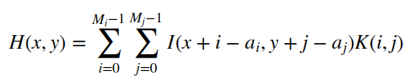
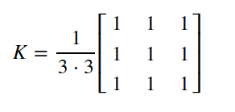

# [filter2D]线性滤波器

## 相关

相关（`correlation`）指的是图像的每一个部分与操作符（内核）之间的操作

## 内核

内核本质上是一个固定大小的数值系数数组，每个内核拥有一个锚点，该锚点通常位于数组中心

## 实现过程

滤波器计算过程如下：

1. 将内核锚点放置在确定的像素点上，内核其余部分覆盖图像中相应的领域像素点
2. 将核系数乘以相应的图像像素值并求和
3. 将结果放置回锚点的位置（输出图像）
4. 从左到右、从上到下滑动内核，对所有像素重复该过程

表达式如下：

<!-- $$
H(x,y)=\sum_{i=0}^{M_{i}-1} \sum_{j=0}^{M_{j}-1}I(x+i-a_{i}, y+j-a_{j})K(i,j)
$$ -->



其中`I`是图像像素值，`K`是内核系数值，`(a_{i}, a_{j})`表示内核锚点的坐标，比如`3x3`大小的内核锚点坐标是`(1,1)`

## filter2D

`OpenCV`使用函数[filter2D](https://docs.opencv.org/4.1.0/d5/df1/group__imgproc__hal__functions.html#ga42c2468ab3a1238fbf48458c57169081)进行线性滤波

```
CV_EXPORTS_W void filter2D( InputArray src, OutputArray dst, int ddepth,
                            InputArray kernel, Point anchor = Point(-1,-1),
                            double delta = 0, int borderType = BORDER_DEFAULT );
```

* `src`：原图
* `dst`：结果图像
* `ddepth`：结果图像深度，输入负数（比如`-1`）表示和原图一样
* `kernel`：内核
* `anchor`：锚点位置，默认为`Point(-1,-1)`，表明锚点在内核中心
* `delta`：计算过程中添加到每个像素的值，默认为`0`
* `borderType`：边界填充像素方法，默认为`BORDER_DEFAULT`

## 测试

执行标准化的方框滤波（`normalized box filgter`）。比如内核大小为`3x3`

<!-- $$
K=\frac {1}{3\cdot 3}\begin{bmatrix}
1 & 1 & 1\\ 
1 & 1 & 1\\ 
1 & 1 & 1
\end{bmatrix}
$$ -->



### OpenCV实现

滑动条设置范围`[0-5]`，分别实现内核大小为`1/3/5/7/9/11`的滤波效果（*当内核大小为`1`时，滤波没有效果*）

```
#include "opencv2/imgproc.hpp"
#include "opencv2/imgcodecs.hpp"
#include "opencv2/highgui.hpp"
#include <iostream>

using namespace std;
using namespace cv;

// 滑动条名
const string trackbarname = "size";
// 窗口名
const string winname = "filter2D";
// 最大值
const int maxNum = 5;
// Initialize arguments for the filter
Point anchor = Point(-1, -1);
int delta = 0;
int ddepth = -1;

Mat src, dst, kernel;
int ind = 0;

void onResize(int, void *) {

    // Update kernel size for a normalized box filter
    int kernel_size = 1 + 2 * (ind % 6);
    kernel = Mat::ones(kernel_size, kernel_size, CV_32F) / (float) (kernel_size * kernel_size);
    cout << kernel << endl;

    // Apply filter
    filter2D(src, dst, ddepth, kernel, anchor, delta, BORDER_DEFAULT);

    imshow(winname, dst);
}

int main(int argc, char **argv) {
    // Declare variables
    const char *imageName = argc >= 2 ? argv[1] : "../lena.jpg";
    // Loads an image
    src = imread(imageName, IMREAD_COLOR); // Load an image
    if (src.empty()) {
        printf(" Error opening image\n");
        printf(" Program Arguments: [image_name -- default ../lena.jpg] \n");
        return -1;
    }

    namedWindow(winname);
    createTrackbar(trackbarname, winname, &ind, maxNum, onResize, NULL);
    onResize(0, NULL);
    waitKey(0);

    return 0;
}
```

### 自定义实现

参考：[Opencv - how does the filter2D() method actually work?](https://stackoverflow.com/questions/13981699/opencv-how-does-the-filter2d-method-actually-work)

## 相关阅读

* [opencv cvFilter2D](https://blog.csdn.net/u012005313/article/details/46794419)

* [Making your own linear filters!](https://docs.opencv.org/4.1.0/d4/dbd/tutorial_filter_2d.html)
