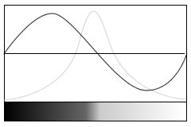
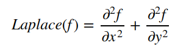
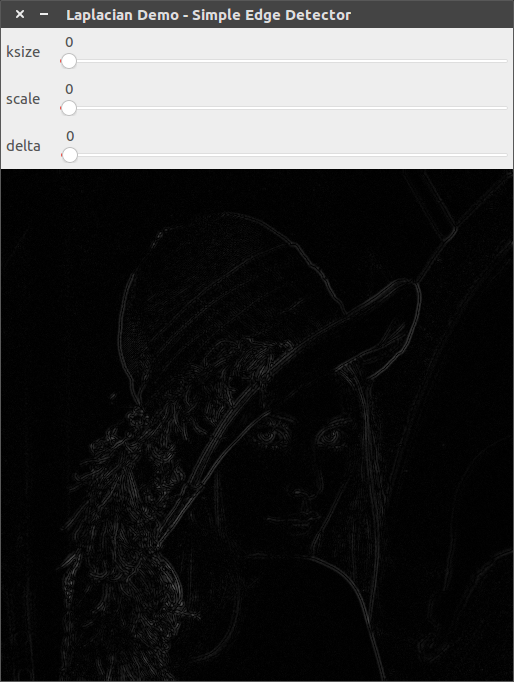
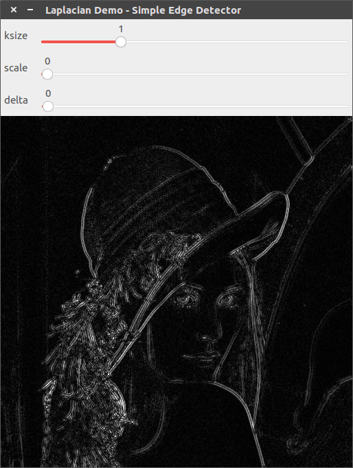
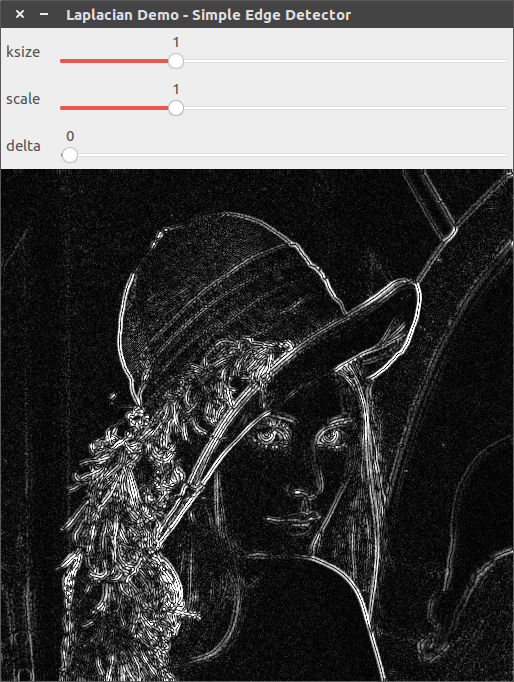

# [Laplacian]图像求导

`OpenCV`提供了二阶求导算子`Laplacian`

## Laplacian算子

对于`Sobel`算子而言，图像边缘区域的像素值变化剧烈，其表现在一阶导数上就是出现极大值


`Laplacian`算子计算的是图像的二阶导数，此时边缘区域的像素值在二阶导数中表现为`0`值




**与一阶导数相比，二阶导数能够区分像素值递增和递减区域，并且通过比较递增极大值和递减极小值，能够进一步区分出像素值变化缓慢和剧烈区域**

对于二维图像而言，其数学公式如下：



需要对水平和垂直方向进行二阶求导操作

## 函数解析

参考：[Laplacian()](https://docs.opencv.org/4.1.0/d4/d86/group__imgproc__filter.html#gad78703e4c8fe703d479c1860d76429e6)

```
CV_EXPORTS_W void Laplacian( InputArray src, OutputArray dst, int ddepth,
                             int ksize = 1, double scale = 1, double delta = 0,
                             int borderType = BORDER_DEFAULT );
```

* `src`：原图
* `dst`：结果图像
* `ddepth`：输出图像深度，使用`CV_16S`以避免溢出
* `dx`：导数在`x`轴方向的阶数
* `dy`：导数在`y`轴方向的阶数
* `ksize`：`Sobel`内核大小，比如`3/5/7/9/11`等等
* `scale`：计算导数值的比例因子，默认为`1`
* `delta`：添加到每个梯度的值，默认为`0`
* `borderType`：边界填充类型，默认为`BORDER_DEFAULT`

源代码地址：`/path/to/modules/imgproc/src/deriv.cpp`

```
    if( ksize == 1 || ksize == 3 )
    {
        float K[2][9] =
        {
            { 0, 1, 0, 1, -4, 1, 0, 1, 0 },
            { 2, 0, 2, 0, -8, 0, 2, 0, 2 }
        };

        Mat kernel(3, 3, CV_32F, K[ksize == 3]);
        if( scale != 1 )
            kernel *= scale;

        CV_OCL_RUN(_dst.isUMat() && _src.dims() <= 2,
                   ocl_Laplacian3_8UC1(_src, _dst, ddepth, kernel, delta, borderType));
    }

    if( ksize == 1 || ksize == 3 )
    {
        float K[2][9] =
        {
            { 0, 1, 0, 1, -4, 1, 0, 1, 0 },
            { 2, 0, 2, 0, -8, 0, 2, 0, 2 }
        };
        Mat kernel(3, 3, CV_32F, K[ksize == 3]);
        if( scale != 1 )
            kernel *= scale;

        filter2D( _src, _dst, ddepth, kernel, Point(-1, -1), delta, borderType );
    }
    else
    {
        int ktype = std::max(CV_32F, std::max(ddepth, sdepth));
        int wdepth = sdepth == CV_8U && ksize <= 5 ? CV_16S : sdepth <= CV_32F ? CV_32F : CV_64F;
        int wtype = CV_MAKETYPE(wdepth, cn);
        Mat kd, ks;
        getSobelKernels( kd, ks, 2, 0, ksize, false, ktype );

        ...
        ...
    }
```

当`ksize=1`时，`OpenCV`提供的内核为

```
0  1  0
1 -4  1
0  1  0
```

**通过差分方式进行计算，并没有平滑的效果**

当`ksize=3`时，`OpenCV`提供的内核为

```
2  0  2
0 -8  0
2  0  2
```

## 示例

```
#include "opencv2/imgproc.hpp"
#include "opencv2/imgcodecs.hpp"
#include "opencv2/highgui.hpp"
#include <iostream>

using namespace cv;
using namespace std;

// 滑动条名
const string ksize_trackbarname = "ksize";
const string scale_trackbarname = "scale";
const string delta_trackbarname = "delta";
// 窗口名
const string winname = "Laplacian Demo - Simple Edge Detector";
// 最大值
const int maxNum = 4;

int ksize_value, scale_value, delta_value;

Mat image, src, src_gray;
int ddepth = CV_16S;

void onLaplacian(int, void *) {
    int ksize = 1 + 2 * (ksize_value % 5); // ksize取值为 1/3/5/7/9
    double scale = 1 + scale_value;        // scale取值为 1/2/3/4/5
    double delta = 10 * delta_value;       // delta取值为 0/10/20/30/40

    Mat grad, abs_grad;
    Laplacian(src_gray, grad, ddepth, ksize, scale, delta, BORDER_DEFAULT);

    // converting back to CV_8U
    convertScaleAbs(grad, abs_grad);

    imshow(winname, abs_grad);
}

int main(int argc, char **argv) {
    cv::CommandLineParser parser(argc, argv,
                                 "{@input   |../lena.jpg|input image}"
                                 "{help    h|false|show help message}");
    cout << "The sample uses Laplacian OpenCV functions for edge detection\n\n";
    parser.printMessage();

    String imageName = parser.get<String>("@input");
    // As usual we load our source image (src)
    image = imread(imageName, IMREAD_COLOR); // Load an image
    // Check if image is loaded fine
    if (image.empty()) {
        printf("Error opening image: %s\n", imageName.c_str());
        return 1;
    }

    // Remove noise by blurring with a Gaussian filter ( kernel size = 3 )
    GaussianBlur(image, src, Size(3, 3), 0, 0, BORDER_DEFAULT);
    // Convert the image to grayscale
    cvtColor(src, src_gray, COLOR_BGR2GRAY);

    namedWindow(winname);
    createTrackbar(ksize_trackbarname, winname, &ksize_value, maxNum, onLaplacian, NULL);
    createTrackbar(scale_trackbarname, winname, &scale_value, maxNum, onLaplacian, NULL);
    createTrackbar(delta_trackbarname, winname, &delta_value, maxNum, onLaplacian, NULL);

    onLaplacian(0, NULL);
    waitKey(0);

    return 0;
}
```



`ksize=1, scale=1, delta=0`



`ksize=3, scale=1, delta=0`



`ksize=3, scale=2, delta=0`

## 小结

`OpenCV`中的`Laplacian`实现和`Sobel/Scharr`实现相比，没有高斯平滑功能，更注重像素值的变化，所以能够得到更加精细的图像轮廓

## 相关阅读

* [Laplace Operator](https://docs.opencv.org/4.1.0/d5/db5/tutorial_laplace_operator.html)

* [opencv cvLaplace()](https://blog.csdn.net/u012005313/article/details/46795131)
