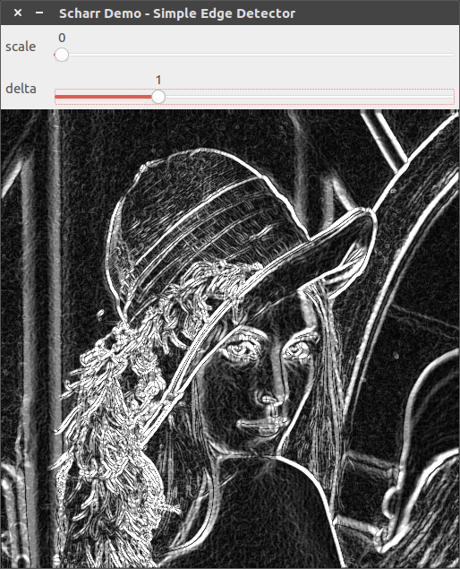

# [Scharr]图像求导

通过`Scharr`算子计算图像导数

## Scharr算子

`Scharr`算子和`Sobel`算子类似，均用于计算图像近似梯度。其`3x3`内核如下


相比于`Sobel`算子，其同样结合了高斯平滑和差分的功能，**并且因为中间差分系数相比于两边更高，所以相应地梯度计算精度更高**

## 函数解析

```
CV_EXPORTS_W void Scharr( InputArray src, OutputArray dst, int ddepth,
                          int dx, int dy, double scale = 1, double delta = 0,
                          int borderType = BORDER_DEFAULT );
```

* `src`：原图
* `dst`：结果图像
* `ddepth`：输出图像深度，使用`CV_16S`以避免溢出
* `dx`：导数在`x`轴方向的阶数
* `dy`：导数在`y`轴方向的阶数
* `scale`：计算导数值的比例因子，默认为`1`
* `delta`：添加到每个梯度的值，默认为`0`
* `borderType`：边界填充类型，默认为`BORDER_DEFAULT`

`OpenCV`提供的`Scharr`函数仅支持`3x3`大小模板

## 示例

```
#include "opencv2/imgproc.hpp"
#include "opencv2/imgcodecs.hpp"
#include "opencv2/highgui.hpp"
#include <iostream>

using namespace cv;
using namespace std;

// 滑动条名
const string scale_trackbarname = "scale";
const string delta_trackbarname = "delta";
// 窗口名
const string winname = "Scharr Demo - Simple Edge Detector";
// 最大值
const int maxNum = 4;

int scale_value, delta_value;

Mat image, src, src_gray, grad;
int ddepth = CV_16S;

void onSobel(int, void *) {
    double scale = 1 + scale_value;        // scale取值为 1/2/3/4/5
    double delta = 10 * delta_value;       // delta取值为 0/10/20/30/40

    Mat grad_x, grad_y;
    Mat abs_grad_x, abs_grad_y;
    Scharr(src_gray, grad_x, ddepth, 1, 0, scale, delta, BORDER_DEFAULT); // x方向求导
    Scharr(src_gray, grad_y, ddepth, 0, 1, scale, delta, BORDER_DEFAULT); // y方向求导

    // converting back to CV_8U
    convertScaleAbs(grad_x, abs_grad_x);
    convertScaleAbs(grad_y, abs_grad_y);
    addWeighted(abs_grad_x, 0.5, abs_grad_y, 0.5, 0, grad);                     // 近似计算图像梯度

    imshow(winname, grad);
}

int main(int argc, char **argv) {
    cv::CommandLineParser parser(argc, argv,
                                 "{@input   |../lena.jpg|input image}"
                                 "{help    h|false|show help message}");
    cout << "The sample uses Sobel or Scharr OpenCV functions for edge detection\n\n";
    parser.printMessage();
    cout << "\nPress 'ESC' to exit program.\nPress 'R' to reset values ( ksize will be -1 equal to Scharr function )";

    String imageName = parser.get<String>("@input");
    // As usual we load our source image (src)
    image = imread(imageName, IMREAD_COLOR); // Load an image
    // Check if image is loaded fine
    if (image.empty()) {
        printf("Error opening image: %s\n", imageName.c_str());
        return 1;
    }

    // Remove noise by blurring with a Gaussian filter ( kernel size = 3 )
    GaussianBlur(image, src, Size(3, 3), 0, 0, BORDER_DEFAULT);
    // Convert the image to grayscale
    cvtColor(src, src_gray, COLOR_BGR2GRAY);

    namedWindow(winname);
    createTrackbar(scale_trackbarname, winname, &scale_value, maxNum, onSobel, NULL);
    createTrackbar(delta_trackbarname, winname, &delta_value, maxNum, onSobel, NULL);

    onSobel(0, NULL);
    waitKey(0);

    return 0;
}
```


`scale=1, delta=0`


`scale=2, delta=0`



`scale=1, delta=10`

## 相关阅读

* [Sobel Derivatives](https://docs.opencv.org/4.1.0/d2/d2c/tutorial_sobel_derivatives.html)

* [opencv cvSobel()以及Scharr滤波器](https://blog.csdn.net/u012005313/article/details/46794743#commentBox)
