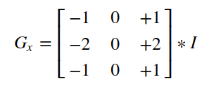
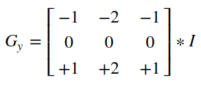
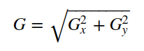
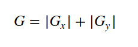
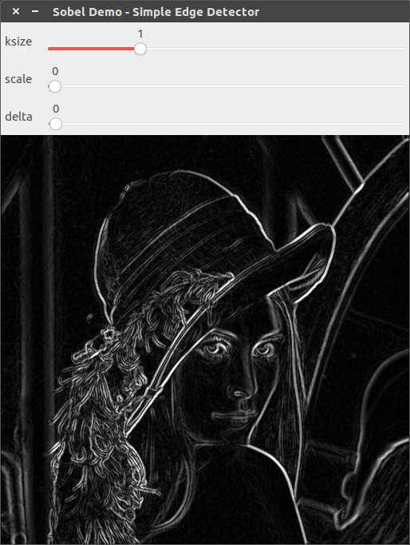
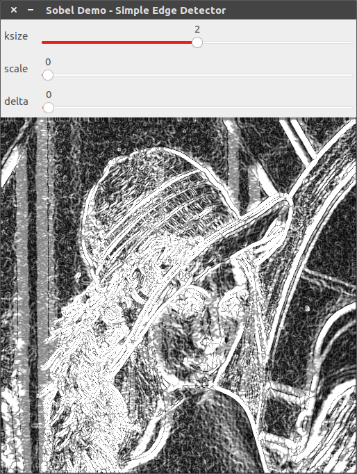
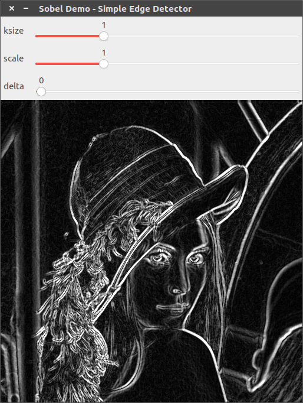

# [Sobel]图像求导

通过`Sobel`算子计算图像导数

## 导数和边缘

图像边缘处的像素值变化强烈，通过导数计算更能够发现变化强烈的地方，所以在进行边缘检测之前先进行求导操作，能够有利于图像轮廓的检测

## Sobel算子

`Sobel`算子是对一阶导数的近似计算，通过定义内核对图像进行水平和垂直方向的卷积运算，最后求取`L2`范数得到图像的近似梯度

水平方向计算如下：



垂直方向计算如下：



*从内核可看出，`Sobel`算子结合了高斯平滑和差分功能，更加具有抗噪声的能力*

计算梯度：



也可以使用近似计算公式：



## 函数解析

源文件：

1. `/path/to/modules/imgproc/src/filter.dispatch.cpp`
2. `/path/to/modules/imgproc/src/deriv.cpp`

`OpenCV`提供了`Sobel`算子的实现：

```
CV_EXPORTS_W void Sobel( InputArray src, OutputArray dst, int ddepth,
                         int dx, int dy, int ksize = 3,
                         double scale = 1, double delta = 0,
                         int borderType = BORDER_DEFAULT );
```

* `src`：原图
* `dst`：结果图像
* `ddepth`：输出图像深度，使用`CV_16S`以避免溢出
* `dx`：导数在`x`轴方向的阶数
* `dy`：导数在`y`轴方向的阶数
* `ksize`：`Sobel`内核大小，比如`3/5/7/9/11`等等
* `scale`：计算导数值的比例因子，默认为`1`
* `delta`：添加到每个梯度的值，默认为`0`
* `borderType`：边界填充类型，默认为`BORDER_DEFAULT`

还有一个相关的函数是`getDerivKernels`，其返回计算空间图像导数的滤波系数

```
void cv::getDerivKernels( OutputArray kx, OutputArray ky, int dx, int dy,
                          int ksize, bool normalize, int ktype )
{
    if( ksize <= 0 )
        getScharrKernels( kx, ky, dx, dy, normalize, ktype );
    else
        getSobelKernels( kx, ky, dx, dy, ksize, normalize, ktype );
}
```

如果指定内核大小`ksize`大于`0`，则调用函数`getSobelKernels`制作`Sobel`算子内核

## 示例

```
#include "opencv2/imgproc.hpp"
#include "opencv2/imgcodecs.hpp"
#include "opencv2/highgui.hpp"
#include <iostream>

using namespace cv;
using namespace std;

// 滑动条名
const string ksize_trackbarname = "ksize";
const string scale_trackbarname = "scale";
const string delta_trackbarname = "delta";
// 窗口名
const string winname = "Sobel Demo - Simple Edge Detector";
// 最大值
const int maxNum = 4;

int ksize_value, scale_value, delta_value;

Mat image, src, src_gray, grad;
int ddepth = CV_16S;

void onSobel(int, void *) {
    int ksize = 1 + 2 * (ksize_value % 5); // ksize取值为 1/3/5/7/9
    double scale = 1 + scale_value;        // scale取值为 1/2/3/4/5
    double delta = 10 * delta_value;       // delta取值为 0/10/20/30/40

    Mat grad_x, grad_y;
    Mat abs_grad_x, abs_grad_y;
    Sobel(src_gray, grad_x, ddepth, 1, 0, ksize, scale, delta, BORDER_DEFAULT); // x方向求导
    Sobel(src_gray, grad_y, ddepth, 0, 1, ksize, scale, delta, BORDER_DEFAULT); // y方向求导

    // converting back to CV_8U
    convertScaleAbs(grad_x, abs_grad_x);
    convertScaleAbs(grad_y, abs_grad_y);
    addWeighted(abs_grad_x, 0.5, abs_grad_y, 0.5, 0, grad);                     // 近似计算图像梯度

    imshow(winname, grad);
}

int main(int argc, char **argv) {
    cv::CommandLineParser parser(argc, argv,
                                 "{@input   |../lena.jpg|input image}"
                                 "{help    h|false|show help message}");
    cout << "The sample uses Sobel or Scharr OpenCV functions for edge detection\n\n";
    parser.printMessage();
    cout << "\nPress 'ESC' to exit program.\nPress 'R' to reset values ( ksize will be -1 equal to Scharr function )";

    String imageName = parser.get<String>("@input");
    // As usual we load our source image (src)
    image = imread(imageName, IMREAD_COLOR); // Load an image
    // Check if image is loaded fine
    if (image.empty()) {
        printf("Error opening image: %s\n", imageName.c_str());
        return 1;
    }

    // Remove noise by blurring with a Gaussian filter ( kernel size = 3 )
    GaussianBlur(image, src, Size(3, 3), 0, 0, BORDER_DEFAULT);
    // Convert the image to grayscale
    cvtColor(src, src_gray, COLOR_BGR2GRAY);

    namedWindow(winname);
    createTrackbar(ksize_trackbarname, winname, &ksize_value, maxNum, onSobel, NULL);
    createTrackbar(scale_trackbarname, winname, &scale_value, maxNum, onSobel, NULL);
    createTrackbar(delta_trackbarname, winname, &delta_value, maxNum, onSobel, NULL);

    onSobel(0, NULL);
    waitKey(0);

    return 0;
}
```

`Sobel`算子有`3`个关键参数：`ksize/scale/delta`。实现步骤如下：

1. 读取彩色图像
2. 高斯平滑操作，去除噪声
3. 转换成灰度图像
4. 创建`3`个滑动条，分别控制`ksize/scale/delta`
5. `Sobel`滤波

从实验结果发现

1. `ksize`越大，图像轮廓越不明显，取`ksize=3`即可
2. `scale`有助于显示更多图像轮廓信息，不过`scale`过大会导致过多的轮廓信息出现，取`scale=1`或`2`即可
3. `delta`有助于提高图像整体亮度



`ksize=3, scale=1, delta=0`



`ksize=5, scale=1, delta=0`



`ksize=3, scale=2, delta=0`

## 相关阅读

* [Sobel Derivatives](https://docs.opencv.org/4.1.0/d2/d2c/tutorial_sobel_derivatives.html)

* [opencv cvSobel()以及Scharr滤波器](https://blog.csdn.net/u012005313/article/details/46794743#commentBox)
