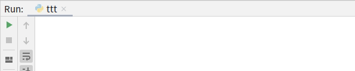
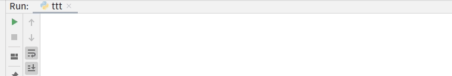
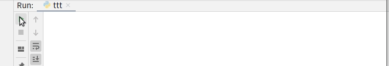

# [tqdm]进度条

[tqdm](https://github.com/tqdm/tqdm)提供了一个简易的方式实现进度条

## 安装

```
pip install tqdm
```

## 示例

`tqdm`提供了多个公式以实现进度条，常用的有以下几种方式

1. 基于可迭代对象
2. 手动设置迭代进度

### tqdm()

```
from tqdm import tqdm
from time import sleep

text = ""
for char in tqdm(["a", "b", "c", "d"]):
    sleep(0.25)
    text = text + char
print(text)
```



### trange()

```
from time import sleep
from tqdm import trange

for i in trange(100):
    sleep(0.01)
```



### with tqdm(total=xxx) as pbar

```
from tqdm import tqdm
from time import sleep

with tqdm(total=100) as pbar:
    for i in range(10):
        sleep(0.1)
        pbar.update(10)
```



### pbar = tqdm(total=100)

```
from tqdm import tqdm
from time import sleep

pbar = tqdm(total=100)
for i in range(10):
    sleep(0.1)
    pbar.update(10)
pbar.close()
```
