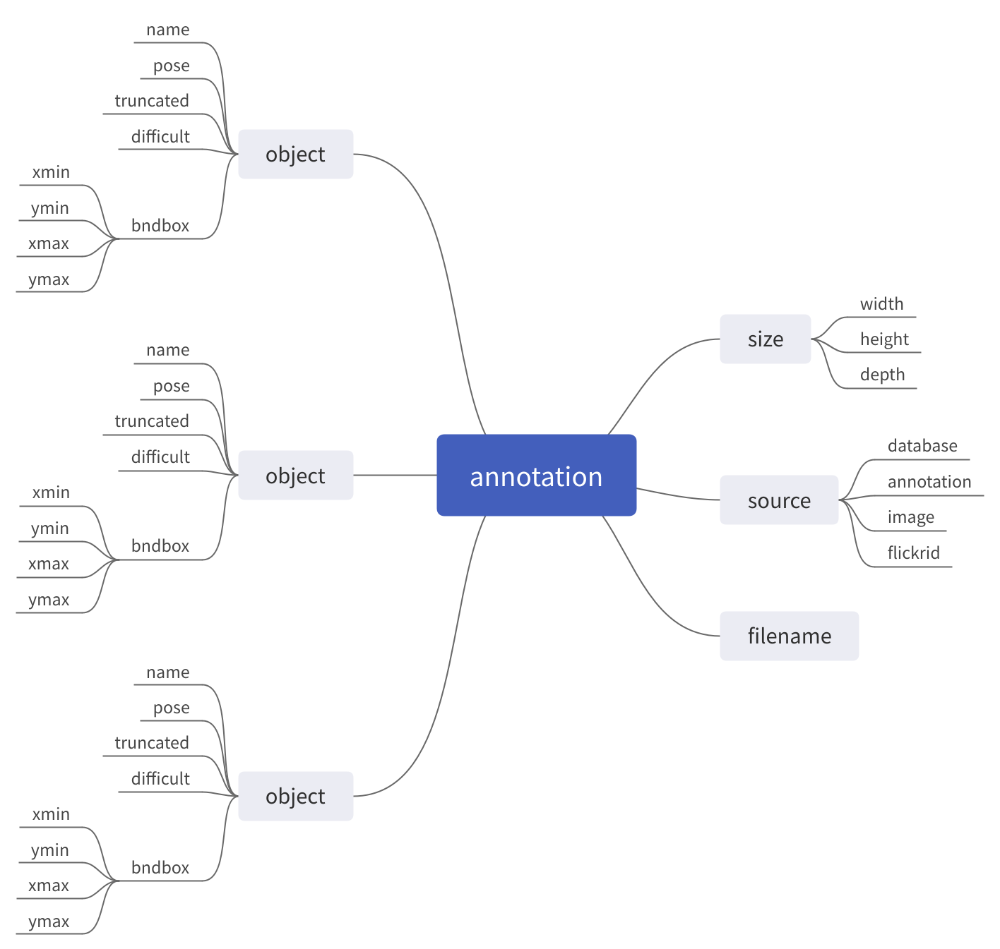

# [ElementTree]读取XML文件

很多`python`模块提供了读取`XML`文件功能，参考[用 ElementTree 在 Python 中解析 XM](https://pycoders-weekly-chinese.readthedocs.io/en/latest/issue6/processing-xml-in-python-with-element-tree.html)，利用`xml.etree.cElementTree`实现`XML`文件读取（*操作最简单易懂，符合`tree`的读取*）

## XML文件

`XML`测试文件如下，表示一个图像的标注数据，包含了被标注的图像信息以及标注信息

```
<annotation>
	<filename>000005.jpg</filename>
	<source>
		<database>The VOC2007 Database</database>
		<annotation>PASCAL VOC2007</annotation>
		<image>flickr</image>
		<flickrid>325991873</flickrid>
	</source>
	<size>
		<width>500</width>
		<height>375</height>
		<depth>3</depth>
	</size>
	<object>
		<name>chair</name>
		<pose>Rear</pose>
		<truncated>0</truncated>
		<difficult>0</difficult>
		<bndbox>
			<xmin>263</xmin>
			<ymin>211</ymin>
			<xmax>324</xmax>
			<ymax>339</ymax>
		</bndbox>
	</object>
	<object>
		<name>chair</name>
		<pose>Unspecified</pose>
		<truncated>0</truncated>
		<difficult>0</difficult>
		<bndbox>
			<xmin>165</xmin>
			<ymin>264</ymin>
			<xmax>253</xmax>
			<ymax>372</ymax>
		</bndbox>
	</object>
	<object>
		<name>chair</name>
		<pose>Unspecified</pose>
		<truncated>1</truncated>
		<difficult>1</difficult>
		<bndbox>
			<xmin>5</xmin>
			<ymin>244</ymin>
			<xmax>67</xmax>
			<ymax>374</ymax>
		</bndbox>
	</object>
</annotation>
```

其结构如下图所示



## 解析

加载解析模块，读取`xml`文件

```
import xml.etree.cElementTree as ET
tree = ET.ElementTree(file='xml_test.xml')
```

读取根节点

```
root  = tree.getroot()
```

**每个节点均包含节点名`tag`和属性`attrib`**

读取根节点名和属性

```
print(root.tag, root.attrib)
// 输出
annotation {}
```

**类似数组一样按下标读取子节点**

读取所有节点

```
for child in root:
    print(child.tag, child.attrib)
// 输出 
filename {}
source {}
size {}
segmented {}
object {}
object {}
object {}
```

读取`size`节点

```
>>> size = root[4]
>>> size
<Element 'size' at 0x7efe63ad0a70>
```

**节点值可通过参数`text`获取**

读取`size`节点下的子节点`widht/height/depth`的值

```
>>> for child in size:
...     print(child.tag, child.text)
... 
width 500
height 375
depth 3
```

## 示例

读取图像名（`filename`），图像宽/高/深度（`width/height/depth`），以及标注的目标名（`name`）和边界框坐标（`xmin/ymin/xmax/ymax`）

```
# -*- coding: utf-8 -*-

"""
@author: zj
@file:   xml.py
@time:   2019-12-07
"""

import xml.etree.cElementTree as ET

if __name__ == '__main__':
    tree = ET.ElementTree(file='xml_test.xml')
    root = tree.getroot()

    node_filename = root[0]
    print("文件名：", node_filename.text)

    node_size = root[2]
    node_width = node_size[0]
    node_height = node_size[1]
    node_depth = node_size[2]
    print('文件大小(宽, 高, 深度)：(%s, %s, %s)' % (node_width.text, node_height.text, node_depth.text))

    for i in range(3, 6):
        node_obj = root[i]
        node_name = node_obj[0]
        node_bndbox = node_obj[4]

        node_xmin = node_bndbox[0]
        node_ymin = node_bndbox[1]
        node_xmax = node_bndbox[2]
        node_ymax = node_bndbox[3]

        print('目标：' + node_name.text)
        print('边界框坐标：(%s, %s, %s, %s)' % (node_xmin.text, node_ymin.text, node_xmax.text, node_ymax.text))
```

实现结果如下

```
文件名： 000005.jpg
文件大小(宽, 高, 深度)：(500, 375, 3)
目标：chair
边界框坐标：(263, 211, 324, 339)
目标：chair
边界框坐标：(165, 264, 253, 372)
目标：chair
边界框坐标：(5, 244, 67, 374)
```