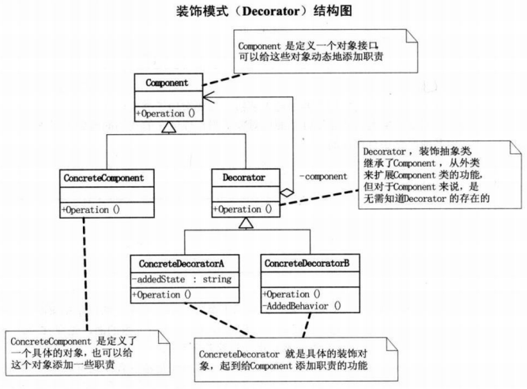

# 装饰器

装饰模式（`Decorator Pattern`）能够动态的给对象添加额外功能，其目的是分离核心和装饰功能

`python`不仅支持面向对象的装饰模式实现，还提供了高阶函数装饰器（`decorator`），从语法层面支持装饰模式

## 面向对象实现

需要向旧的类添加新功能时，使用装饰模式能够在不改变原有类功能的情况下新增功能



实现方式：

1. 定义抽象类`Component`，定义装饰方法`operation`
2. 原有类`ConcreteComponent`实现该抽象类以及装饰方法
3. 定义装饰类`Decorator`，实现赋值抽象类对象方法`set_component`，实现装饰方法`operation`
4. 定义具体装饰类`ConcreteDecoratorA`和`ConcreteDecoratorB`，实现装饰方法`operation`
5. 定义原有类对象以及具体装饰类对象，使用方法`set_component`进行对象赋值
6. 最后执行装饰方法

```
# -*- coding: utf-8 -*-

# @Time    : 19-6-11 下午4:20
# @Author  : zj

from abc import ABCMeta, abstractmethod


class Component(metaclass=ABCMeta):

    @abstractmethod
    def operation(self):
        pass


class ConcreteComponent(Component):

    def __init__(self):
        super(ConcreteComponent, self).__init__()

    def operation(self):
        print('concrete component')


class Decorator(Component):

    def __init__(self):
        super(Decorator, self).__init__()
        self.component = None

    def set_component(self, component):
        assert isinstance(component, Component)
        self.component = component

    def operation(self):
        if self.component is not None:
            self.component.operation()


class ConcreteDecoratorA(Decorator):

    def __init__(self):
        super(ConcreteDecoratorA, self).__init__()
        self.addedState = None

    def operation(self):
        super(ConcreteDecoratorA, self).operation()
        self.addedState = 'New State'
        print('concrete decorator a')


class ConcreteDecoratorB(Decorator):

    def __init__(self):
        super(ConcreteDecoratorB, self).__init__()

    def operation(self):
        super(ConcreteDecoratorB, self).operation()
        self.added_behavior()

    def added_behavior(self):
        print('concrete decorator b')


if __name__ == '__main__':
    cc = ConcreteComponent()
    cda = ConcreteDecoratorA()
    cdb = ConcreteDecoratorB()

    cda.set_component(cc)
    cdb.set_component(cda)

    cdb.operation()
```

实现如下：

```
concrete component
concrete decorator a
concrete decorator b
```

上述实现中，首先执行原有类，然后按顺序执行具体装饰类，实际情况中可灵活进行调整

## python装饰器

`python`提供了[decorator -- 装饰器](https://docs.python.org/zh-cn/3/glossary.html#term-decorator)用于装饰模式的实现

### 语法糖@wrapper

简单实现如下：

```
def log(func):
    print('hello world')
    return func


@log
def concrete_thing():
    print("concrete thing")


if __name__ == '__main__':
    concrete_thing()
```

执行方法`concrete_thing()`输出如下

```
hello world
concrete thing
```

等同于执行方法`log(concrete_thing)()`，其中语法`@wrapper`是`python`提供的语法糖

### 元信息变化

另一种实现是在装饰方法中新建内部函数并返回内部函数，实现如下：

```
def log(func):
    def wrapper(*args, **kw):
        print('before func')
        func(*args, **kw)
        print('after func')

    return wrapper


@log
def concrete_thing(i, j):
    z = i + j
    print("concrete thing: %d" % z)


if __name__ == '__main__':
    concrete_thing(1, 2)
    print(concrete_thing.__name__)
```

上述代码执行具体方法`concrete_thing`并打印其函数名

```
before func
concrete thing: 3
after func
wrapper
```

函数名`__name__`发生了变化，**可通过方法`functools.wrap`进行校正**

```
from functools import wraps


def log(func):
    @wraps(func)
    def wrapper(*args, **kw):
        print('before func')
        func(*args, **kw)
        print('after func')

    return wrapper


@log
def concrete_thing(i, j):
    z = i + j
    print("concrete thing: %d" % z)


if __name__ == '__main__':
    print(concrete_thing.__name__)
```

输出如下：

```
concrete_thing
```

### 装饰器参数

可以添加参数到装饰器，**需要再包装一个函数到之前的装饰器函数**

```
from functools import wraps


def use_logging(level):
    def log(func):
        @wraps(func)
        def wrapper(*args, **kw):
            if level == 'warn':
                print('warn')
            else:
                print('nothing')
            print('before func')
            func(*args, **kw)
            print('after func')

        return wrapper

    return log


@use_logging('warn')
def concrete_thing(i, j):
    z = i + j
    print("concrete thing: %d" % z)


if __name__ == '__main__':
    concrete_thing(1, 2)
    print(concrete_thing.__name__)
```

其实先等同于`use_logging(3)(concrete_thing)(3, 2)`，输出结果如下：

```
warn
before func
concrete thing: 3
after func
concrete_thing
```

#### 添加多个装饰器

可以分别进行多个装饰器的操作

```
from functools import wraps


def use_logging(level='verbose'):
    def log(func):
        @wraps(func)
        def wrapper(*args, **kw):
            if level == 'warn':
                print('warn')
            else:
                print('nothing')
            print('before func')
            func(*args, **kw)
            print('after func')

            return func

        return wrapper

    return log


@use_logging('warn')
@use_logging()
def concrete_thing(i, j):
    z = i + j
    print("concrete thing: %d" % z)


if __name__ == '__main__':
    concrete_thing(2, 3)
```

输出如下：

```
warn
before func
nothing
before func
concrete thing: 5
after func
after func
```

从上到下顺序执行装饰器，运行第一个装饰器`use_logging('warn')`，依次进入`log->wrapper->func`，执行`func`时触发第二个装饰器`use_logging()`，先执行`log->wrapper`，再执行`func`，然后依次退出（*func仅执行一次*）

### 装饰器类

之前的装饰器操作在函数上，同样可以定义包装器类

```
from functools import wraps


class Foo(object):

    def __init__(self, level='verbose'):
        self._level = level

    def __call__(self, func):
        @wraps(func)
        def wrapper(*args, **kw):
            print('before class')
            func(*args, **kw)
            print('after class')

            self.notify()

        return wrapper

    def notify(self):
        if self._level == 'verbose':
            pass
        else:
            pass


@Foo()
def concrete_thing(i, j):
    z = i + j
    print("concrete thing: %d" % z)


if __name__ == '__main__':
    concrete_thing(2, 3)
```

模拟上一节面向对象实现如下：

```
from functools import wraps


class Decorator(object):

    def __init__(self, info):
        self._info = info

    def __call__(self, func):
        @wraps(func)
        def wrapper(*args, **kw):
            self.notify()
            func(*args, **kw)

        return wrapper

    def notify(self):
        print(self._info)


class ConcreteComponent:

    def __init__(self):
        pass

    @Decorator('concrete decorator a')
    @Decorator('concrete decorator b')
    def operation(self):
        print('concrete component')


if __name__ == '__main__':
    cc = ConcreteComponent()
    cc.operation()
```

或者

```
from functools import wraps


class Decorator(object):

    def __init__(self, info):
        self._info = info

    def __call__(self, cls):
        @wraps(cls)
        def wrapper(*args, **kw):
            self.notify()

            return cls()

        return wrapper

    def notify(self):
        print(self._info)


@Decorator('concrete decorator a')
@Decorator('concrete decorator b')
class ConcreteComponent:

    def __init__(self):
        pass

    def operation(self):
        print('concrete component')


if __name__ == '__main__':
    cc = ConcreteComponent()
    cc.operation()
```

```
concrete decorator a
concrete decorator b
concrete component
```

## 相关阅读

* 《大话设计模式》第六章 穿什么有这么重要? - 装饰模式
* [Python 函数装饰器](https://www.runoob.com/w3cnote/python-func-decorators.html)
* [理解 Python 装饰器看这一篇就够了](https://foofish.net/python-decorator.html)
* [装饰器](https://www.liaoxuefeng.com/wiki/1016959663602400/1017451662295584)
