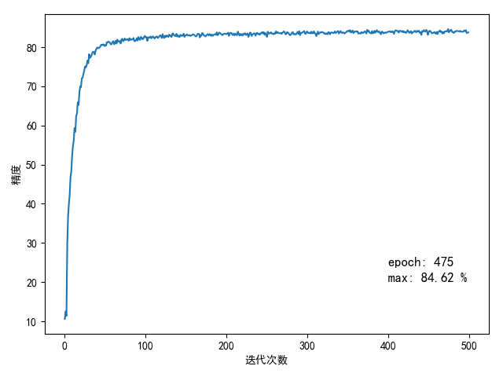

# AlexNet定义

`AlexNet`使用`5`层卷积层和`3`层全连接层

## 定义网络

`pytorch`已经定义好了[AlexNet模型](https://github.com/pytorch/vision/blob/master/torchvision/models/alexnet.py)

```
import torchvision.models as models
alexnet = models.alexnet()
```

其实现和原文有差别

```
AlexNet(
  (features): Sequential(
    (0): Conv2d(3, 64, kernel_size=(11, 11), stride=(4, 4), padding=(2, 2))
    (1): ReLU(inplace)
    (2): MaxPool2d(kernel_size=3, stride=2, padding=0, dilation=1, ceil_mode=False)
    (3): Conv2d(64, 192, kernel_size=(5, 5), stride=(1, 1), padding=(2, 2))
    (4): ReLU(inplace)
    (5): MaxPool2d(kernel_size=3, stride=2, padding=0, dilation=1, ceil_mode=False)
    (6): Conv2d(192, 384, kernel_size=(3, 3), stride=(1, 1), padding=(1, 1))
    (7): ReLU(inplace)
    (8): Conv2d(384, 256, kernel_size=(3, 3), stride=(1, 1), padding=(1, 1))
    (9): ReLU(inplace)
    (10): Conv2d(256, 256, kernel_size=(3, 3), stride=(1, 1), padding=(1, 1))
    (11): ReLU(inplace)
    (12): MaxPool2d(kernel_size=3, stride=2, padding=0, dilation=1, ceil_mode=False)
  )
  (classifier): Sequential(
    (0): Dropout(p=0.5)
    (1): Linear(in_features=9216, out_features=4096, bias=True)
    (2): ReLU(inplace)
    (3): Dropout(p=0.5)
    (4): Linear(in_features=4096, out_features=4096, bias=True)
    (5): ReLU(inplace)
    (6): Linear(in_features=4096, out_features=1000, bias=True)
  )
)
```

原文实现如下：

```
import torch.nn as nn

__all__ = ['AlexNet', 'alexnet']


class AlexNet(nn.Module):

    def __init__(self, num_classes=1000):
        super(AlexNet, self).__init__()
        self.conv1 = nn.Sequential(
            nn.Conv2d(3, 96, kernel_size=11, stride=4),
            nn.ReLU(inplace=True),
            nn.MaxPool2d(kernel_size=3, stride=2)
        )
        self.conv2 = nn.Sequential(
            nn.Conv2d(96, 256, kernel_size=5, padding=2),
            nn.ReLU(inplace=True),
            nn.MaxPool2d(kernel_size=3, stride=2)
        )
        self.conv3 = nn.Sequential(
            nn.Conv2d(256, 384, kernel_size=3, padding=1),
            nn.ReLU(inplace=True)
        )
        self.conv4 = nn.Sequential(
            nn.Conv2d(384, 384, kernel_size=3, padding=1),
            nn.ReLU(inplace=True)
        )
        self.conv5 = nn.Sequential(
            nn.Conv2d(384, 256, kernel_size=3, padding=1),
            nn.ReLU(inplace=True),
            nn.MaxPool2d(kernel_size=3, stride=2)
        )
        self.dense = nn.Sequential(
            nn.Dropout(),
            nn.Linear(6 * 6 * 256, 4096),
            nn.ReLU(inplace=True),
            nn.Dropout(),
            nn.Linear(4096, 4096),
            nn.ReLU(inplace=True),
            nn.Linear(4096, num_classes),
        )

    def forward(self, x):
        x = self.conv1(x)
        x = self.conv2(x)
        x = self.conv3(x)
        x = self.conv4(x)
        x = self.conv5(x)
        x = x.view(x.size(0), 256 * 6 * 6)
        x = self.dense(x)
        return x


def alexnet(**kwargs):
    model = AlexNet(**kwargs)
    return model


if __name__ == '__main__':
    net = alexnet()
    print(net)
```

网络结构如下：

```
AlexNet(
  (conv1): Sequential(
    (0): Conv2d(3, 96, kernel_size=(11, 11), stride=(4, 4))
    (1): ReLU(inplace)
    (2): MaxPool2d(kernel_size=3, stride=2, padding=0, dilation=1, ceil_mode=False)
  )
  (conv2): Sequential(
    (0): Conv2d(96, 256, kernel_size=(5, 5), stride=(1, 1), padding=(2, 2))
    (1): ReLU(inplace)
    (2): MaxPool2d(kernel_size=3, stride=2, padding=0, dilation=1, ceil_mode=False)
  )
  (conv3): Sequential(
    (0): Conv2d(256, 384, kernel_size=(3, 3), stride=(1, 1), padding=(1, 1))
    (1): ReLU(inplace)
  )
  (conv4): Sequential(
    (0): Conv2d(384, 384, kernel_size=(3, 3), stride=(1, 1), padding=(1, 1))
    (1): ReLU(inplace)
  )
  (conv5): Sequential(
    (0): Conv2d(384, 256, kernel_size=(3, 3), stride=(1, 1), padding=(1, 1))
    (1): ReLU(inplace)
    (2): MaxPool2d(kernel_size=3, stride=2, padding=0, dilation=1, ceil_mode=False)
  )
  (dense): Sequential(
    (0): Dropout(p=0.5)
    (1): Linear(in_features=9216, out_features=4096, bias=True)
    (2): ReLU(inplace)
    (3): Dropout(p=0.5)
    (4): Linear(in_features=4096, out_features=4096, bias=True)
    (5): ReLU(inplace)
    (6): Linear(in_features=4096, out_features=1000, bias=True)
  )
)
```

## 训练网络

使用`cifar-10`进行测试，输入图像缩放为`227x227`大小，使用`SGD`进行反向更新，每次批量训练`100`张图像，学习率为`0.001`，`momentum`为`0.9`

`500`次训练精度如下：

```
# -*- coding: utf-8 -*-

# @Time    : 19-4-6 上午9:54
# @Author  : zj

import matplotlib.pyplot as plt

accuracy_list = [10.59, 12.52, 11.36, 29.54, 36.71, 39.91, 42.3, 46.82, 48.18, 52.17, 54.7, 56.12, 59.33, 58.36, 62.33,
                 63.08, 65.91, 65.22, 68.47, 69.99, 69.78, 72.05, 72.17, 73.18, 74.03, 75.09, 74.81, 75.36, 76.54,
                 75.88, 78.21, 77.23, 77.51, 77.84, 78.59, 78.83, 78.76, 78.11, 79.1, 79.52, 79.92, 79.78, 79.72, 79.96,
                 80.2, 80.62, 80.52, 80.65, 80.68, 80.28, 80.54, 80.41, 81.25, 81.21, 81.4, 81.27, 81.1, 80.69, 80.77,
                 81.33, 81.52, 80.73, 80.99, 81.65, 80.92, 81.9, 81.51, 81.35, 81.57, 80.92, 81.9, 82.14, 81.52, 81.7,
                 82.2, 81.84, 81.88, 82.05, 81.96, 81.63, 82.3, 81.84, 81.95, 81.91, 82.05, 82.32, 81.53, 81.55, 81.83,
                 82.28, 81.65, 82.6, 82.11, 81.84, 82.59, 82.48, 82.0, 82.13, 82.58, 82.87, 82.5, 82.58, 81.59, 82.48,
                 82.49, 82.41, 82.71, 82.26, 82.55, 82.74, 82.49, 82.2, 82.48, 82.67, 82.7, 82.31, 82.55, 82.8, 83.04,
                 82.78, 82.34, 83.3, 82.58, 82.33, 82.94, 82.58, 82.98, 82.82, 82.57, 83.18, 82.91, 82.92, 82.56, 83.4,
                 83.49, 83.0, 82.89, 82.82, 83.39, 82.69, 82.99, 82.65, 82.6, 83.15, 82.96, 82.83, 83.03, 83.42, 82.6,
                 82.98, 83.05, 83.27, 82.98, 82.98, 83.09, 82.85, 82.91, 83.04, 83.22, 83.25, 83.1, 82.91, 82.72, 82.86,
                 83.3, 83.42, 83.36, 82.47, 83.09, 82.92, 83.62, 83.42, 82.97, 82.92, 82.7, 83.02, 83.15, 83.35, 82.98,
                 83.28, 83.2, 82.84, 83.19, 82.9, 83.12, 83.21, 83.31, 83.14, 83.79, 83.03, 83.31, 83.72, 83.61, 83.34,
                 83.25, 83.05, 83.29, 83.44, 83.41, 83.35, 83.33, 83.48, 83.69, 82.88, 83.52, 83.63, 83.64, 83.18,
                 83.09, 83.44, 83.03, 83.44, 83.25, 83.04, 83.97, 83.5, 82.94, 83.37, 83.05, 83.34, 82.95, 83.41, 83.3,
                 83.56, 83.09, 83.26, 83.49, 82.61, 83.07, 83.7, 83.64, 82.87, 83.24, 83.35, 83.54, 83.38, 82.93, 83.56,
                 83.63, 83.35, 83.42, 83.16, 83.51, 83.54, 83.82, 83.49, 83.83, 83.18, 83.57, 83.07, 82.61, 83.95,
                 83.48, 83.48, 83.59, 83.79, 83.45, 83.46, 83.28, 83.55, 83.39, 84.02, 83.57, 83.88, 83.65, 83.6, 83.53,
                 83.63, 83.37, 83.63, 83.82, 84.03, 83.75, 83.27, 83.42, 83.85, 83.59, 83.56, 83.09, 83.08, 83.33,
                 83.73, 83.82, 83.25, 83.4, 83.24, 83.27, 83.56, 83.91, 83.34, 84.06, 83.04, 83.63, 83.64, 83.79, 83.91,
                 84.11, 83.47, 83.37, 83.93, 83.94, 83.58, 83.59, 83.71, 83.46, 83.94, 83.59, 83.51, 84.03, 83.56,
                 83.47, 82.81, 83.39, 83.97, 83.32, 83.64, 83.77, 83.71, 83.89, 83.76, 83.7, 83.42, 83.54, 83.3, 83.51,
                 83.28, 83.85, 83.72, 83.28, 83.67, 83.77, 83.69, 83.58, 83.65, 84.01, 83.6, 83.79, 83.99, 84.13, 83.47,
                 83.8, 84.11, 83.71, 83.61, 83.77, 83.69, 83.47, 83.69, 83.78, 84.09, 84.08, 84.22, 83.94, 84.33, 83.72,
                 83.91, 84.23, 83.6, 83.93, 83.93, 84.06, 83.96, 84.03, 83.45, 83.54, 83.52, 83.44, 83.86, 83.68, 83.6,
                 83.83, 84.04, 83.87, 83.46, 84.41, 84.06, 84.17, 83.69, 83.57, 83.49, 84.09, 83.52, 83.68, 84.17,
                 83.66, 83.98, 84.33, 83.92, 83.84, 83.99, 83.55, 83.31, 83.97, 83.88, 83.52, 83.61, 83.74, 83.63,
                 83.72, 83.85, 83.89, 84.02, 83.91, 83.98, 83.8, 84.03, 83.96, 83.39, 83.94, 84.29, 84.23, 84.13, 84.14,
                 83.7, 84.16, 84.19, 84.03, 83.89, 84.14, 83.75, 83.97, 83.81, 83.6, 83.95, 84.32, 83.96, 83.64, 83.9,
                 84.08, 83.46, 83.77, 83.86, 83.98, 84.2, 83.86, 83.84, 84.16, 83.97, 84.19, 83.66, 83.8, 83.13, 84.09,
                 83.97, 84.33, 84.05, 83.97, 84.4, 84.12, 83.14, 83.83, 84.2, 84.09, 83.85, 83.51, 83.63, 83.63, 83.87,
                 83.64, 83.39, 83.89, 83.35, 83.88, 84.0, 84.27, 83.85, 83.95, 83.46, 83.87, 83.54, 84.0, 84.07, 84.01,
                 84.04, 84.62, 83.79, 84.04, 84.34, 84.42, 83.88, 83.78, 83.61, 83.95, 83.93, 84.17, 84.11, 84.11,
                 84.08, 83.96, 84.16, 83.93, 83.93, 83.92, 83.93, 84.28, 84.11, 84.32, 83.61, 83.69, 83.77]

if __name__ == '__main__':
    max_accuracy = max(accuracy_list)
    index = accuracy_list.index(max_accuracy)
    print(max_accuracy)
    print(index)

    y = accuracy_list

    fig = plt.figure(1)
    plt.xlabel('迭代次数')
    plt.ylabel('精度')
    plt.plot(y)
    plt.text(400, 20, 'max: %.2f %%' % (max_accuracy), fontsize=12)
    plt.text(400, 24, 'epoch: %d' % (index + 1), fontsize=12)

    plt.show()
```



`500`次迭代平均损失如下：

```
import matplotlib.pyplot as plt

loss_list = [2.3023554348945616, 2.301481910228729, 2.297154522895813, 2.1280875062942504, 1.8379582653045654,
             1.669295969247818, 1.5810251920223235, 1.5055523529052734, 1.4295441448688506, 1.3665236794948579,
             1.3059324505329133, 1.2510101475715638, 1.1981551232337952, 1.1395108386278152, 1.0867853610515594,
             1.0324375677108764, 0.979730964064598, 0.9378578369617462, 0.8985381683111191, 0.850989138007164,
             0.8172901912927627, 0.7802419648766518, 0.7401535509228706, 0.711376772403717, 0.6795852983593941,
             0.6541237514615059, 0.631098689198494, 0.6107631900906563, 0.5851399653553963, 0.5635620189905166,
             0.5435092575252056, 0.5184067181944847, 0.5014592601656914, 0.4858271193504333, 0.46333419311046603,
             0.4532018289864063, 0.42763098707795144, 0.4132226316332817, 0.396316266566515, 0.37738977929949763,
             0.3628608306646347, 0.3496949945986271, 0.3305501665472984, 0.31730471420288087, 0.30102346366643906,
             0.2896851798892021, 0.27939001682400705, 0.25949965964257715, 0.246481137663126, 0.23442410534620284,
             0.22163819167017937, 0.21265612183511257, 0.20047365176677703, 0.18742387757450343, 0.17855865625292064,
             0.1677149810567498, 0.154177688293159, 0.15042978563904763, 0.14268546827882528, 0.1368310364112258,
             0.12530359837412836, 0.12169317781552673, 0.11370081383734941, 0.11167965089157224, 0.10163202315941453,
             0.09595007120072842, 0.09459267865866422, 0.08645266618207097, 0.0842693310007453, 0.08304678938165307,
             0.07992156226374209, 0.07701870370097458, 0.0695659006871283, 0.0664693288076669, 0.06642133915517479,
             0.06265601583383977, 0.056990278281271456, 0.05502620827779174, 0.0563024969175458, 0.05179337090905756,
             0.05390102145634591, 0.05013217957224697, 0.047894780240021646, 0.04979440573137253, 0.044015709917992356,
             0.04271620447095484, 0.04101199016859755, 0.04031469342298806, 0.03884203802514821, 0.039219345845282076,
             0.036577904852572826, 0.03907706611114554, 0.0361761428124737, 0.03163229085784405, 0.035862435116432605,
             0.03195161422342062, 0.03404081508750096, 0.02858095672307536, 0.030052931246813387, 0.029494990379782395,
             0.030383618766674773, 0.026562911146320402, 0.028536910780705513, 0.029512147314613685,
             0.02555940634361468, 0.02630987067054957, 0.0258638685264159, 0.0254664005425293, 0.02428429182409309,
             0.02438895021006465, 0.0245781307623256, 0.025463432995486073, 0.0235929683544673, 0.021498547429335303,
             0.020774107778212057, 0.021545217675971798, 0.021813443814986386, 0.020541449017007836,
             0.01820706488052383, 0.017649245951964987, 0.020058365898672492, 0.018405225903261452,
             0.018621295122196898, 0.019838776429649443, 0.016380658557754942, 0.017164871873974336,
             0.018028026151354425, 0.019356709198094905, 0.018231124180485496, 0.018395765487803147,
             0.016105072998383548, 0.015179727331269533, 0.016299875374126714, 0.015085068691696506,
             0.018948303679964737, 0.01599038930342067, 0.016047433278290554, 0.01707094766572118, 0.013952232679934241,
             0.015925398912862876, 0.012253207897534594, 0.014249857271206565, 0.015343778268026654,
             0.014050648485252167, 0.015497341806883924, 0.012989436029689386, 0.012973057323062675,
             0.013189709749247413, 0.013074487987963948, 0.012896031438343926, 0.01463514385704184,
             0.013017207039461937, 0.01260304382641334, 0.012487518818728859, 0.01148568089932087, 0.012231810154946288,
             0.012639161194616463, 0.011949124958191533, 0.011104230772500159, 0.01110897874494549, 0.01184638007718604,
             0.01075845922465669, 0.011803323366504628, 0.011189079596078955, 0.011852088407526025,
             0.010032479642424732, 0.010075568100990496, 0.010237885579757858, 0.008160053584695562,
             0.009685541810453287, 0.010290937676269095, 0.009738948807906126, 0.01077272217007703,
             0.010204139888635836, 0.011878722621462657, 0.008791215230114176, 0.008618170866539003,
             0.009619524309106054, 0.00923018698162923, 0.009359515312491566, 0.01019535560134682, 0.009724539561197162,
             0.008917307243973483, 0.008755299040363752, 0.008749160619627218, 0.007563632056306233,
             0.009125921483704587, 0.00912057917418133, 0.009024953503962024, 0.008593017021441484,
             0.008539001743411063, 0.0077288789020894914, 0.008505882150682736, 0.007793880528508453,
             0.007137073770660208, 0.00864036325881898, 0.0087442821629229, 0.007532394663678133, 0.007475989064536406,
             0.0062249136378814, 0.008133284956733405, 0.008150202800359694, 0.005886500506603625, 0.00830879307322175,
             0.008004190551320789, 0.006817936822524643, 0.006619828666072863, 0.00744507709206664,
             0.007966567792122077, 0.007723686921515764, 0.006946094763217843, 0.00655201717777527, 0.00745878563990118,
             0.007332688589391182, 0.007243902755100862, 0.005995059856693842, 0.006384705826276331,
             0.0069106193994812205, 0.006785604962366051, 0.00694520105241827, 0.008086832001950825,
             0.0065483458100570715, 0.00792971807471622, 0.007389939010681701, 0.006622238218173152,
             0.006093346083187498, 0.005943470242331387, 0.005790347196394577, 0.006015991518841474,
             0.0074585179452078595, 0.005914302180586674, 0.007327967083630938, 0.007622692054537765, 0.005457709966322,
             0.0057864018495092755, 0.006227527946834016, 0.007227311020178604, 0.00683375024101042,
             0.004717794655451144, 0.005139781115089136, 0.0056734568019310245, 0.006533810636596172,
             0.0052957619339504165, 0.005330230964573275, 0.005613558418022876, 0.005501012120941596,
             0.006865234048174898, 0.006563224710196664, 0.00627450886004226, 0.005407856598678336,
             0.005728048359418608, 0.005075275451592461, 0.005367957471496993, 0.005456057647457783,
             0.0056746067753410895, 0.005759298367818701, 0.004937522290230845, 0.005049937578958634,
             0.006823564438858739, 0.004957691795454593, 0.005144693393685884, 0.005125566905051528,
             0.005815664825386193, 0.005322718743409496, 0.005094432396690536, 0.004885511080985452,
             0.005312768693431281, 0.006140519934186159, 0.0048707172306822035, 0.004247224950406235,
             0.0051013962283323055, 0.004468768008857296, 0.005501184091990581, 0.004599527215941634,
             0.0045569707741997265, 0.005558889166590234, 0.004966879600829998, 0.004787083343144332,
             0.00496453921108332, 0.005512439356112737, 0.005889432853036851, 0.00498907085038445, 0.004651913378082099,
             0.0055129615632140486, 0.00573011300509097, 0.006860683583414357, 0.004279622266254592,
             0.0036286795757587242, 0.0035307615625142716, 0.00426168008716013, 0.0039056383911411103,
             0.004471666975871812, 0.005761601122409047, 0.0035444638527471852, 0.0038365176247170895,
             0.003935816614528449, 0.003915699019386011, 0.004289903153183332, 0.0038422099298004468,
             0.004423364245320045, 0.004405206257657482, 0.004962780888163252, 0.00435256673652475, 0.00428818148874052,
             0.005623357491938805, 0.004397057161098928, 0.00392995552477987, 0.004305356504777592,
             0.004687286893247801, 0.004298550893849096, 0.003405862651194184, 0.00463604515465704,
             0.004302220894551283, 0.005082934656844372, 0.00411365927217048, 0.004677866500594974,
             0.0030459499043499817, 0.004210107209069974, 0.0040547001432214526, 0.0027381580519413545,
             0.004050856333527917, 0.004227770007093568, 0.004030774714838117, 0.005018345095577388,
             0.0032719418783381114, 0.003351006104937369, 0.0029817384950601993, 0.0026302031217583133,
             0.003280571735338526, 0.0035558689786448668, 0.004205360252928585, 0.0029079487627477647,
             0.004098905124343219, 0.003542495353076447, 0.003081703792425287, 0.003492205733211449,
             0.0033371069174281728, 0.003593680324382149, 0.003512297643450438, 0.004104051453726242,
             0.00461652236810005, 0.0031558901785047055, 0.003720683491674208, 0.0031628684751849505,
             0.0025320905454191234, 0.003412458815282662, 0.0032652928177208194, 0.003979588574427907,
             0.003915366819605879, 0.004165092138446198, 0.002962712936239768, 0.003078945228170596,
             0.004269886271751602, 0.0023429454169800012, 0.002621246657876327, 0.003383844038224197,
             0.003323895074718166, 0.002794730183606589, 0.002823568507492382, 0.0018732382681214404,
             0.002550507807689428, 0.003280275447173608, 0.002401557149488326, 0.0034376542055897514,
             0.003757636667556653, 0.0026018071434755255, 0.0032089097497628245, 0.00335968538358793,
             0.004228235929987932, 0.004070185016989854, 0.003165467161104971, 0.0035640277471848092,
             0.0024565769155396994, 0.0030684826836295544, 0.0030653736470831064, 0.003396674034166608,
             0.0021161214580388333, 0.002852054690710702, 0.002869594355293884, 0.004164764517185176,
             0.003189116159160221, 0.004200297322493498, 0.0031529699833081396, 0.0034960765357650416,
             0.002963131217591581, 0.0028773406478139803, 0.002103390648655477, 0.0035559125550744283,
             0.0024437471075243592, 0.0021850995379818416, 0.002296971422431852, 0.004163998917976642,
             0.003475776674127701, 0.0024353930988509093, 0.003708705186381849, 0.002780251746758495,
             0.0030948908307345847, 0.003008290999260225, 0.0021980666043837117, 0.0023672687506368674,
             0.0027605360975821894, 0.0026993031426595735, 0.0032048289706222022, 0.0034214606724572148,
             0.002842112348722367, 0.002955962325241671, 0.003008353360388355, 0.0024773763059311024,
             0.002961317035250886, 0.0028743630094741094, 0.0024097423300872833, 0.0024652174803904926,
             0.0018506375783881594, 0.0022462038803000724, 0.003346956914236216, 0.0021976059937178433,
             0.0029280172989274433, 0.002607957666596576, 0.002810332587963785, 0.002713494183808052,
             0.0027457057695228285, 0.0032415839553614203, 0.004271236735775346, 0.0026016717752654584,
             0.0023875766469286645, 0.0035489254711665126, 0.003277309690398397, 0.0020115319863025435,
             0.0025063152911679936, 0.0020001863198795037, 0.0029542504124628974, 0.0031980360606094107,
             0.0030625714106918165, 0.0027177858417526293, 0.0030698941718919743, 0.002241708401068536,
             0.0023102308236407224, 0.0022258592657872214, 0.0016790062781474261, 0.0020348402045951845,
             0.001961215630854895, 0.0020603480465456415, 0.0031117380592795597, 0.0030579218903358197,
             0.002440217039597883, 0.0024463933404208545, 0.001912145499700273, 0.002578561692433823,
             0.0028966538803206275, 0.00321378026445791, 0.0029051831211327228, 0.002659289992749109,
             0.0017522510473449984, 0.003473874756688019, 0.0020188003195462443, 0.0023216185468463665,
             0.0026489692931831997, 0.0030489806673467683, 0.0021244396962101747, 0.0021834194289094737,
             0.0029166554677804014, 0.0028895056043338626, 0.002109997985330665, 0.002988235169001655,
             0.0023148214752466176, 0.0019483039500555607, 0.0021936858971598667, 0.0034709255742900497,
             0.0022301809673817845, 0.002972933062378161, 0.0025700031402448075, 0.002376834989747749,
             0.00237939503787311, 0.0028678781160015204, 0.003280452137994871, 0.002239143894951667,
             0.002054123923860061, 0.0025146206840045123, 0.0021704534681653057, 0.002199003494405588,
             0.002492286330088973, 0.002027095573491806, 0.0022916206999834686, 0.0032376010041498377,
             0.002148027115779769, 0.002000001475722456, 0.002498166879457358, 0.0015826331357438903,
             0.0017522124237525532, 0.002566311738254626, 0.002768004638581715, 0.0017476825052754066,
             0.002260754235856666, 0.0012499641668447339, 0.0018814508131381445, 0.0033585303547201874,
             0.0019435347456155795, 0.002161104112448811, 0.0018020590772130163, 0.001353069934423729]

if __name__ == '__main__':
    min_loss = min(loss_list)
    index = loss_list.index(min_loss)
    print(min_loss)
    print(index)

    y = loss_list

    fig = plt.figure(1)
    plt.xlabel('迭代次数')
    plt.ylabel('损失值')
    plt.plot(y)
    plt.text(400, 0.5, 'min: %f' % (min_loss), fontsize=12)
    plt.text(400, 0.6, 'epoch: %d' % (index + 1), fontsize=12)

    plt.show()
```


从实验结果来看，在第`100`次迭代后就开始慢慢收敛，`10000`张测试图像最大准确率为`84.62%`

## 相关阅读

* [AlexNet](https://blog.zhujian.life/posts/ca9994d1.html)
* [AlexNet-pytorch](https://blog.zhujian.life/posts/ba337bfa.html)
* [ [pytorch]训练一个简单的检测器](https://blog.zhujian.life/posts/5bfa4e56.html)
* [[PyTorch]ZFNet vs AlexNet](https://blog.zhujian.life/posts/d2cd3d94.html)