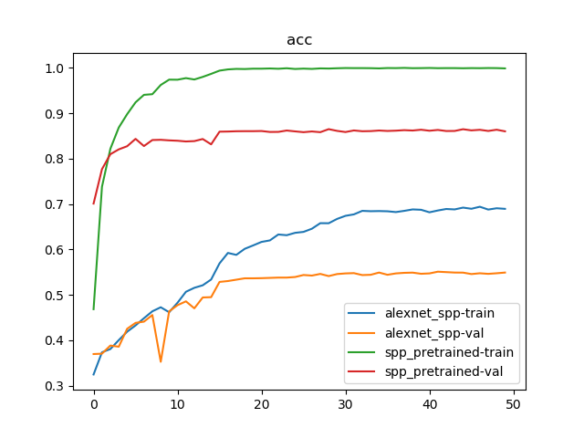
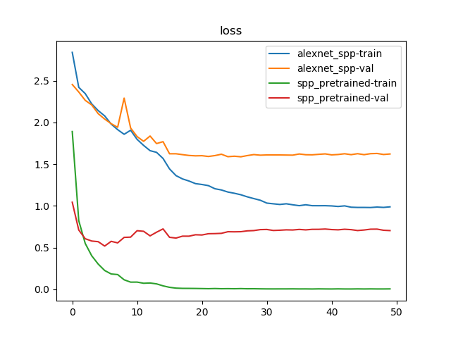

# 加载部分预训练模型

`PyTorch`提供了一些常用网络的预训练模型，比如`AlexNet`、`VGGNet`等等，参考[[译]保存和加载模型](./译-保存和加载模型.md)。实际操作中经常会调整模型参数，所以只能加载部分的预训练模型

## 模型参数解析

模型参数以键值对的方式进行保存。以`AlexNet`为例，其模型定义如下：

```
class AlexNet(nn.Module):

    def __init__(self, num_classes=1000):
        super(AlexNet, self).__init__()
        self.features = nn.Sequential(
            nn.Conv2d(3, 64, kernel_size=11, stride=4, padding=2),
            nn.ReLU(inplace=True),
            nn.MaxPool2d(kernel_size=3, stride=2),
            nn.Conv2d(64, 192, kernel_size=5, padding=2),
            nn.ReLU(inplace=True),
            nn.MaxPool2d(kernel_size=3, stride=2),
            nn.Conv2d(192, 384, kernel_size=3, padding=1),
            nn.ReLU(inplace=True),
            nn.Conv2d(384, 256, kernel_size=3, padding=1),
            nn.ReLU(inplace=True),
            nn.Conv2d(256, 256, kernel_size=3, padding=1),
            nn.ReLU(inplace=True),
            nn.MaxPool2d(kernel_size=3, stride=2),
        )
        self.avgpool = nn.AdaptiveAvgPool2d((6, 6))
        self.classifier = nn.Sequential(
            nn.Dropout(),
            nn.Linear(256 * 6 * 6, 4096),
            nn.ReLU(inplace=True),
            nn.Dropout(),
            nn.Linear(4096, 4096),
            nn.ReLU(inplace=True),
            nn.Linear(4096, num_classes),
        )

    def forward(self, x):
        x = self.features(x)
        x = self.avgpool(x)
        x = torch.flatten(x, 1)
        x = self.classifier(x)
        return x
```

打印出模型参数的键以及值大小：

```
model = alexnet()
model_dict = model.state_dict()
for k, v in model_dict.items():
    print(k, v.shape)
############################ 输出
features.0.weight torch.Size([64, 3, 11, 11])
features.0.bias torch.Size([64])
features.3.weight torch.Size([192, 64, 5, 5])
features.3.bias torch.Size([192])
features.6.weight torch.Size([384, 192, 3, 3])
features.6.bias torch.Size([384])
features.8.weight torch.Size([256, 384, 3, 3])
features.8.bias torch.Size([256])
features.10.weight torch.Size([256, 256, 3, 3])
features.10.bias torch.Size([256])
classifier.1.weight torch.Size([4096, 9216])
classifier.1.bias torch.Size([4096])
classifier.4.weight torch.Size([4096, 4096])
classifier.4.bias torch.Size([4096])
classifier.6.weight torch.Size([1000, 4096])
classifier.6.bias torch.Size([1000])
```

## 加载模型

实际操作中，可分为`3`种加载场景

1. 仅修改输出大小
2. 修改部分层参数
3. 部分层一致

### 仅修改输出大小

最常遇见的就是修改输出类别，可以在加载完成后重新设置输出层即可

```
model = alexnet()
print(model)
num_features = model.classifier[6].in_features
model.classifier[6] = nn.Linear(num_features, 20)
print(model)
#################### 输出
AlexNet(
  (features): Sequential(
      。。。
      。。。
  )
  (avgpool): AdaptiveAvgPool2d(output_size=(6, 6))
  (classifier): Sequential(
      。。。
      。。。
    (6): Linear(in_features=4096, out_features=1000, bias=True)
  )
)
AlexNet(
  (features): Sequential(
      。。。
      。。。
  )
  (avgpool): AdaptiveAvgPool2d(output_size=(6, 6))
  (classifier): Sequential(
      。。。
      。。。
    (6): Linear(in_features=4096, out_features=20, bias=True)
  )
)
```

### 修改部分层参数

这里指的是未新增或者删除参数层，仅仅修改了参数层参数以及调整非参数层

对`AlexNet`添加空间金字塔池化层为例，其替换了最后一个池化层，并且修改了第一个全连接层的输入，其定义如下：

```
class SpatialPyramidPooling(nn.Module):
    """Generate fixed length representation regardless of image dimensions
    Based on the paper "Spatial Pyramid Pooling in Deep Convolutional Networks
    for Visual Recognition" (https://arxiv.org/pdf/1406.4729.pdf)
    :param [int] num_pools: Number of pools to split each input feature map into.
        Each element must be a perfect square in order to equally divide the
        pools across the feature map. Default corresponds to the original
        paper's implementation
    :param str mode: Specifies the type of pooling, either max or avg
    """

    # 默认使用3级金字塔，其向量长度为21
    def __init__(self, num_pools=(1, 4, 16), mode='max'):
        super(SpatialPyramidPooling, self).__init__()
        self.name = 'SpatialPyramidPooling'
        if mode == 'max':
            pool_func = nn.AdaptiveMaxPool2d
        elif mode == 'avg':
            pool_func = nn.AdaptiveAvgPool2d
        else:
            raise NotImplementedError(f"Unknown pooling mode '{mode}', expected 'max' or 'avg'")
        self.pools = []
        for p in num_pools:
            side_length = sqrt(p)
            if not side_length.is_integer():
                raise ValueError(f'Bin size {p} is not a perfect square')
            self.pools.append(pool_func(int(side_length)))

    def forward(self, feature_maps):
        """Pool feature maps at different bin levels and concatenate
        :param torch.tensor feature_maps: Arbitrarily shaped spatial and
            channel dimensions extracted from any generic convolutional
            architecture. Shape ``(N, C, H, W)``
        :return torch.tensor pooled: Concatenation of all pools with shape
            ``(N, C, sum(num_pools))``
        """
        assert feature_maps.dim() == 4, 'Expected 4D input of (N, C, H, W)'
        batch_size = feature_maps.size(0)
        channels = feature_maps.size(1)
        pooled = []
        for p in self.pools:
            pooled.append(p(feature_maps).view(batch_size, channels, -1))
        return torch.cat(pooled, dim=2)

class AlexNet_SPP(nn.Module):

    def __init__(self, num_classes=1000):
        super(AlexNet_SPP, self).__init__()
        self.features = nn.Sequential(
            nn.Conv2d(3, 64, kernel_size=11, stride=4, padding=2),
            nn.ReLU(inplace=True),
            nn.MaxPool2d(kernel_size=3, stride=2),
            nn.Conv2d(64, 192, kernel_size=5, padding=2),
            nn.ReLU(inplace=True),
            nn.MaxPool2d(kernel_size=3, stride=2),
            nn.Conv2d(192, 384, kernel_size=3, padding=1),
            nn.ReLU(inplace=True),
            nn.Conv2d(384, 256, kernel_size=3, padding=1),
            nn.ReLU(inplace=True),
            nn.Conv2d(256, 256, kernel_size=3, padding=1),
            nn.ReLU(inplace=True),
            # nn.MaxPool2d(kernel_size=3, stride=2),
        )
        self.spp = SpatialPyramidPooling(num_pools=(1, 4, 9, 36), mode='max')
        # self.avgpool = nn.AdaptiveAvgPool2d((6, 6))
        self.classifier = nn.Sequential(
            nn.Dropout(),
            nn.Linear(256 * 50, 4096),
            nn.ReLU(inplace=True),
            nn.Dropout(),
            nn.Linear(4096, 4096),
            nn.ReLU(inplace=True),
            nn.Linear(4096, num_classes),
        )

    def forward(self, x):
        x = self.features(x)
        # x = self.avgpool(x)
        x = self.spp(x)
        x = torch.flatten(x, 1)
        x = self.classifier(x)
        return x
```

此时`AlexNet`的键排列和`AlexNet_SPP`是一样的，逐个进行比对即可

```
def alexnet_spp(num_classes=20):
    model = AlexNet_SPP(num_classes=num_classes)
    model_alexnet = alexnet(pretrained=True, progress=True)

    pretrained_dict = model_alexnet.state_dict()
    model_dict = model.state_dict()

    res_dict = dict()
    for item in zip(pretrained_dict.items(), model_dict.items()):
        pretrained_dict_item, model_dict_item = item

        k1, v1 = pretrained_dict_item
        k2, v2 = model_dict_item
        # print(k1, k2)
        # print(v1.shape, v2.shape)

        if k1 == k2 and v1.shape == v2.shape:
            res_dict[k2] = v1
        else:
            res_dict[k2] = v2

    model_dict.update(res_dict)
    model.load_state_dict(model_dict)

    return model
```

### 部分层一致

如果新增或者删除或者打乱了原先模型的参数层顺序，只能**手动加入相同层的参数**了，或者**可以按键进行查询**

```
#加载model，model是自己定义好的模型
resnet50 = models.resnet50(pretrained=True) 
model =Net(...) 
 
#读取参数 
pretrained_dict =resnet50.state_dict() 
model_dict = model.state_dict() 
 
#将pretrained_dict里不属于model_dict的键剔除掉 
pretrained_dict =  {k: v for k, v in pretrained_dict.items() if k in model_dict} 
 
# 更新现有的model_dict 
model_dict.update(pretrained_dict) 
 
# 加载我们真正需要的state_dict 
model.load_state_dict(model_dict)  
```

## 示例

训练参数：

1. 优化器：`Adam`
      1. 未使用预训练模型：学习率为`1e-3`
      2. 使用`AlexNet`预训练模型：学习率为`1e-4`
2. 随步长衰减：每隔`15`轮，因子`0.1`
3. 损失函数：交叉熵损失
4. 共训练`50`轮

分类`VOC 2007`数据集

```
# -*- coding: utf-8 -*-

"""
@date: 2020/3/26 下午2:33
@file: classifier.py
@author: zj
@description: 
"""

import os
import time
import copy
import torch
import torch.nn as nn
import torch.optim as optim
from torch.utils.data import DataLoader
import torchvision.transforms as transforms
from torchvision.datasets import ImageFolder
import torchvision

import models.alexnet_spp as alexnet_spp
import utils.util as util

data_root_dir = '../data/train_val/'
model_dir = '../data/models/'


def load_data(root_dir):
    transform = transforms.Compose([
        transforms.Resize((227, 227)),
        transforms.RandomHorizontalFlip(),
        transforms.ToTensor(),
        transforms.Normalize((0.5, 0.5, 0.5), (0.5, 0.5, 0.5))
    ])

    data_loaders = {}
    dataset_sizes = {}
    for phase in ['train', 'val']:
        phase_dir = os.path.join(root_dir, phase)

        data_set = ImageFolder(phase_dir, transform=transform)
        data_loader = DataLoader(data_set, batch_size=128, shuffle=True, num_workers=8)

        data_loaders[phase] = data_loader
        dataset_sizes[phase] = len(data_set)

    return data_loaders, dataset_sizes


def train_model(model, criterion, optimizer, scheduler, dataset_sizes, data_loaders, num_epochs=25, device=None):
    since = time.time()

    best_model_wts = copy.deepcopy(model.state_dict())
    best_acc = 0.0

    loss_dict = {'train': [], 'val': []}
    acc_dict = {'train': [], 'val': []}
    for epoch in range(num_epochs):
        print('Epoch {}/{}'.format(epoch, num_epochs - 1))
        print('-' * 10)

        # Each epoch has a training and validation phase
        for phase in ['train', 'val']:
            if phase == 'train':
                model.train()  # Set model to training mode
            else:
                model.eval()  # Set model to evaluate mode

            running_loss = 0.0
            running_corrects = 0

            # Iterate over data.
            for inputs, labels in data_loaders[phase]:
                inputs = inputs.to(device)
                labels = labels.to(device)

                # zero the parameter gradients
                optimizer.zero_grad()

                # forward
                # track history if only in train
                with torch.set_grad_enabled(phase == 'train'):
                    outputs = model(inputs)
                    _, preds = torch.max(outputs, 1)
                    loss = criterion(outputs, labels)

                    # backward + optimize only if in training phase
                    if phase == 'train':
                        loss.backward()
                        optimizer.step()

                # statistics
                running_loss += loss.item() * inputs.size(0)
                running_corrects += torch.sum(preds == labels.data)
            if phase == 'train':
                scheduler.step()

            dataset_size = dataset_sizes[phase]

            epoch_loss = running_loss / dataset_size
            epoch_acc = running_corrects.double() / dataset_size
            loss_dict[phase].append(epoch_loss)
            acc_dict[phase].append(epoch_acc)

            print('{} Loss: {:.4f} Acc: {:.4f}'.format(
                phase, epoch_loss, epoch_acc))

            # deep copy the model
            if phase == 'val' and epoch_acc > best_acc:
                best_acc = epoch_acc
                best_model_wts = copy.deepcopy(model.state_dict())

        print()

    time_elapsed = time.time() - since
    print('Training complete in {:.0f}m {:.0f}s'.format(
        time_elapsed // 60, time_elapsed % 60))
    print('Best val Acc: {:4f}'.format(best_acc))

    # load best model weights
    model.load_state_dict(best_model_wts)
    return model, loss_dict, acc_dict


if __name__ == '__main__':
    data_loaders, data_sizes = load_data(data_root_dir)
    print(data_sizes)

    res_loss = dict()
    res_acc = dict()
    for name in ['alexnet_spp', 'spp_pretrained']:
        if name == 'alexnet_spp':
            model = alexnet_spp.AlexNet_SPP(num_classes=20)
            optimizer = optim.Adam(model.parameters(), lr=1e-3)
        else:
            model = alexnet_spp.alexnet_spp(num_classes=20)
            optimizer = optim.Adam(model.parameters(), lr=1e-4)

        device = util.get_device()
        model = model.to(device)

        criterion = nn.CrossEntropyLoss()

        lr_scheduler = optim.lr_scheduler.StepLR(optimizer, step_size=15, gamma=0.1)

        best_model, loss_dict, acc_dict = train_model(model, criterion, optimizer, lr_scheduler, data_sizes,
                                                      data_loaders, num_epochs=50, device=device)

        # 保存最好的模型参数
        util.check_dir(model_dir)
        torch.save(best_model.state_dict(), os.path.join(model_dir, '%s.pth' % name))

        res_loss[name] = loss_dict
        res_acc[name] = acc_dict

        print('train %s done' % name)
        print()

    util.save_png('loss', res_loss)
    util.save_png('acc', res_acc)
```

训练`50`轮结果如下：

```
{'train': 6301, 'val': 6307}
Epoch 0/49
----------
train Loss: 2.8387 Acc: 0.3247
val Loss: 2.4537 Acc: 0.3697
。。。
。。。
Epoch 49/49
----------
train Loss: 0.9877 Acc: 0.6896
val Loss: 1.6212 Acc: 0.5492

Training complete in 7m 37s
Best val Acc: 0.551134
train alexnet_spp done

Epoch 0/49
----------
train Loss: 1.8903 Acc: 0.4685
val Loss: 1.0425 Acc: 0.7011
。。。
。。。
Epoch 49/49
----------
train Loss: 0.0043 Acc: 0.9989
val Loss: 0.7032 Acc: 0.8603

Training complete in 7m 37s
Best val Acc: 0.865071
train spp_pretrained done
```





`AlexNet_SPP`使用预训练模型后，确实能够得到更快的进行收敛，并且能够得到更高的检测精度

## 相关阅读

* [PyTorch预训练](https://zhuanlan.zhihu.com/p/25980324)

* [pytorch学习笔记之加载预训练模型](https://blog.csdn.net/weixin_41278720/article/details/80759933)

* [How to load part of pre trained model?](https://discuss.pytorch.org/t/how-to-load-part-of-pre-trained-model/1113)