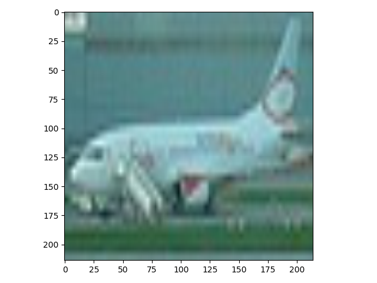
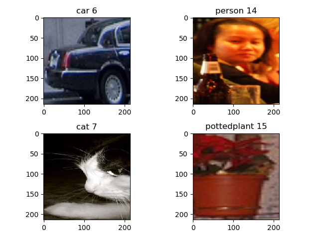

# ImageFolder

如果自定义数据集仅包含图像，那么可以使用[torchvision.datasets.ImageFolder](https://pytorch.org/docs/stable/torchvision/datasets.html#imagefolder)实现数据集加载

## ImageFolder

`ImageFolder`是一个通用的数据加载器，假定图像按以下方式排列：

```
root/dog/xxx.png
root/dog/xxy.png
root/dog/xxz.png

root/cat/123.png
root/cat/nsdf3.png
root/cat/asd932_.png
```

类声明如下：

```
torchvision.datasets.ImageFolder(root, transform=None, target_transform=None, loader=<function default_loader>, is_valid_file=None)
```

* `root`：根路径
* `transform`：（可选）回调函数/类，作用于图像处理
* `target_transform`：（可选）回调函数/类，作用于图像处理
* `loader`：（可选）具体加载图像函数（给定图像路径）
* `is_valid_file`：函数，给定图像路径，判断是否有效

## 示例

加载`PASCAL VOC`检测数据集，在`voc`文件夹内包含`train`和`test`训练集，其文件路径如下：

```
├── test
│   ├── aeroplane
│   ├── bicycle
│   ├── ...
│   ├── ...
└── train
    ├── aeroplane
    ├── bicycle
    ├── bird
    ├── ...
    ├── ...
```

```
# -*- coding: utf-8 -*-

"""
@author: zj
@file:   voc.py
@time:   2019-12-09
"""

import torch
import torch.utils.data as data
import torchvision
import torchvision.transforms as transforms
import matplotlib.pyplot as plt
import numpy as np

transform = transforms.Compose(
    [transforms.Resize((214, 214)), transforms.ToTensor()])

# transforms.Normalize((0.5, 0.5, 0.5), (0.5, 0.5, 0.5))

trainset = torchvision.datasets.ImageFolder('./voc/train', transform=transform)
trainloader = torch.utils.data.DataLoader(trainset, batch_size=4, shuffle=True, num_workers=2)

testset = torchvision.datasets.ImageFolder('./voc/test', transform=transform)
testloader = torch.utils.data.DataLoader(testset, batch_size=4, shuffle=False, num_workers=2)

if __name__ == '__main__':
    # 打印训练集长度
    print('trainset lens: ', trainset.__len__())
    print('testset lens: ', testset.__len__())

    # 打印类别以及标签
    classes, class_to_idx = trainset._find_classes('./voc/train')
    print(classes)
    print(class_to_idx)

    # 从数据集中提取图像并显示
    img = trainset.__getitem__(1)[0]
    numpy_img = img.numpy().transpose((1, 2, 0))
    plt.figure()
    plt.imshow(numpy_img)
    plt.show()

    # 通过迭代器提取批量图片并显示
    # get some random training images
    dataiter = iter(trainloader)
    images, labels = dataiter.__next__()
    plt.figure()
    for i in range(4):
        plt.subplot(2, 2, i + 1)
        npimg = images[i].numpy()
        plt.imshow(np.transpose(npimg, (1, 2, 0)))
        plt.title(''.join([classes[labels[i]], ' ', str(class_to_idx[classes[labels[i]]])]))
    plt.show()
```

通过`ImageFolder`对象加载一张图像，通过迭代器`DataLoader`批量加载



