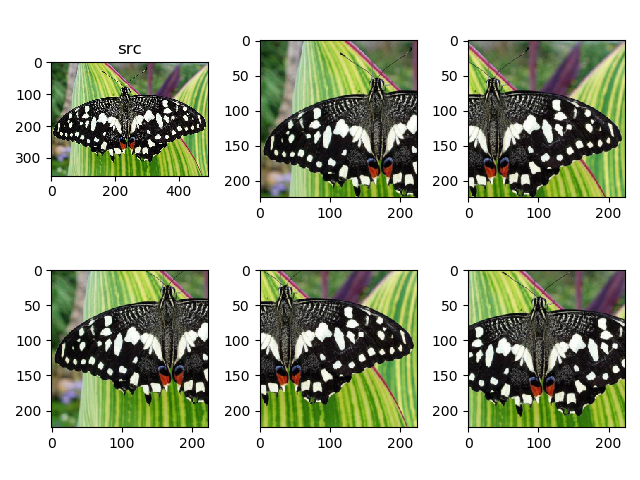

# [Ten Crops]多样本检测

在检测阶段，采集一张样本中的多个裁剪，平均其预测结果，有助于更高的检测精度

完整实现参考`py/data_preprocessing/ten-crops.py`

## FiveCrops/TenCrops

常用的有`FiveCrops`和`TenCrops`

* `FiveCrops`：裁剪图像中心和`4`个角
* `TenCrops`：裁剪图像中心和`4`个角，以及翻转图像后的`5`个裁剪

## PyTorch实现

`PyTorch`提供了函数`torchvision.transforms.FiveCrop`和`torchvision.transforms.TenCrop`。裁剪`5`张图像并显示

```
def plot(src, dsts):
    f = plt.figure()

    cols = 3
    rows = 2

    plt.subplot(rows, cols, 1)
    plt.title('src')
    plt.imshow(src)

    for i in range(rows):
        for j in range(cols):
            if (i * cols + j) == 5:
                break

            plt.subplot(rows, cols, i * cols + j + 2)
            plt.imshow(dsts[i * cols + j])

    plt.show()


def draw_five_crop():
    src = Image.open('./data/butterfly.jpg')

    transform = transforms.Compose([
        transforms.Resize(256),
        transforms.FiveCrop(224),  # this is a list of PIL Images
    ])

    dsts = transform(src)
    print(len(dsts))
    plot(src, dsts)
```



## 相关阅读

* [PyTorch数据增强，TenCrop的用法](https://www.jianshu.com/p/aba1142c0453)

* [How to properly do 10-crop testing on Imagenet?](https://discuss.pytorch.org/t/how-to-properly-do-10-crop-testing-on-imagenet/11341)

* [[Pytorch]Pytorch中图像的基本操作(TenCrop)](https://blog.csdn.net/weixin_44538273/article/details/88406404)