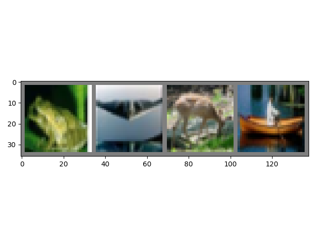

# [torchvision]加载数据集、批量以及转换操作

[torchvision](https://pytorch.org/docs/stable/torchvision/index.html)代码库包含了流行的数据集、模型结构和用于计算机视觉的常见图像转换

## 组织结构

`torchvision`提供了简单有效的图像处理模式，其包含`3`个主要对象：

1. 数据集（`DataSet`）：实现数据加载功能；
2. 转换器（`Transform`）：实现图像预处理功能；
3. 加载器（`DataLoader`）：实现批量加载数据功能。

## 数据集

[torchvision.datasets](https://pytorch.org/docs/stable/torchvision/datasets.html)已实现了许多常用数据集对象。比如，加载`CIFAR10`数据集实现如下：

```
class torchvision.datasets.CIFAR10(root, train=True, transform=None, target_transform=None, download=False)
```

* `root`：指定本地数据集的根目录
* `train`：指定是否是加载训练集
* `transform`：转换器对象（可选），指定图像加载后进行的预处理
* `target_transform`：转换器对象（可选），指定输出加载的图像前对其进行的预处理
* `download`：是否需要下载

实现如下：

```
trainset = torchvision.datasets.CIFAR10(root='./data', train=True, download=True, transform=transform)
testset = torchvision.datasets.CIFAR10(root='./data', train=False, download=True, transform=transform)
```

上述语句将数据集`CIFAR10`保存在`data`文件夹内，需要下载并提供了转换器对象

## 转换器

[torchvision.transforms](https://pytorch.org/docs/stable/torchvision/transforms.html)提供了常见的图像操作，包括

1. 裁剪（随机裁剪/中央裁剪）
2. 缩放
3. 翻转（水平/垂直）
4. 标准化
5. 边界填充

所有实现的函数如下：

```
__all__ = ["Compose", "ToTensor", "ToPILImage", "Normalize", "Resize", "Scale", "CenterCrop", "Pad",
           "Lambda", "RandomApply", "RandomChoice", "RandomOrder", "RandomCrop", "RandomHorizontalFlip",
           "RandomVerticalFlip", "RandomResizedCrop", "RandomSizedCrop", "FiveCrop", "TenCrop", "LinearTransformation",
           "ColorJitter", "RandomRotation", "RandomAffine", "Grayscale", "RandomGrayscale",
           "RandomPerspective", "RandomErasing"]
```

如果要对图像进行多种预处理，可以使用类[Compose](https://pytorch.org/docs/stable/torchvision/transforms.html#torchvision.transforms.Compose)组合在一起实现

```
class torchvision.transforms.Compose(transforms)
```

参数`transforms`是一个`Transforms`对象列表。比如，创建一个`Compose`类，组合了转换`Tensor`结构以及标准化功能，实现如下：

```
transform = transforms.Compose(
    [transforms.ToTensor(),
     transforms.Normalize((0.5, 0.5, 0.5), (0.5, 0.5, 0.5))])
```

## 加载器

[torch.util.data.DataLoader](https://pytorch.org/docs/stable/data.html#torch.utils.data.DataLoader)组合数据集对象和转换器对象，并在给定数据集上提供`iterable`，实现批量输出图像数据的功能

实现如下：

```
trainloader = torch.utils.data.DataLoader(trainset, batch_size=4, shuffle=True, num_workers=2)
testloader = torch.utils.data.DataLoader(testset, batch_size=4, shuffle=False, num_workers=2)
```

其中`trainset`和`testset`是之前定义的数据集对象，上述操作中将批量大小设置为`4`，确定每轮打乱数据后输出，使用`2`个子进程来加载数据

定义加载器后，可以调用迭代器进行批量输出

```
# get some random training images
dataiter = iter(trainloader)
images, labels = dataiter.next()
```

每次迭代得到`4`个图像以及标签

## 示例

利用`torchvision`实现`Cifar-10`数据集的加载和显示

```
import torch
import torch.utils.data as data
import torchvision
import torchvision.transforms as transforms
import matplotlib.pyplot as plt
import numpy as np

transform = transforms.Compose(
    [transforms.ToTensor(),
     transforms.Normalize((0.5, 0.5, 0.5), (0.5, 0.5, 0.5))])

trainset = torchvision.datasets.CIFAR10(root='./data', train=True, download=False, transform=transform)
trainloader = torch.utils.data.DataLoader(trainset, batch_size=4, shuffle=True, num_workers=2)

testset = torchvision.datasets.CIFAR10(root='./data', train=False, download=False, transform=transform)
testloader = torch.utils.data.DataLoader(testset, batch_size=4, shuffle=False, num_workers=2)

classes = ('plane', 'car', 'bird', 'cat', 'deer', 'dog', 'frog', 'horse', 'ship', 'truck')


def imshow(img):
    img = img / 2 + 0.5  # unnormalize
    npimg = img.numpy()
    plt.imshow(np.transpose(npimg, (1, 2, 0)))
    plt.show()


if __name__ == '__main__':
    # get some random training images
    dataiter = iter(trainloader)
    images, labels = dataiter.next()
    print(images.size(), labels.size())

    # show images
    imshow(torchvision.utils.make_grid(images))
    # print labels
    print(' '.join('%5s' % classes[labels[j]] for j in range(4)))
```

之前已完成`CIFAR10`数据集下载，解压后放置在`./data`目录下

```
/data$ tree
.
└── cifar-10-batches-py
    ├── batches.meta
    ├── data_batch_1
    ├── data_batch_2
    ├── data_batch_3
    ├── data_batch_4
    ├── data_batch_5
    ├── readme.html
    └── test_batch

1 directory, 8 files
```

获取第一批图像数据（`Tensor`结构，需要先转换成`numpy`数组）并显示



## 相关阅读

* [Training a Classifier](https://pytorch.org/tutorials/beginner/blitz/cifar10_tutorial.html#loading-and-normalizing-cifar10)