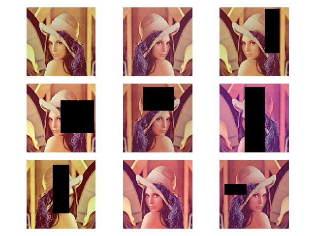

# 数据预处理

`PyTorch`提供了丰富的预处理函数，组合不同的预处理函数能够极大的扩充图像数据库

实现代码位于`py/data`目录下

## 预处理功能

1. 缩放（`Resize`）
2. 裁剪（`CenterCrop/RandomCrop`）
3. 翻转（`RandomHorizontalFlip/RandomVerticalFlip`）
4. 颜色抖动（`ColorJitter`）
5. 随机擦除（`RandomErasing`）

## 组合

`Torchvision`提供了`Compose`函数来组合多种预处理功能

```
    # 预处理顺序如下：
    # 1. 按较短边缩放
    # 2. 随机裁剪224x224
    # 3. 随机水平翻转
    # 4. 随机颜色抖动：亮度、对比度、饱和度、色调
    # 5. 转换成Tensor张量
    # 6. 随机擦除
    # 7. 转换成PIL Image
    transform = transforms.Compose([
        transforms.Resize(224),
        transforms.RandomCrop(224),
        transforms.RandomHorizontalFlip(),
        transforms.ColorJitter(brightness=0.1, contrast=0.1, saturation=0.1, hue=0.1),
        transforms.ToTensor(),
        transforms.RandomErasing(),
        transforms.ToPILImage()
    ])
```



## 后续

更多预处理功能参考：[ ZJCV/ZTransforms](https://github.com/ZJCV/ZTransforms)

## 相关阅读

* [深度学习入门之Pytorch——数据增强](https://blog.csdn.net/
weixin_40793406/article/details/84867143)

* [深度神经网络模型训练中的最新tricks总结【原理与代码汇总】](https://zhuanlan.zhihu.com/p/66080948)
